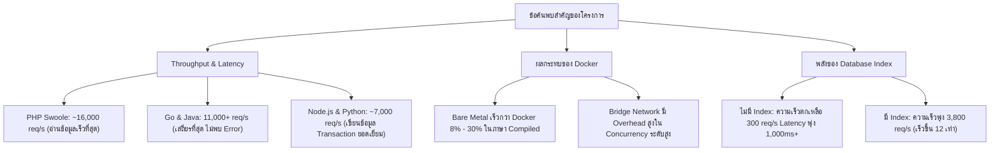

# โครงการ Project Antigravity: รายงานการทดสอบเปรียบเทียบประสิทธิภาพ Web Framework หลายภาษาและหลายสภาพแวดล้อม

> **เอกสารสรุปภาพรวม วัตถุประสงค์ สถาปัตยกรรมระบบ รูปแบบการทดสอบ และบทวิเคราะห์เชิงลึก (ฉบับภาษาไทย)**

---

## 1. บทสรุปสำหรับผู้บริหาร: โครงการนี้คืออะไร? (Executive Summary)

ในวงการพัฒนาซอฟต์แวร์ Backend ยุคปัจจุบัน มีการถกเถียงกันอย่างต่อเนื่องว่าภาษาและ Framework ใดเร็วและรองรับผู้ใช้ได้มากที่สุด:
* *"Go เร็วกว่า Node.js จริงหรือไม่?"*
* *"Java มีขนาดใหญ่และกินทรัพยากรเกินไป หรือ JIT Compiler ช่วยให้เร็วระดับท็อป?"*
* *"PHP ยังมีประสิทธิภาพดีพอสำหรับงาน Backend สมัยใหม่หรือไม่?"*
* *"Python FastAPI ช้ากว่าภาษาที่ Compile แล้วมากน้อยเพียงใด?"*
* *"การรันแอปพลิเคชันบน Docker Container ทำให้เซิร์ฟเวอร์ช้าลงกี่เปอร์เซ็นต์?"*

การทดสอบประสิทธิภาพ (Benchmark) ส่วนใหญ่บนอินเทอร์เน็ตมักทดสอบเฉพาะโปรแกรมอย่างง่าย เช่น **"Hello World"** ซึ่งส่งค่าข้อความสั้นๆ อย่าง `{"status": "ok"}` กลับมา ซึ่ง**ไม่สะท้อนความเป็นจริงในระบบ Production** เพราะในการทำงานจริงเซิร์ฟเวอร์ต้อง:
1. เชื่อมต่อฐานข้อมูลจริง (Relational Database - MySQL)
2. ประมวลผลคำสั่ง SQL และ `JOIN` ข้อมูลหลายตาราง
3. จัดการ Database Connection Pool
4. ทำธุรกรรมการเขียนข้อมูล (Transactions พร้อม Foreign Keys)
5. รับมือกับผู้ใช้งานพร้อมกันนับร้อยนับพันคน

**Project Antigravity** คือ ชุดทดสอบประสิทธิภาพมาตรฐาน (Benchmark Suite) ที่มีความเป็นกลาง เป็นไปตามหลักการทางวิทยาศาสตร์ และสามารถทำซ้ำได้ (Deterministic & Reproducible) โดยทำการประเมิน **5 ภาษาและ Web Framework ชั้นนำ** ภายใต้ **ภาระงานฐานข้อมูลจริง** เปรียบเทียบระหว่าง **Bare Metal (รันตรงบน OS)** กับ **Docker Container** ครอบคลุม **5 ระดับโหลดตามสถานการณ์จริง** (ตั้งแต่ 20 ถึง 10,000 Concurrent Connections) พร้อมระบบคำนวณค่าเฉลี่ยและการเก็บ Log ข้อมูลดิบรายรอบ

---

## 2. ทำไมจึงต้องสร้างโครงการนี้? (เป้าหมายและปัญหาที่ได้รับการแก้ไข)

### 🎯 1. ก้าวข้ามกับดัก "Hello World"
ในการทำงานจริง เซิร์ฟเวอร์ใช้เวลากว่า 80-90% ไปกับการรอ Database I/O, แปลงข้อมูล JSON, และจัดการ Connection Pool ไม่ใช่การคำนวณลูปตัวเลขในแรม โครงการนี้จึงทดสอบการเชื่อมต่อ MySQL จริงที่มีข้อมูลหลักหมื่นแถว

### 🎯 2. วัดต้นทุนความหน่วงของ Docker (Virtualization Tax)
การ Deploy ระบบบน Docker Container ทำให้สูญเสีย Throughput และเพิ่ม Latency มากน้อยเพียงใด? ชุดทดสอบนี้รันโค้ดชุดเดียวกันบนเครื่องเดียวกัน เพื่อวัดผลกระทบของการทำ Virtualization และ Bridge Network อย่างแม่นยำ

### 🎯 3. ผลกระทบของ Database Index ในสภาวะ Concurrency สูง
เกิดอะไรขึ้นหากนักพัฒนาลืมสร้าง Index บน Foreign Key เมื่อมีทราฟฟิกเข้ามาพร้อมกันนับพัน? เราเปรียบเทียบคำสั่ง SQL เดียวกันระหว่างแบบมี Index และไม่มี Index เพื่อให้เห็นตัวเลขความต่างอย่างชัดเจน

### 🎯 4. หาขีดจำกัดความเสถียร (Breakdown & Saturation Limits)
Framework ใดสามารถทนทานต่อการเชื่อมต่อพร้อมกัน 10,000 Connections ได้อย่างราบรื่น และ Framework ใดเริ่มมี Connection หลุด (Errors/Drops) หรือเกิด Latency พุ่งสูง

### 🎯 5. มาตรฐานความยุติธรรมแบบเท่าเทียมกันทุกภาษา
การเปรียบเทียบส่วนใหญ่มักมีความลำเอียง เช่น ตั้ง Connection Pool ไม่เท่ากัน หรือไม่รอ Warmup โครงการนี้กำหนดขนาด Connection Pool เท่ากัน มีช่วง Warmup 3 วินาที รีเซ็ตฐานข้อมูลระหว่างรอบ และปรับ `ulimit` ป้องกันคอขวดของ OS

---

## 3. เทคโนโลยีและสถาปัตยกรรมระบบที่นำมาประเมิน

| ภาษา (Language) | Web Framework | Database Driver / Client | โมเดลการประมวลผล (Concurrency) | Port มาตรฐาน |
| :--- | :--- | :--- | :--- | :--- |
| **Python** | **FastAPI** (Uvicorn) | `aiomysql` (Async Pool) | Multi-process Async Event Loop | `8001` |
| **Node.js** | **Fastify** | `mysql2/promise` (Pool) | Multi-core Cluster + Event Loop | `8002` |
| **PHP** | **Swoole** | `PDO_MySQL` (`PDOPool`) | C-based Coroutine Event Loop | `8003` |
| **Go** | **Fiber** (v2) | `database/sql` (`go-sql-driver`) | Lightweight Goroutines | `8004` |
| **Java** | **Spring Boot** (v3) | `JdbcTemplate` + `HikariCP` | Multi-threaded JVM Pool | `8005` |

---

## 4. รูปแบบการทดสอบและระดับโหลด (Scenarios & Load Tiers)

### A. หมวดการอ่านข้อมูล / GET Benchmark Suites (Raw SQL)
* `/raw/1table`: สืบค้นตารางเดี่ยว (`SELECT * FROM users LIMIT 100`)
* `/raw/2join`: สืบค้นแบบเชื่อม 2 ตาราง (`users` + `profiles`)
* `/raw/3join`: สืบค้นแบบเชื่อม 3 ตาราง (`users` + `profiles` + `orders`)
* `/raw/4join`: สืบค้นแบบเชื่อม 4 ตาราง (`users` + `profiles` + `orders` + `order_items`)

*ทดสอบใน 2 สภาวะ:*
1. **`GET/get_no_index`**: ทดสอบแบบไม่มี Secondary Index (จำลองสภาวะ Table Scan)
2. **`GET/get_with_index`**: ทดสอบแบบมี Secondary Index บน Foreign Keys

### B. หมวดการเขียนข้อมูล / POST Benchmark Suite (Database Transactions)
* `/raw/post/1table`: บันทึกข้อมูลลงตาราง `users` 1 รายการ
* `/raw/post/2table`: บันทึกข้อมูลแบบ Transaction เชื่อมโยง `users` + `profiles`
* `/raw/post/3table`: บันทึกข้อมูลแบบ Transaction เชื่อมโยง `users` + `profiles` + `orders`
* `/raw/post/4table`: บันทึกข้อมูลแบบ Transaction ครบวงจร `users` + `profiles` + `orders` + `order_items` หลายรายการ

### C. 5 ระดับโหลดตามสถานการณ์จริง (ทดสอบด้วย `wrk`)

| ตัวเลือกระดับโหลด (`--tier`) | สถานการณ์ (Scenario) | ตัวอย่างระบบจริง (Typical Website) | เธรด (`-t`) | Connections (`-c`) | ระยะเวลา (`-d`) |
| :--- | :--- | :--- | :---: | :---: | :---: |
| **`poc`** | **POC / Small internal system** | โปรเจกต์จบการศึกษา, ระบบต้นแบบในแผนก | `2` | `20` | `30s` |
| **`small`** | **Small production website** | เว็บไซต์บริษัทขนาดเล็ก, ธุรกิจท้องถิ่น | `4` | `100` | `60s` |
| **`general`** | **General web application** | ระบบมหาวิทยาลัย, ระบบอีคอมเมิร์ซ, CMS | `8` | `500` | `60s` |
| **`high`** | **High-density website** | เว็บพอร์ทัลยอดนิยม, แพลตฟอร์ม SaaS | `8` | `2,000` | `120s` |
| **`stress`** | **Stress testing** | หาจุดอิ่มตัวและขีดจำกัดสูงสุดของระบบ | `16` | `10,000` | `300s` |
| **`all`** | **ทุกระดับโหลด (ค่าเริ่มต้น)** | รันครบทั้ง 5 สถานการณ์ต่อเนื่องกัน | Sequential | Sequential | Cumulative |

---

## 5. ผลการค้นพบและข้อสรุปสำคัญเชิงลึก



### 🏆 1. PHP Swoole คือผู้นำด้านความเร็วที่น่าทึ่ง
PHP เมื่อทำงานร่วมกับ Swoole Coroutines และ `PDOPool` สามารถทำ Throughput สูงสุดในการอ่านตารางเดี่ยวได้มากกว่า **16,000 requests/sec** ด้วย Latency เพียง **~7ms** ลบล้างความเชื่อเดิมที่ว่า PHP ทำงานช้า

### 🛡️ 2. Go (Fiber) และ Java (Spring Boot) มีความเสถียรสูงสุด
ทั้ง Go และ Java ให้ประสิทธิภาพระดับท็อปอย่างสม่ำเสมอ (**11,000+ req/s** สำหรับการอ่าน และ **7,000+ req/s** สำหรับการเขียน) โดยมี Latency Jitter ต่ำมาก และแทบไม่พบ Error แม้โหลดจะเพิ่มถึง 10,000 Connections

### ⚡ 3. ต้นทุนความหน่วงของ Docker (Virtualization Tax)
Node.js (Fastify) ทำได้กว่า 7,000 req/s บน Bare Metal แต่เมื่อรันบน Docker ภายใต้โหลดสูง ประสิทธิภาพลดลงอย่างเห็นได้ชัด เนื่องจาก Overhead ในการแปลงเน็ตเวิร์กของ Linux Bridge Driver

### 🔍 4. พลังทวีคูณ 12 เท่าของ Database Index
ในการ JOIN 4 ตาราง:
- **แบบไม่มี Index**: ความเร็วตกลงเหลือเพียง ~300 req/s และ Latency พุ่งเกิน 1,000ms
- **แบบมี Index**: ความเร็วพุ่งขึ้นถึง ~3,800 req/s (เร็วขึ้น 12 เท่า) และ Latency ลดลงเหลือเพียง 28ms

### ✍️ 5. Python FastAPI โดดเด่นในงานเขียนข้อมูล (POST Transactions)
แม้ว่า Python จะเสียเปรียบในงานอ่านตารางขนาดใหญ่ที่ใช้ CPU มาก แต่เมื่อเป็นงานเขียนข้อมูลแบบ Async Transaction (`aiomysql`) FastAPI กลับทำได้ถึง **7,045 req/s** เทียบเท่ากับ Go และ Node.js

---

## 6. วิธีการรันทดสอบและระบบจัดเก็บผลลัพธ์

### ข้อกำหนดเบื้องต้น
* เปิดใช้งาน MySQL 8.0 ในเครื่อง Local บนพอร์ต `3306` (`user=admin`, `password=secret`, `database=benchmark_db`)
* ติดตั้ง Python 3.10+ และเครื่องมือ `wrk`
* ติดตั้ง Docker (สำหรับทดสอบในโหมดคอนเทนเนอร์)

### คำสั่งการรันทดสอบ
```bash
# 1. รันการทดสอบ GET (No Index) บน Bare Metal พร้อมหาค่าเฉลี่ย 3 รอบ
cd main_web_benchmark/GET/get_no_index
python3 run_bme_wrk.py --tier all --runs 3

# 2. รันการทดสอบ GET (With Index) บน Docker
cd main_web_benchmark/GET/get_with_index
python3 run_dkr_wrk.py --tier all --runs 3

# 3. รันการทดสอบ POST ธุรกรรมการเขียน
cd main_web_benchmark/POST
python3 run_bme_wrk.py --tier all --runs 3

# 4. การดูผลลัพธ์:
# - ผลลัพธ์ค่าเฉลี่ย: bme_benchmark_results.json & results/<suite>.json
# - ข้อมูลการรันดิบทุกรอบ: raw_results.json & results/raw_results/<suite>_raw.json

# 5. ดูตารางสรุปเปรียบเทียบอัตโนมัติ
cd main_web_benchmark
python3 compare_results.py GET/get_no_index/dkr_benchmark_results.json
```

---

## 7. ไฟล์เอกสารและรายงานในโครงการ

* 📄 **[`Project_Benchmark_Overview_TH.docx`](file:///D:/github/Programming-Benchmark/Project_Benchmark_Overview_TH.docx)**: ไฟล์ Microsoft Word ภาษาไทย จัดรูปแบบสวยงาม พร้อมตารางและกล่องข้อความสรุป
* 📄 **[`Project_Benchmark_Overview.docx`](file:///D:/github/Programming-Benchmark/Project_Benchmark_Overview.docx)**: ไฟล์ Microsoft Word ภาษาอังกฤษ
* 📄 **[`SUMMARY.md`](file:///D:/github/Programming-Benchmark/main_web_benchmark/results/SUMMARY.md)**: ตารางสรุปคะแนนและตัวเลขสถิติอย่างละเอียดทุกภาษาและทุกระดับโหลด
* 📊 **[`SUMMARY.csv`](file:///D:/github/Programming-Benchmark/main_web_benchmark/results/SUMMARY.csv)**: ข้อมูลผลลัพธ์ในรูปแบบตาราง CSV สำหรับนำไปวิเคราะห์ต่อ
