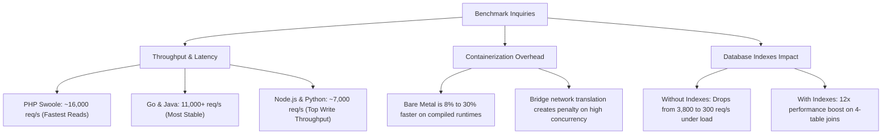

# Project Antigravity: Multi-Language & Multi-Environment Web Benchmark Suite

> 🌐 **Language / ภาษา**: **English** | [ภาษาไทย (Thai)](README_TH.md)

---

## 1. Executive Summary: What is this project in simple words?

In modern software development, teams constantly debate which backend programming language or framework is the fastest and most scalable:
* *"Is Go really faster than Node.js?"*
* *"Is Java too bloated, or does JIT make it blazing fast?"*
* *"Is PHP outdated, or can modern async runtimes like Swoole outperform others?"*
* *"How much slower is Python FastAPI compared to compiled languages?"*
* *"Does running our apps inside Docker containers hurt our performance?"*

Most public benchmarks test simple `"Hello World"` examples where the server just returns a tiny string like `{"status": "ok"}`. But in the real world, web applications do not just return static text—they:
1. Connect to relational databases (like MySQL).
2. Execute SQL queries with `JOIN` operations across multiple tables.
3. Manage database connection pools.
4. Perform database write transactions with foreign keys.
5. Handle hundreds to thousands of simultaneous users.

**Project Antigravity** is a rigorous, fair, and reproducible benchmarking suite designed to answer these questions with real empirical data. It evaluates **5 major backend languages and frameworks** under **realistic database workloads** across **Bare Metal (direct OS)** and **Docker Containerized** environments across **5 production load scenarios** (from 20 up to 10,000 concurrent connections).

---

## 2. Why Did We Build This? (The Core Goals & Problems Solved)

### 🎯 Goal 1: Replace "Hello World" with Real-World Database Workloads
Instead of synthetic micro-benchmarks, this suite tests real database operations against a MySQL database containing tens of thousands of records, testing single-table lookups, 2-to-4 table relational joins, and multi-table transactional writes.

### 🎯 Goal 2: Measure the "Docker Virtualization Tax"
Many engineering teams deploy microservices to Docker without knowing how much throughput or latency penalty containerization introduces. This benchmark tests the exact same application code on Bare Metal (direct host) and inside Docker containers side-by-side.

### 🎯 Goal 3: Understand Database Indexing Under High Concurrency
What happens when traffic spikes on a database query missing an index? We benchmark identical queries with secondary indexes vs without indexes across 20 to 10,000 concurrent connections to measure the exact performance drop.

### 🎯 Goal 4: Guarantee Fair, Apples-to-Apples Comparisons
In unfair benchmarks, one language might use 500 connections while another uses 10, or one language might suffer from cold-start JVM latency. This suite eliminates bias by:
- Standardizing connection pool sizing across all frameworks.
- Adding a 3-second warmup phase before recording measurements.
- Resetting database state between write tests.
- Elevating OS socket and file descriptor limits (`ulimit -n 65535`).
- Supporting multi-run iterations (`--runs N`) to calculate statistical averages while logging raw iterations into `raw_results.json`.

---

## 3. Evaluated Technologies & Frameworks

| Language | Web Framework | Database Client / Driver | Concurrency Model | Port |
| :--- | :--- | :--- | :--- | :--- |
| **Python** | **FastAPI** (Uvicorn) | `aiomysql` (Async Pool) | Multi-process Async Event Loop | `8001` |
| **Node.js** | **Fastify** | `mysql2/promise` (Pool) | Multi-core Cluster + Event Loop | `8002` |
| **PHP** | **Swoole** | `PDO_MySQL` (`PDOPool`) | C-based Coroutine Event Loop | `8003` |
| **Go** | **Fiber** (v2) | `database/sql` (`go-sql-driver`) | Lightweight Goroutines | `8004` |
| **Java** | **Spring Boot** (v3) | `JdbcTemplate` + `HikariCP` | Multi-threaded JVM Pool | `8005` |

---

## 4. Test Scenarios and Load Tiers

### A. Read (GET) Benchmark Suites
* `/raw/1table`: Single table query (`SELECT * FROM users LIMIT 100`)
* `/raw/2join`: 2-Table relational JOIN (`users` + `profiles`)
* `/raw/3join`: 3-Table relational JOIN (`users` + `profiles` + `orders`)
* `/raw/4join`: 4-Table relational JOIN (`users` + `profiles` + `orders` + `order_items`)

*Evaluated in two suites:*
1. **`GET/get_no_index`**: Evaluates query execution without secondary indexes (table scans).
2. **`GET/get_with_index`**: Evaluates query execution with optimized secondary indexes on foreign keys.

### B. Write (POST) Benchmark Suite
* `/raw/post/1table`: Single-table INSERT into `users`.
* `/raw/post/2table`: Transactional INSERT into `users` + `profiles`.
* `/raw/post/3table`: Transactional INSERT into `users` + `profiles` + `orders`.
* `/raw/post/4table`: Transactional INSERT into `users` + `profiles` + `orders` + multiple `order_items`.

### C. Concurrency Load Tiers (via `wrk`)

| Tier Option (`--tier`) | Scenario | Typical Website | Threads (`-t`) | Connections (`-c`) | Duration (`-d`) |
| :--- | :--- | :--- | :---: | :---: | :---: |
| **`poc`** | **POC / Small internal system** | Thesis project, department website prototype | `2` | `20` | `30s` |
| **`small`** | **Small production website** | Small company, local business | `4` | `100` | `60s` |
| **`general`** | **General web application** | University system, e-commerce, CMS | `8` | `500` | `60s` |
| **`high`** | **High-density website** | Popular portals, SaaS platforms | `8` | `2,000` | `120s` |
| **`stress`** | **Stress testing** | Find saturation point / max concurrency | `16` | `10,000` | `300s` |
| **`all`** | **All Scenarios (Default)** | Sequential evaluation across all 5 tiers | Sequential | Sequential | Cumulative |

---

## 5. Key Findings Explained in Plain English



### 🏆 1. PHP Swoole is a Surprising Speed Leader
When running with Swoole coroutines and connection pooling (`PDOPool`), PHP achieved **16,000+ requests/sec** with **~7ms latency** on single-table reads, outperforming all other frameworks. This proves that modern coroutine-based PHP is exceptionally fast.

### 🛡️ 2. Go (Fiber) and Java (Spring Boot) Provide Peak Stability
Both Go and Java demonstrated remarkable resilience under load. Under heavy 1,000 to 10,000 connection stress, they maintained consistent 11,000+ req/s throughput with minimal latency jitter and zero dropped requests.

### ⚡ 3. The Docker Virtualization Penalty
Running on Bare Metal yielded **+8% to +30% higher throughput** for compiled languages (Go, Java) and up to **+240% higher throughput** for Node.js compared to Docker bridge networking under high concurrency.

### 🔍 4. The 12x Multiplier of Database Indexes
In 3-table and 4-table joins:
- **Without indexes**: Server throughput collapsed to ~300 req/s with latency spiking over 1,000ms.
- **With indexes**: Throughput reached ~3,800 req/s with latency staying under 30ms.

### ✍️ 5. Python FastAPI Excels in Write Workloads
While Python lagged in CPU-intensive heavy table scans, FastAPI with `aiomysql` performed exceptionally well in transactional write workloads (POST 1-table: **7,045 req/s**), matching Go and Node.js.

---

## 6. How to Run the Benchmarks

### Prerequisites
* MySQL 8.0 running locally on port `3306` (`user=admin`, `password=secret`, `database=benchmark_db`).
* Python 3.10+ and `wrk` installed.
* Docker (optional, for containerized mode).

### Step-by-Step Execution
```bash
# 1. Run GET (No Index) Bare Metal Benchmark (e.g. 3 iterations averaged)
cd main_web_benchmark/GET/get_no_index
python3 run_bme_wrk.py --tier all --runs 3

# 2. Run GET (With Index) Docker Benchmark
cd main_web_benchmark/GET/get_with_index
python3 run_dkr_wrk.py --tier all --runs 3

# 3. Run POST Write Benchmark
cd main_web_benchmark/POST
python3 run_bme_wrk.py --tier all --runs 3

# 4. View Averaged & Raw Iteration Results
# - Averaged results: bme_benchmark_results.json & results/<suite>.json
# - Raw individual runs: raw_results.json & results/raw_results/<suite>_raw.json

# 5. View Automated Comparison Matrix
cd main_web_benchmark
python3 compare_results.py GET/get_no_index/dkr_benchmark_results.json
```

---

## 7. Results & Documentation

* 📊 **[`main_web_benchmark/results/SUMMARY.md`](file:///D:/github/Programming-Benchmark/main_web_benchmark/results/SUMMARY.md)**: Full numeric breakdown and tables across all languages, tiers, and endpoints.
* 📊 **[`main_web_benchmark/results/SUMMARY.csv`](file:///D:/github/Programming-Benchmark/main_web_benchmark/results/SUMMARY.csv)**: Machine-readable side-by-side comparison matrix.
* 📜 **[`main_web_benchmark/issue.md`](file:///D:/github/Programming-Benchmark/main_web_benchmark/issue.md)**: Technical audit of common benchmarking pitfalls (connection churn, ulimits, method mismatches).
