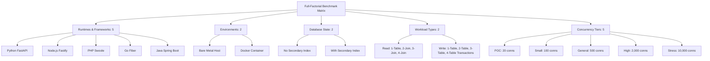

# Multi-Language & Multi-Environment Web Framework Benchmark Suite

> **Language**: **English** | [Thai (ภาษาไทย)](README_TH.md)

---

## 1. Background & Significance

In modern enterprise software engineering, evaluating programming language and framework performance is a critical architectural decision. However, many conventional benchmarks focus primarily on isolated single dimensions—such as basic computational microbenchmarks (e.g., matrix multiplication, recursive functions) or synthetic "Hello World" endpoints [[1]](#1-n-wickramage-2005)[[2]](#2-l-prechelt-2000)[[6]](#6-m-amaral-et-al-2015). 

In modern cloud-native architectures, backends rarely operate in isolation. Instead, applications run inside containerized environments (such as Docker and Kubernetes) and heavily depend on relational database management systems (RDBMS) like MySQL and PostgreSQL. While prior research has investigated differences between monolithic and microservice architectures [[3]](#3-วิลาวัณย์-และคณะ-2559)[[5]](#5-m-villamizar-et-al-2017)[[12]](#12-r-lauwren-et-al-2025) and container virtualization performance [[4]](#4-r-morabito-et-al-2015)[[7]](#7-j-shetty-et-al-2020), there remains a lack of empirical clarity on how containerization overhead, database connection pooling, query complexity, and high-concurrency loads compound together across different programming runtimes.

This benchmark project provides a deterministic, reproducible, and scientifically structured experimental evaluation across **5 programming languages and web frameworks** under **realistic relational database workloads**, comparing **Bare Metal (Host OS)** versus **Docker Containerization** across escalating load scenarios (up to 10,000 concurrent connections).

---

## 2. Research Objectives

1. **Evaluate Architecture & Containerization Overhead**: Measure and compare throughput, response time, and resource virtualization overhead between native host execution (**Bare Metal**) and containerized execution (**Docker**) under relational database workloads.
2. **Comparative Runtime & Framework Analysis**: Analyze the empirical performance of 5 backend language runtimes and web frameworks (**Python / FastAPI**, **Node.js / Fastify**, **PHP / Swoole**, **Go / Fiber**, and **Java / Spring Boot**) across database read operations (single-table and 2-to-4 table `JOIN`s) and write operations (multi-table atomic `POST` transactions).
3. **High-Concurrency Saturation & Resource Limits**: Investigate the impact of secondary database indexing, connection pool sizing, and socket management on response latency, requests-per-second throughput, and error rates under stress-level concurrency (up to 10,000 concurrent connections).

---

## 3. Literature Review & Research Gap

### Summary of Related Studies

| Study | Key Contribution & Focus | Key Findings |
| :--- | :--- | :--- |
| **Wickramage (2005)** [[1]](#1-n-wickramage-2005) | Web service framework benchmark under real business scenarios. | SOAP message complexity and payload size significantly impact system response time. |
| **Prechelt (2000)** [[2]](#2-l-prechelt-2000) | Empirical comparison of 7 scripting and non-scripting languages. | Inter-programmer skill variability often has greater impact on efficiency than programming language differences alone. |
| **Wilawan & Mongkolnam (2016)** [[3]](#3-วิลาวัณย์-และคณะ-2559) | Microservices architecture and container technologies. | Containers resolve dependency conflicts effectively, but resource management overhead increases when running many services on constrained hardware. |
| **Morabito et al. (2015)** [[4]](#4-r-morabito-et-al-2015) | Hypervisors vs. lightweight virtualization (Docker vs Bare Metal vs VMs). | Docker CPU and RAM performance closely match Bare Metal, but distinct latency overhead appears in Network I/O. |
| **Villamizar et al. (2017)** [[5]](#5-m-villamizar-et-al-2017) | Monolithic vs. Microservices deployment in cloud environments. | Monolithic provides lower response time in normal conditions, whereas Microservices offer better scaling cost-efficiency. |
| **Amaral et al. (2015)** [[6]](#6-m-amaral-et-al-2015) | Microservice performance evaluation using containers. | Latency introduced by HTTP/REST communication and JSON serialization compounds multiplicatively across service call chains. |
| **Shetty et al. (2020)** [[7]](#7-j-shetty-et-al-2020) | Empirical performance evaluation of Docker containers vs Bare Metal. | In heavy disk read/write workloads, containers incur approximately 5–10% throughput degradation compared to non-containerized execution. |
| **Ahantarig (2023)** [[8]](#8-วรเทพ-อหันตริก-2566) | Pod autoscaling algorithms on Docker and Kubernetes. | CPU allocation and thread management are the primary determinants of response speed under high traffic. |
| **Ruslan (2023)** [[9]](#9-r-ruslan-2023) | Multi-language web frameworks throughput benchmark. | Go and Java (Vert.x) achieve high throughput, but show significant differences in memory footprint in constrained environments. |
| **Effendy (2021)** [[10]](#10-f-effendy-2021) | Web framework performance based on response time and throughput. | Highlights the necessity of matching language runtime characteristics to application workload profiles. |
| **The-Benchmarker (2024)** [[11]](#11-the-benchmarker-2024) | Cross-layer containerized web framework benchmark with MySQL/PostgreSQL. | Database driver implementation efficiency often dominates total request latency more than raw language compute speed in CRUD tasks. |
| **Lauwren et al. (2025)** [[12]](#12-r-lauwren-et-al-2025) | Microservice and monolith performance comparison in transactional apps. | Monolithic architecture maintains lower average latency in most scenarios, but microservices provide higher request success rates under extreme load. |
| **TechEmpower (2024)** [[13]](#13-techempower-2024) | Industry-standard web framework benchmark suite. | Comprehensive multi-tier tests (Single-query, Multi-queries, Updates, Fortunes) across hundreds of frameworks. |

### Research Gap
Previous literature has largely focused on **isolated, single-dimension evaluations**—such as testing pure computational algorithm execution, evaluating web frameworks with mock in-memory data, or analyzing architecture patterns without considering database layer contention and container network virtualizations. 

This project bridges this research gap through a **multi-factor cross-combination evaluation** (*Full-Factorial Design*), jointly examining language runtimes, containerization overhead, database indexing, query complexity, and concurrency stress tiers.

---

## 4. Research Methodology & Experimental Design

This benchmark employs an **experimental research methodology** using a **Full-Factorial Design** across the following dimensions:



### Experimental Phases:
1. **Experimental Environment Setup**: Host OS tuning (`ulimit -n 65535`), dedicated MySQL 8.0 instance, standardized resource allocations.
2. **Software & System Architecture**: Implementation of identical database schemas, endpoints, query structures, and JSON response formats across all 5 frameworks.
3. **Independent & Dependent Variables Definition**:
   - *Independent Variables*: Language/Framework, Execution Environment (Bare Metal vs. Docker), Indexing State, Query Complexity, Concurrency Level.
   - *Dependent Variables*: Throughput (Req/sec), Average Latency (ms), Max Latency (ms), Socket/Timeout Errors.
4. **Workload Definition**: Read suites (Single-table and 2–4 table `JOIN`s) and Write suites (1–4 table relational transactions).
5. **Execution Protocol**: Automated test harness via `wrk` with warmup phases, database state resets between runs, and multi-iteration averaging (`--runs N`).
6. **Data Analysis**: Statistical aggregation, raw JSON logging, and markdown/CSV summary generation.

---

## 5. Evaluated Technologies & Future Extensibility

The benchmark suite is architected with a **modular Language-first and Framework-subfolder layout** (`frameworks/<language>/<framework>/`), allowing effortless integration and benchmarking of new languages and web frameworks.

### A. Primary Baseline Frameworks
| Language | Web Framework | Database Driver / Client | Concurrency Model | Standard Port |
| :--- | :--- | :--- | :--- | :---: |
| **Python** | **FastAPI** (Uvicorn) | `aiomysql` (Async Connection Pool) | Multi-process Async Event Loop | `8001` |
| **Node.js** | **Fastify** | `mysql2/promise` (Connection Pool) | Multi-core Cluster + Event Loop | `8002` |
| **PHP** | **Swoole** | `PDO_MySQL` (`PDOPool`) | Coroutine Event Loop Engine | `8003` |
| **Go** | **Fiber** (v2) | `database/sql` (`go-sql-driver/mysql`) | Lightweight Goroutines | `8004` |
| **Java** | **Spring Boot** (v3) | `JdbcTemplate` + `HikariCP` | Multi-threaded JVM Thread Pool | `8005` |

### B. Future-Ready Extensible Framework Support
The architecture is pre-configured and ready to scale to additional languages and frameworks:
* **Go**: Gin, Echo, Chi
* **Python**: Flask, Django, BlackSheep, Litestar
* **Node.js / TypeScript**: Express, NestJS, Hono
* **Rust**: Actix-Web, Axum, Rocket
* **C# / .NET**: ASP.NET Core Minimal APIs
* **Ruby**: Ruby on Rails, Sinatra, Hanami
* **Elixir**: Phoenix Framework

### C. Standard Framework Endpoint Contract
Any new framework only needs to implement the standard routes (`GET /`, `GET /raw/1table` to `4join`, `POST /raw/post/1table` to `4table`) to immediately integrate into all automated Bare Metal and Docker benchmark suites.

---

## 6. Test Scenarios & Concurrency Tiers

### A. Read (GET) Workload Suites
* `/raw/1table`: Single-table lookup (`SELECT * FROM users LIMIT 100`)
* `/raw/2join`: 2-table relational query (`users` ⨝ `profiles`)
* `/raw/3join`: 3-table relational query (`users` ⨝ `profiles` ⨝ `orders`)
* `/raw/4join`: 4-table relational query (`users` ⨝ `profiles` ⨝ `orders` ⨝ `order_items`)

Tested under two database states:
1. **`get_no_index`**: Executed without secondary foreign-key indexes (forces table scans).
2. **`get_with_index`**: Executed with optimized secondary B-tree indexes on foreign keys.

### B. Write (POST) Workload Suite (Transactions)
* `/raw/post/1table`: Atomic single-table insert into `users`.
* `/raw/post/2table`: Multi-table relational transaction across `users` and `profiles`.
* `/raw/post/3table`: Transaction across `users`, `profiles`, and `orders`.
* `/raw/post/4table`: Comprehensive transaction across `users`, `profiles`, and `orders`, and multiple `order_items`.

### C. Concurrency Load Testing Tiers (via `wrk`)

| Tier Option (`--tier`) | Scenario | Target Scale | Threads (`-t`) | Connections (`-c`) | Duration (`-d`) |
| :--- | :--- | :--- | :---: | :---: | :---: |
| **`poc`** | **Proof-of-Concept / Prototype** | Prototype, small department tool | `2` | `20` | `30s` |
| **`small`** | **Small Production System** | Local business, internal web portal | `4` | `100` | `60s` |
| **`general`** | **General Web Application** | E-commerce, university portal, CMS | `8` | `500` | `60s` |
| **`high`** | **High-Density Web Platform** | High-traffic SaaS, media portal | `8` | `2,000` | `120s` |
| **`stress`** | **Stress / Saturation Testing** | System limit & connection pool exhaustion | `16` | `10,000` | `300s` |
| **`all`** | **All Scenarios (Default)** | Sequential evaluation across all 5 tiers | Sequential | Sequential | Cumulative |

---

## 7. Key Findings & Empirical Results

### Executive Comparison: Docker vs Bare Metal (`/raw/1table` - Light Load)

| Suite | Language | Docker (Req/s) | Bare Metal (Req/s) | Docker Latency | BME Latency | Overhead / Gain |
| :--- | :--- | :---: | :---: | :---: | :---: | :---: |
| **get_no_index** | **Go** | 10,988.10 | 11,928.00 | 10.67ms | 9.30ms | +8.6% BME |
| **get_no_index** | **Java** | 9,231.73 | 11,958.11 | 12.24ms | 8.37ms | +29.5% BME |
| **get_no_index** | **Node.js** | 2,041.90 | 7,016.52 | 49.18ms | 16.30ms | +243.6% BME |
| **get_no_index** | **PHP** | 16,002.61 | 15,762.22 | 6.94ms | 7.27ms | -1.5% BME |
| **get_no_index** | **Python** | 2,515.54 | 1,624.44 | 40.03ms | 61.24ms | -35.4% BME |
| **get_with_index** | **Go** | 10,958.75 | 11,824.33 | 10.71ms | 9.34ms | +7.9% BME |
| **get_with_index** | **Java** | 10,133.17 | 11,760.51 | 10.80ms | 8.51ms | +16.1% BME |
| **get_with_index** | **Node.js** | 2,046.80 | 11,071.53 | 49.07ms | 9.10ms | +440.9% BME |
| **get_with_index** | **PHP** | 17,011.24 | 16,817.10 | 7.51ms | 6.27ms | -1.1% BME |
| **get_with_index** | **Python** | 2,557.69 | 1,908.37 | 41.69ms | 52.19ms | -25.4% BME |

> For complete tabular results across all endpoints, tiers, and raw metrics, see [main_web_benchmark/results/SUMMARY.md](main_web_benchmark/results/SUMMARY.md).

---

## 8. How to Run the Benchmarks

### Prerequisites
* MySQL 8.0 instance running on port `3306` (`user=admin`, `password=secret`, `database=benchmark_db`).
* Python 3.10+ and HTTP load generator `wrk` installed.
* Docker & Docker Compose (for containerized benchmark runs).

### Execution Commands
```bash
# 1. Run GET (No Index) Bare Metal Benchmark across all load tiers (3 runs averaged)
cd main_web_benchmark/GET/get_no_index
python3 run_bme_wrk.py --tier all --runs 3

# 2. Run GET (With Index) Docker Container Benchmark
cd main_web_benchmark/GET/get_with_index
python3 run_dkr_wrk.py --tier all --runs 3

# 3. Run POST Write / Transaction Benchmark
cd main_web_benchmark/POST
python3 run_bme_wrk.py --tier all --runs 3
```

### CLI Arguments
* `--tier {poc,small,general,high,stress,all}` (Default: `all`): Select target concurrency tier.
* `--runs N` (Default: `1`): Number of test iterations per endpoint to compute statistical averages.
* `--no-warmup` (Default: False): Skip the 3-second warmup phase before recording.

### Aggregating & Visualizing Results
```bash
# View formatted CLI comparison table
cd main_web_benchmark
python3 compare_results.py GET/get_no_index/dkr_benchmark_results.json

# Regenerate centralized SUMMARY.md and SUMMARY.csv
cd main_web_benchmark/results
python3 generate_summary.py
```

---

## 9. Repository Structure

```text
Programming-Benchmark/
├── Programming_Benchmark_Report.docx  # Formal academic benchmark report
├── Programming_Benchmark_Report.md    # Markdown transcription of academic report
├── README.md                          # English suite documentation & research overview
├── README_TH.md                       # Thai suite documentation & research overview
├── main_web_benchmark/                # Main web framework benchmark suite
│   ├── GET/
│   │   ├── get_no_index/              # Read suite without secondary indexes
│   │   │   ├── frameworks/            # Language & framework implementations (go, java, nodejs, php, python)
│   │   │   ├── docker-compose.yml     # Container orchestration pointing to frameworks/
│   │   │   ├── run_bme_wrk.py         # Bare metal multi-tier runner
│   │   │   └── run_dkr_wrk.py         # Docker container multi-tier runner
│   │   └── get_with_index/            # Read suite with secondary indexes
│   │       ├── frameworks/            # Language & framework implementations (go, java, nodejs, php, python)
│   │       ├── docker-compose.yml
│   │       ├── run_bme_wrk.py
│   │       └── run_dkr_wrk.py
│   ├── POST/                          # Write / transaction benchmark suite
│   │   ├── frameworks/                # Language & framework implementations (go, java, nodejs, php, python)
│   │   ├── docker-compose.yml
│   │   ├── run_bme_wrk.py
│   │   └── run_dkr_wrk.py
│   ├── results/                       # Aggregated results and reports
│   │   ├── raw_results/               # Per-run raw iteration logs
│   │   ├── generate_summary.py        # Summary generation script
│   │   ├── SUMMARY.md                 # Consolidated markdown results
│   │   └── SUMMARY.csv                # Consolidated CSV results
│   ├── compare_results.py             # CLI comparison table generator
│   └── issue.md                       # Technical audit and anomaly analysis
└── benchmark/                         # Computational microbenchmarks (recursive, interactive)
```

---

## 10. References & Bibliography

<a id="1-n-wickramage-2005"></a>
[1] N. Wickramage, "A benchmark for web service frameworks," Master's thesis, Department of Computer Science, Indiana University, Bloomington, IN, USA, 2005.

<a id="2-l-prechelt-2000"></a>
[2] L. Prechelt, "An empirical comparison of seven programming languages," *IEEE Computer*, vol. 33, no. 10, pp. 23–29, Oct. 2000. doi: [10.1109/2.876288](https://doi.org/10.1109/2.876288).

<a id="3-วิลาวัณย์-และคณะ-2559"></a>
[3] วิลาวัณย์ รักประชาสรรค์ และ พรชัย มงคลนาม, "สถาปัตยกรรม Microservices กับเทคโนโลยี Containers," *วารสารวิชาการพระจอมเกล้าพระนครเหนือ*, ปีที่ 26, ฉบับที่ 3, หน้า 511–522, ก.ย.–ธ.ค. 2559.

<a id="4-r-morabito-et-al-2015"></a>
[4] R. Morabito, J. Kjällman, and M. Komu, "Hypervisors vs. lightweight virtualization: A performance comparison," in *Proc. IEEE Int. Conf. Cloud Eng. (IC2E)*, Tempe, AZ, USA, 2015, pp. 386–393. doi: [10.1109/IC2E.2015.74](https://doi.org/10.1109/IC2E.2015.74).

<a id="5-m-villamizar-et-al-2017"></a>
[5] M. Villamizar et al., "Evaluating the monolithic and the microservice architecture pattern to deploy web applications in the cloud," in *Proc. 10th Int. Conf. High Perform. Comput. Commun. (HPCC)*, Bangor, UK, 2017, pp. 583–590. doi: [10.1109/HPCC/SmartCity/DSS.2016.0086](https://doi.org/10.1109/HPCC/SmartCity/DSS.2016.0086).

<a id="6-m-amaral-et-al-2015"></a>
[6] M. Amaral et al., "Performance evaluation of microservices architectures using containers," in *Proc. 14th Int. Symp. Netw. Comput. Appl. (NCA)*, Cambridge, MA, USA, 2015, pp. 27–34. doi: [10.1109/NCA.2015.10](https://doi.org/10.1109/NCA.2015.10).

<a id="7-j-shetty-et-al-2020"></a>
[7] J. Shetty et al., "An empirical performance evaluation of Docker container and bare metal server," in *Proc. Int. Conf. Emerg. Trends Inf. Technol. Eng. (ic-ETITE)*, Vellore, India, 2020, pp. 1–6. doi: [10.1109/ic-ETITE47903.2020.9077782](https://doi.org/10.1109/ic-ETITE47903.2020.9077782).

<a id="8-วรเทพ-อหันตริก-2566"></a>
[8] วรเทพ อหันตริก, "การประเมินและเปรียบเทียบประสิทธิภาพการทำงานของอัลกอริทึมการขยายตัวอัตโนมัติของพอดบนแพลตฟอร์มคูเบอร์เนเตส," วิทยานิพนธ์ วท.ม., คณะวิทยาการสารสนเทศ, มหาวิทยาลัยบูรพา, ชลบุรี, ประเทศไทย, 2566.

<a id="9-r-ruslan-2023"></a>
[9] R. Ruslan, "Web Frameworks Benchmark," GitHub Repository, 2023. [Online]. Available: [https://github.com/the-benchmarker/web-frameworks](https://github.com/the-benchmarker/web-frameworks).

<a id="10-f-effendy-2021"></a>
[10] F. Effendy, "Performance comparison of web frameworks based on response time and throughput," *Jurnal RESTI (Rekayasa Sistem dan Teknologi Informasi)*, vol. 5, no. 4, pp. 780–786, 2021. doi: [10.29207/resti.v5i4.3312](https://doi.org/10.29207/resti.v5i4.3312).

<a id="11-the-benchmarker-2024"></a>
[11] The-Benchmarker, "Which is the fastest web framework?," 2024. [Online]. Available: [https://web-frameworks-benchmark.netlify.app/](https://web-frameworks-benchmark.netlify.app/).

<a id="12-r-lauwren-et-al-2025"></a>
[12] R. Lauwren, A. F. Wicaksono, and D. I. Sensuse, "Microservice and monolith performance comparison in transaction application," in *Proc. Int. Conf. Adv. Comput. Sci. Inf. Syst. (ICACSIS)*, 2025, pp. 1–8.

<a id="13-techempower-2024"></a>
[13] TechEmpower, "TechEmpower Web Framework Benchmarks," 2024. [Online]. Available: [https://www.techempower.com/benchmarks/](https://www.techempower.com/benchmarks/).
