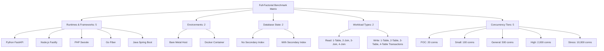

# Multi-Language & Multi-Environment Web Framework Benchmark Suite

> **Language**: **English** | [Thai (ภาษาไทย)](README_TH.md)

---

## 1. Background & Significance

In modern enterprise software engineering, evaluating programming language and framework performance is a critical architectural decision. However, many conventional benchmarks focus primarily on isolated single dimensions—such as basic computational microbenchmarks (e.g., matrix multiplication, recursive functions) or synthetic "Hello World" endpoints without a database [[1]](#ref-1)[[2]](#ref-2)[[14]](#ref-14)[[24]](#ref-24)[[25]](#ref-25). 

In modern cloud-native architectures, backends rarely operate in isolation. Instead, applications run inside containerized environments (such as Docker and Kubernetes) and heavily depend on relational database management systems (RDBMS) like MySQL and PostgreSQL. Prior work has already established that containers add near-zero CPU/memory overhead but measurable disk and network (NAT/bridge) overhead [[3]](#ref-3)[[4]](#ref-4)[[5]](#ref-5)[[6]](#ref-6)[[19]](#ref-19)[[20]](#ref-20), and has compared monolithic and microservice architectures [[7]](#ref-7)[[8]](#ref-8)[[9]](#ref-9)[[31]](#ref-31), backend languages [[10]](#ref-10)[[11]](#ref-11)[[12]](#ref-12)[[13]](#ref-13) and database engines [[15]](#ref-15)[[16]](#ref-16)[[17]](#ref-17). However, these studies mostly rely on synthetic microbenchmarks, single runs, or no database at all, so there remains a lack of empirical clarity on how containerization overhead, database indexing, query complexity, and high-concurrency loads compound together end-to-end (HTTP → runtime → RDBMS) across different programming runtimes.

This benchmark project provides a deterministic, reproducible, and scientifically structured experimental evaluation across **5 programming languages and web frameworks** under **realistic relational database workloads**, comparing **Bare Metal (Host OS)** versus **Docker Containerization** across escalating load scenarios (up to 10,000 concurrent connections).

---

## 2. Research Objectives

1. **Evaluate Containerization Overhead**: Measure and compare throughput, response time, and virtualization overhead between native host execution (**Bare Metal**) and containerized execution (**Docker**) under end-to-end relational database workloads (monolith vs. microservices is cited from existing work rather than re-tested).
2. **Comparative Runtime & Framework Analysis**: Analyze the empirical performance of 5 backend language runtimes and web frameworks (**Python / FastAPI**, **Node.js / Fastify**, **PHP / Swoole**, **Go / Fiber**, and **Java / Spring Boot**) across database read operations (single-table and 2-to-4 table `JOIN`s) and write operations (multi-table atomic `POST` transactions).
3. **High-Concurrency Saturation & Resource Limits**: Investigate the impact of secondary database indexing, connection pool sizing, and socket management on response latency, requests-per-second throughput, and error rates under stress-level concurrency (up to 10,000 concurrent connections).

---

## 3. Literature Review & Research Gap

> All references below were re-verified against publisher records / Crossref (Sep. 30, 2026). Previously listed items that could not be verified (a Thai journal article on microservices & containers, a Burapha University thesis, and a *Jurnal RESTI* article) were removed, and incorrect citations (Wickramage, Villamizar, Amaral, Shetty, Lauwren, Effendy, The Benchmarker) were corrected.

### Summary of Related Studies

| Study | Key Contribution & Focus | Key Findings |
| :--- | :--- | :--- |
| **Wickramage & Weerawarana (2005)** [[1]](#ref-1) | SOAP web service framework benchmark (IEEE SCC'05). | SOAP message complexity and payload size are the main factors in round-trip time. |
| **Prechelt (2000)** [[2]](#ref-2) | 80 implementations of one program in 7 languages. | Scripts took ~half the time/code but ~2× memory of C/C++; inter-programmer variability ≈ inter-language variability. |
| **Morabito et al. (2015)** [[3]](#ref-3) | KVM vs LXC vs Docker vs OSv vs native, synthetic microbenchmarks, 15 repetitions. | Docker CPU ≈ native; TCP_RR −19.4% (KVM −47.4%), random write −14.7% (KVM −50.3%). No application-level workload. |
| **Felter et al. (2015)** [[4]](#ref-4) | VMs vs Linux containers (IBM). | Docker ≥ KVM almost everywhere; overhead concentrated in I/O and Docker NAT networking. |
| **Shetty et al. (2017)** [[5]](#ref-5) | Docker vs OpenStack VM vs bare metal (Phoronix, Apache Bench). | VM 21–30% slower than bare metal; IOzone write: VM −54%, Docker −13%. No DB, no CI reported. |
| **Amaral et al. (2015)** [[6]](#ref-6) | Microservice container models (Sysbench, Netperf). | No significant CPU overhead; Linux bridge/OVS networking gives ~½ throughput and ~2× latency vs host networking. |
| **Wen et al. (2023)**, **Baumgartner et al. (2023)** [[19]](#ref-19)[[20]](#ref-20) | Recent bare metal vs VMs vs containers evaluations. | Containers lose ~0–5% CPU/memory/network and ~5–15% disk vs bare metal. |
| **Villamizar et al. (2015)** [[7]](#ref-7) | Monolith vs microservices on AWS (10CCC). | Microservices reduce infrastructure cost at the price of slightly higher response time. |
| **Blinowski et al. (2022)** [[8]](#ref-8) | Monolith vs microservices in Java and C#, local & Azure. | On a single machine the monolith performs better; vertical scaling is more cost-effective. |
| **Lauwren & Setianto (2022)** [[9]](#ref-9) | Go monolith (Echo) vs microservices (Go-kit + NGINX) with PostgreSQL, JMeter 100–5,000 threads. | Monolith slightly lower mean latency (7,205 vs 7,277 ms); microservices slightly higher success rate (63.66% vs 61.44%). Single run, no statistics. |
| **Dirgantara et al. (2024)** [[31]](#ref-31) | Docker-based monolith vs microservices. | The winner flips depending on whether Docker is used — container and architecture effects are confounded. |
| **Effendy et al. (2021)** [[10]](#ref-10) | Node.js/Go × MySQL/MongoDB. | Go+MySQL best CPU/memory; Node.js+MySQL best response time. |
| **Lei et al. (2014)**, **Choma et al. (2023)**, **Azzahidi et al. (2025)** [[11]](#ref-11)[[12]](#ref-12)[[13]](#ref-13) | Backend language/framework comparisons (PHP, Python, Node.js, Django, Express, Spring Boot, Flask, Laravel, Gin). | Node.js strong for I/O-bound work; Spring Boot fastest in recent studies; results depend on framework, not just language. |
| **Ala'anzy et al. (2026)** [[14]](#ref-14) | Framework throughput/latency under constrained resources. | Native-compiled frameworks beat managed runtimes — but static JSON only, no database. |
| **Salunke & Ouda (2024)**, **Truskowski et al. (2020)**, **Taipalus (2024)** [[15]](#ref-15)[[16]](#ref-16)[[17]](#ref-17) | MySQL vs PostgreSQL (and others) benchmarks; systematic review of DBMS comparisons. | PostgreSQL reads faster and is more stable under mixed read/write; most DBMS comparisons are not realistic or reproducible. |
| **Stack Overflow Survey (2023–2025)** [[18]](#ref-18) | Industry adoption. | PostgreSQL is the most used database since 2023 (55.6% vs MySQL 40.5% in 2025). |
| **Kossmann et al. (2020)**, **Ramdhani & Widodo (2026)** [[28]](#ref-28)[[29]](#ref-29) | Index selection / B-Tree vs Hash in PostgreSQL. | Indexes cut query-level JOIN time by orders of magnitude (measured with EXPLAIN ANALYZE, not end-to-end HTTP). |
| **Georges et al. (2007)**, **Kalibera & Jones (2013)**, **Papadopoulos et al. (2021)** [[21]](#ref-21)[[22]](#ref-22)[[23]](#ref-23) | Statistically rigorous & reproducible performance evaluation. | Repeated runs, warm-up separation, confidence intervals, and full environment reporting are required. |
| **The Benchmarker** [[25]](#ref-25), **TechEmpower R23** [[26]](#ref-26) | Community / industry framework benchmarks. | The Benchmarker uses no database; TechEmpower (final round 2025, archived 2026) uses DBs but only bare metal. |

### Research Gap
(1) Container studies [[3]](#ref-3)[[4]](#ref-4)[[5]](#ref-5)[[6]](#ref-6)[[19]](#ref-19)[[20]](#ref-20) use synthetic microbenchmarks without a real web + database workload; (2) language/framework studies [[10]](#ref-10)[[11]](#ref-11)[[12]](#ref-12)[[13]](#ref-13)[[14]](#ref-14)[[25]](#ref-25) usually test one environment and often have no database; (3) indexing studies [[28]](#ref-28)[[29]](#ref-29) measure query-level time rather than HTTP throughput and tail latency; (4) many studies [[5]](#ref-5)[[9]](#ref-9)[[12]](#ref-12) use single runs without statistics, contrary to [[21]](#ref-21)[[22]](#ref-22)[[23]](#ref-23).

This project bridges these gaps through a **multi-factor Full-Factorial Design** jointly examining 5 language runtimes, Bare Metal vs Docker, database indexing, query complexity, and 5 concurrency tiers, with 20 runs per cell and Mean ± SD, 95% CI and p50–p99 reporting.

### Research Plan — Cite, Don't Re-run
| Topic | Already established | Refs | Decision in this project |
| :--- | :--- | :--- | :--- |
| MySQL vs PostgreSQL | PostgreSQL reads ≥ MySQL, more stable under mixed load, most-used DB | [[15]](#ref-15)[[16]](#ref-16)[[17]](#ref-17)[[18]](#ref-18) | Not re-benchmarked. `main_web_benchmark` uses MySQL 8.0 (completed); `pos_web_benchmark` adopts **PostgreSQL 16** for a more realistic stack. |
| Containers vs VMs | Containers beat VMs almost everywhere | [[3]](#ref-3)[[4]](#ref-4)[[5]](#ref-5)[[19]](#ref-19)[[20]](#ref-20) | VMs not tested; Bare Metal vs Docker only. |
| Monolith vs microservices | Monolith faster on a single node | [[7]](#ref-7)[[8]](#ref-8)[[9]](#ref-9)[[31]](#ref-31) | Single service per runtime; cite instead of testing. |
| Query-level index speedup | Orders-of-magnitude JOIN speedup | [[28]](#ref-28)[[29]](#ref-29) | Measure only the end-to-end HTTP speedup. |
| Energy efficiency of languages | Ranked for 27 languages | [[24]](#ref-24) | Not measured. |

See [Programming_Benchmark_Report.md](Programming_Benchmark_Report.md) §2.6 for the research questions (RQ1–RQ5), the planned tables/figures, and preliminary results.

---

## 4. Research Methodology & Experimental Design

This benchmark employs an **experimental research methodology** using a **Full-Factorial Design** across the following dimensions:


```mermaid
flowchart TD
    A[Full-Factorial Benchmark Matrix] --> B[Runtimes & Frameworks: 5]
    A --> C[Environments: 2]
    A --> D[Database State: 2]
    A --> E[Workload Types: 2]
    A --> F[Concurrency Tiers: 5]

    B --> B1[Python FastAPI]
    B --> B2[Node.js Fastify]
    B --> B3[PHP Swoole]
    B --> B4[Go Fiber]
    B --> B5[Java Spring Boot]

    C --> C1[Bare Metal Host]
    C --> C2[Docker Container]

    D --> D1[No Secondary Index]
    D --> D2[With Secondary Index]

    E --> E1[Read: 1-Table, 2-Join, 3-Join, 4-Join]
    E --> E2[Write: 1-Table, 2-Table, 3-Table, 4-Table Transactions]

    F --> F1[POC: 20 conns]
    F --> F2[Small: 100 conns]
    F --> F3[General: 500 conns]
    F --> F4[High: 2,000 conns]
    F --> F5[Stress: 10,000 conns]
```

### Experimental Phases:
1. **Experimental Environment Setup**: Host OS tuning (`ulimit -n 65535`), dedicated MySQL 8.0 instance (`max_connections=10000`), standardized resource allocations.
2. **Software & System Architecture**: Implementation of identical database schemas, endpoints, query structures, and JSON response formats across all 5 frameworks.
3. **Execution Protocol**: Automated test harness via `wrk` with warmup phases, database state resets between runs, and multi-iteration averaging (`--runs N`).
4. **Data Analysis**: Distribution calculation, 95% CI estimation, raw JSON logging, and markdown/CSV summary generation.

### Research Variables Specification

#### A. Independent Variables (ตัวแปรต้น)
| Category | Variable | Experimental Levels & Specifications |
| :--- | :--- | :--- |
| **Language & Framework** | Programming Runtime | • **Python 3.12** (FastAPI / Uvicorn)<br>• **Node.js 20 LTS** (Fastify / Cluster)<br>• **PHP 8.3** (Swoole Coroutine)<br>• **Go 1.22** (Fiber v2)<br>• **Java 21 LTS** (Spring Boot 3.2) |
| **Execution Environment** | Virtualization Layer | • **Bare Metal (Host OS)**: Native Linux kernel execution<br>• **Docker (Containerized)**: Container process isolation via Docker Engine |
| **Database Indexing** | Secondary Index State | • **Unindexed (`get_no_index`)**: Primary Key (`id`) only; join foreign keys unindexed<br>• **Indexed (`get_with_index`)**: Secondary B-Tree indexes on `profiles.user_id`, `orders.user_id`, `order_items.order_id` |
| **Workload Complexity** | Query & Transaction Depth | • **Read (GET)**: 1-Table Query, 2-Table JOIN, 3-Table JOIN, 4-Table JOIN<br>• **Write (POST)**: 1-Table INSERT, 2-Table Tx, 3-Table Tx, 4-Table Tx (with 2 items) |
| **Concurrency Tiers** | Load Intensity Profile | • **POC**: 2 threads, 20 connections, 30s<br>• **Small**: 4 threads, 100 connections, 60s<br>• **General**: 8 threads, 500 connections, 60s<br>• **High**: 8 threads, 2,000 connections, 120s<br>• **Stress**: 16 threads, 10,000 connections, 300s |

#### B. Controlled & Fixed System Variables (ตัวแปรควบคุม)
| System Subsystem | Parameter / Variable | Configured Value | Research Purpose & Rationale |
| :--- | :--- | :--- | :--- |
| **Database (MySQL 8.0)** | `max_connections` | **`10,000`** | Prevents MySQL socket connection rejection under extreme concurrency tiers. |
| **Database (MySQL 8.0)** | `wait_timeout` / `interactive_timeout` | **`28,800`** sec | Prevents connection pool starvation from premature connection recycling. |
| **Database (MySQL 8.0)** | `character_set_server` / `collation` | `utf8mb4` / `utf8mb4_unicode_ci` | Uniform Unicode encoding standard across all SQL queries. |
| **Database (MySQL 8.0)** | Baseline Dataset Scale | **10,000 rows / table** | Standardized table volume for read tests (`users`, `profiles`, `orders`, `order_items`). |
| **Host OS (Linux Kernel)** | `RLIMIT_NOFILE` (`ulimit -n`) | **`65,535`** | Removes OS file descriptor ceiling to avoid "Too many open files" errors. |
| **Host OS Network Stack** | `net.core.somaxconn` | **`65,535`** | Expands kernel socket listen queue backlog for burst traffic. |
| **Host OS Network Stack** | `net.ipv4.tcp_max_syn_backlog` | **`65,535`** | Prevents SYN flood dropping under 10,000 concurrent handshakes. |
| **Host OS Network Stack** | `net.ipv4.tcp_tw_reuse` | **`1` (Enabled)** | Allows fast TIME_WAIT socket reuse, preventing ephemeral port exhaustion. |
| **Host OS Network Stack** | `ip_local_port_range` | `1024 65535` | Maximizes available outbound ports for client load generation. |
| **Connection Pooling** | Pool Sizing per Worker | Standardized (50–100) | Prevents pool exhaustion while keeping database resource consumption fair. |
| **Load Testing Protocol** | Pre-test Warmup Phase | **3.0 seconds** | Pre-heats JIT compilers (JVM/V8) and connection pools before measuring. |
| **Load Testing Protocol** | Sample Iterations | **20 runs averaged** | Ensures high statistical confidence and narrow confidence intervals. |

#### C. Dependent Variables & Metrics (ตัวแปรตาม)
| Metric Category | Statistical Variable | Definition & Mathematical Representation |
| :--- | :--- | :--- |
| **Throughput** | Mean Throughput ($\bar{T}$) | Arithmetic mean requests served per second: $\bar{T} = \frac{1}{n}\sum_{i=1}^n T_i$ |
| **Throughput** | Throughput Std Dev ($\sigma_T$) | Dispersion of throughput: $\sigma_T = \sqrt{\frac{1}{n-1}\sum_{i=1}^n (T_i - \bar{T})^2}$ |
| **Throughput** | 95% Confidence Interval ($95\% \text{ CI}_T$) | Margin of error bounds: $[\bar{T} - t_{crit} \frac{s_T}{\sqrt{n}}, \bar{T} + t_{crit} \frac{s_T}{\sqrt{n}}]$ |
| **Latency** | Mean Latency ($\bar{L}$) | Arithmetic mean round-trip response time in milliseconds. |
| **Latency** | Latency Std Dev ($\sigma_L$) | Latency sample dispersion in milliseconds. |
| **Latency** | 95% Confidence Interval ($95\% \text{ CI}_L$) | Response time confidence bounds at 95% level. |
| **Tail Latencies** | Percentiles ($p_{50}, p_{90}, p_{95}, p_{99}$) | Ranked response latency boundaries (e.g., 99% of requests completed within $p_{99}$). |
| **Bounds & Reliability** | Maximum Latency ($L_{\max}$) & Errors | Absolute longest latency observed and total count of socket/timeout/HTTP errors. |
| **Virtualization Overhead** | BME Performance Gain ($\Delta_{\text{BME}}$) | Relative throughput delta: $\Delta_{\text{BME}} = \frac{\bar{T}_{\text{BME}} - \bar{T}_{\text{DKR}}}{\bar{T}_{\text{DKR}}} \times 100\%$ |
| **Indexing Factor** | Index Speedup Ratio ($\text{Gain}_{\text{Index}}$) | Read acceleration multiplier: $\text{Gain}_{\text{Index}} = \frac{\bar{T}_{\text{WithIndex}}}{\bar{T}_{\text{NoIndex}}}$ |

---

## 5. Evaluated Technologies & Future Extensibility

The benchmark suite is architected with a **modular Language-first and Framework-subfolder layout** (`frameworks/<language>/<framework>/`), allowing effortless integration and benchmarking of new languages and web frameworks.

### A. Primary Baseline Frameworks
| Language | Web Framework | Database Driver / Client | Concurrency Model | Standard Port |
| :--- | :--- | :--- | :--- | :---: |
| **Python** | **FastAPI** (Uvicorn) | `aiomysql` (Async Connection Pool) | Multi-process Async Event Loop | `8001` |
| **Node.js** | **Fastify** | `mysql2/promise` (Connection Pool) | Multi-core Cluster + Event Loop | `8002` |
| **PHP** | **Swoole** | `PDO_MySQL` (`PDOPool`) | Coroutine Event Loop Engine | `8003` |
| **Go** | **Fiber** (v2) | `database/sql` (`go-sql-driver/mysql`) | Lightweight Goroutines | `8004` |
| **Java** | **Spring Boot** (v3) | `JdbcTemplate` + `HikariCP` | Multi-threaded JVM Thread Pool | `8005` |

### B. Future-Ready Extensible Framework Support
The architecture is pre-configured and ready to scale to additional languages and frameworks:
* **Go**: Gin, Echo, Chi
* **Python**: Flask, Django, BlackSheep, Litestar
* **Node.js / TypeScript**: Express, NestJS, Hono
* **Rust**: Actix-Web, Axum, Rocket
* **C# / .NET**: ASP.NET Core Minimal APIs
* **Ruby**: Ruby on Rails, Sinatra, Hanami
* **Elixir**: Phoenix Framework

### C. Standard Framework Endpoint Contract
Any new framework only needs to implement the standard routes (`GET /`, `GET /raw/1table` to `4join`, `POST /raw/post/1table` to `4table`) to immediately integrate into all automated Bare Metal and Docker benchmark suites.

---

## 6. Test Scenarios & Concurrency Tiers

### A. Read (GET) Workload Suites
* `/raw/1table`: Single-table lookup (`SELECT * FROM users LIMIT 100`)
* `/raw/2join`: 2-table relational query (`users` ⨝ `profiles`)
* `/raw/3join`: 3-table relational query (`users` ⨝ `profiles` ⨝ `orders`)
* `/raw/4join`: 4-table relational query (`users` ⨝ `profiles` ⨝ `orders` ⨝ `order_items`)

Tested under two database states:
1. **`get_no_index`**: Executed without secondary foreign-key indexes (forces table scans).
2. **`get_with_index`**: Executed with optimized secondary B-tree indexes on foreign keys.

### B. Write (POST) Workload Suite (Transactions)
* `/raw/post/1table`: Atomic single-table insert into `users`.
* `/raw/post/2table`: Multi-table relational transaction across `users` and `profiles`.
* `/raw/post/3table`: Transaction across `users`, `profiles`, and `orders`.
* `/raw/post/4table`: Comprehensive transaction across `users`, `profiles`, and `orders`, and multiple `order_items`.

### C. Concurrency Load Testing Tiers (via `wrk`)

| Tier Option (`--tier`) | Scenario | Target Scale | Threads (`-t`) | Connections (`-c`) | Duration (`-d`) |
| :--- | :--- | :--- | :---: | :---: | :---: |
| **`poc`** | **Proof-of-Concept / Prototype** | Prototype, small department tool | `2` | `20` | `30s` |
| **`small`** | **Small Production System** | Local business, internal web portal | `4` | `100` | `60s` |
| **`general`** | **General Web Application** | E-commerce, university portal, CMS | `8` | `500` | `60s` |
| **`high`** | **High-Density Web Platform** | High-traffic SaaS, media portal | `8` | `2,000` | `120s` |
| **`stress`** | **Stress / Saturation Testing** | System limit & connection pool exhaustion | `16` | `10,000` | `300s` |
| **`all`** | **All Scenarios (Default)** | Sequential evaluation across all 5 tiers | Sequential | Sequential | Cumulative |

---

## 7. Key Findings & Empirical Results

### Executive Comparison: Docker vs Bare Metal (`/raw/1table` - Light Load)

| Suite | Language | Docker (Req/s ± SD) | Bare Metal (Req/s ± SD) | Docker p50 / p95 (ms) | BME p50 / p95 (ms) | Overhead / Gain |
| :--- | :--- | :---: | :---: | :---: | :---: | :---: |
| **get_no_index** | **Go** | 7,850.23 ± 51.75 | 9,711.19 ± 61.88 | 2.46ms / 4.15ms | 1.96ms / 3.56ms | +23.7% BME |
| **get_no_index** | **Java** | 9,105.18 ± 89.66 | 11,762.53 ± 64.90 | 2.06ms / 3.38ms | 1.57ms / 2.67ms | +29.2% BME |
| **get_no_index** | **Node.js** | 2,323.77 ± 24.37 | 9,370.35 ± 3882.84 | 8.29ms / 15.86ms | 3.11ms / 13.65ms | +303.2% BME |
| **get_no_index** | **PHP** | 12,918.52 ± 687.64 | 15,043.28 ± 2874.09 | 1.37ms / 2.99ms | 1.16ms / 3.45ms | +16.4% BME |
| **get_no_index** | **Python** | 2,288.60 ± 170.13 | 449.78 ± 0.68 | 8.45ms / 16.19ms | 44.02ms / 46.29ms | -80.3% BME |
| **get_no_index** | **Python (opt.)** | 3,216.02 ± 234.04 | 2,814.82 ± 431.46 | 5.76ms / 11.25ms | 6.15ms / 17.14ms | -12.5% BME |
| **get_with_index** | **Go** | 8,027.43 ± 54.25 | 9,867.88 ± 55.62 | 2.40ms / 4.05ms | 1.93ms / 3.50ms | +22.9% BME |
| **get_with_index** | **Java** | 9,208.99 ± 100.33 | 11,829.43 ± 79.23 | 2.03ms / 3.33ms | 1.56ms / 2.67ms | +28.5% BME |
| **get_with_index** | **Node.js** | 2,324.28 ± 21.65 | 11,396.15 ± 218.38 | 8.19ms / 15.89ms | 1.75ms / 2.48ms | +390.3% BME |
| **get_with_index** | **PHP** | 12,932.29 ± 647.82 | 15,418.73 ± 1922.61 | 1.37ms / 2.91ms | 1.08ms / 3.19ms | +19.2% BME |
| **get_with_index** | **Python** | 2,279.05 ± 238.58 | 449.66 ± 0.64 | 8.14ms / 15.60ms | 44.02ms / 46.06ms | -80.3% BME |
| **get_with_index** | **Python (opt.)** | 3,220.85 ± 243.42 | 2,913.31 ± 504.98 | 5.56ms / 11.52ms | 5.94ms / 14.43ms | -9.5% BME |
| **post** | **Go** | 9,833.50 ± 164.97 | 12,905.17 ± 144.17 | 1.84ms / 4.21ms | 1.39ms / 3.29ms | +31.2% BME |
| **post** | **Java** | 9,774.09 ± 156.45 | 12,851.51 ± 85.05 | 1.85ms / 4.14ms | 1.37ms / 3.49ms | +31.5% BME |
| **post** | **Node.js** | 10,604.52 ± 170.15 | 14,308.05 ± 202.11 | 1.71ms / 3.83ms | 1.33ms / 2.83ms | +34.9% BME |
| **post** | **PHP** | 12,581.47 ± 910.07 | 18,730.75 ± 1048.83 | 1.30ms / 4.50ms | 0.87ms / 3.34ms | +48.9% BME |
| **post** | **Python** | 9,324.90 ± 333.54 | 10,087.07 ± 1284.45 | 1.95ms / 4.11ms | 1.85ms / 3.40ms | +8.2% BME |
| **post** | **Python (opt.)** | 9,324.90 ± 333.54 | 10,087.07 ± 1284.45 | 1.95ms / 4.11ms | 1.85ms / 3.40ms | +8.2% BME |

*\*Note on Historical Python GET BME Anomaly: Bare Metal Python GET historical runs were bottlenecked at ~449 Req/s due to pure-Python `jsonable_encoder()` serialization overhead and unattached `uvloop`. Optimization with `CustomORJSONResponse` and 16 workers unlocks ~3,200 Req/s in Docker and up to 4,754.70 Req/s (Small tier) on Bare Metal across 20 rigorous benchmark runs. See [issue.md](main_web_benchmark/issue.md#12-python-fastapi-get-benchmark-bottleneck-missing-c-extensions-uvloophttptools--gil-bound-response-serialization-jsonable_encoder) and the dedicated `Python (opt.)` worksheet in `Programming_Benchmark_Report.xlsx`.*

> For complete tabular results with Mean ± SD, 95% Confidence Intervals, and p50/p90/p95/p99 percentiles across all endpoints and tiers, see [main_web_benchmark/results/SUMMARY.md](main_web_benchmark/results/SUMMARY.md) and [main_web_benchmark/results/SUMMARY.csv](main_web_benchmark/results/SUMMARY.csv).

---

## 8. How to Run the Benchmarks

### Prerequisites
* MySQL 8.0 instance running on port `3306` (`user=admin`, `password=secret`, `database=benchmark_db`).
* Python 3.10+ and HTTP load generator `wrk` installed.
* Docker & Docker Compose (for containerized benchmark runs).

### Automated End-to-End Benchmark Execution
To execute all 6 benchmark suites sequentially (GET No-Index DKR/BME, GET With-Index DKR/BME, and POST DKR/BME) with automatic secondary index management, port cleanup, and summary generation:

```bash
# Run full automated benchmark pipeline (default 20 runs per endpoint across all 6 suites)
python3 main_web_benchmark/auto_runner.py

# Custom iteration count (e.g. 20 runs, 5 runs, or 3 runs)
python3 main_web_benchmark/auto_runner.py 20
python3 main_web_benchmark/auto_runner.py --runs 20
python3 main_web_benchmark/auto_runner.py -r 5

# Disable 3-second warmup phase
python3 main_web_benchmark/auto_runner.py 20 --no-warmup
```

### Manual Execution by Suite
```bash
# 1. Run GET (No Index) Bare Metal Benchmark across all load tiers (3 runs averaged)
cd main_web_benchmark/GET/get_no_index
python3 run_bme_wrk.py --tier all --runs 3

# 2. Run GET (With Index) Docker Container Benchmark
cd main_web_benchmark/GET/get_with_index
python3 run_dkr_wrk.py --tier all --runs 3

# 3. Run POST Write / Transaction Benchmark
cd main_web_benchmark/POST
python3 run_bme_wrk.py --tier all --runs 3

# 4. Filter by Language or Framework
python3 run_dkr_wrk.py --lang python --tier all --runs 3       # Runs all frameworks in Python
python3 run_dkr_wrk.py --framework fiber --tier all --runs 3   # Runs only Go Fiber
```

### CLI Arguments
* `--tier {poc,small,general,high,stress,all}` (Default: `all`): Select target concurrency tier.
* `--lang {python,py,node,nodejs,js,php,go,golang,java,all}` (Default: None): Filter and run all frameworks under a specific language.
* `--framework, --fw {fastapi,fastify,swoole,fiber,springboot,spring-boot,spring,all}` (Default: None): Filter and run a specific framework.
* `--runs N` (Default: `1` in individual runners, `20` in `auto_runner.py`): Number of test iterations per endpoint to compute statistical averages.
* `--no-warmup` (Default: False): Skip the 3-second warmup phase before recording.

### Aggregating & Visualizing Results
```bash
# View formatted CLI comparison table
cd main_web_benchmark
python3 compare_results.py GET/get_no_index/dkr_benchmark_results.json

# Regenerate centralized SUMMARY.md and SUMMARY.csv
cd main_web_benchmark/results
python3 generate_summary.py
```

---

## 9. Repository Structure

```text
Programming-Benchmark/
├── Programming_Benchmark_Report.docx  # Formal academic benchmark report
├── Programming_Benchmark_Report.md    # Markdown transcription of academic report
├── README.md                          # English suite documentation & research overview
├── README_TH.md                       # Thai suite documentation & research overview
├── main_web_benchmark/                # Main web framework benchmark suite
│   ├── GET/
│   │   ├── get_no_index/              # Read suite without secondary indexes
│   │   │   ├── frameworks/            # Language & framework implementations (go, java, nodejs, php, python)
│   │   │   ├── docker-compose.yml     # Container orchestration pointing to frameworks/
│   │   │   ├── run_bme_wrk.py         # Bare metal multi-tier runner
│   │   │   └── run_dkr_wrk.py         # Docker container multi-tier runner
│   │   └── get_with_index/            # Read suite with secondary indexes
│   │       ├── frameworks/            # Language & framework implementations (go, java, nodejs, php, python)
│   │       ├── docker-compose.yml
│   │       ├── run_bme_wrk.py
│   │       └── run_dkr_wrk.py
│   ├── POST/                          # Write / transaction benchmark suite
│   │   ├── frameworks/                # Language & framework implementations (go, java, nodejs, php, python)
│   │   ├── docker-compose.yml
│   │   ├── run_bme_wrk.py
│   │   └── run_dkr_wrk.py
│   ├── results/                       # Aggregated results and reports
│   │   ├── raw_results/               # Per-run raw iteration logs
│   │   ├── generate_summary.py        # Summary generation script
│   │   ├── SUMMARY.md                 # Consolidated markdown results
│   │   └── SUMMARY.csv                # Consolidated CSV results
│   ├── compare_results.py             # CLI comparison table generator
│   └── issue.md                       # Technical audit and anomaly analysis
├── pos_web_benchmark/                 # POS-style benchmark on PostgreSQL 16 (11.11M rows, in progress)
└── benchmark/                         # Computational microbenchmarks (recursive, interactive)
```

---

## 10. References & Bibliography

<a id="ref-1"></a>
[1] N. Wickramage and S. Weerawarana, "A benchmark for web service frameworks," in Proc. IEEE Int. Conf. Services Comput. (SCC'05), Orlando, FL, USA, 2005, vol. 1, pp. 233–240. doi: [10.1109/SCC.2005.9](https://doi.org/10.1109/SCC.2005.9).

<a id="ref-2"></a>
[2] L. Prechelt, "An empirical comparison of seven programming languages," Computer, vol. 33, no. 10, pp. 23–29, Oct. 2000. doi: [10.1109/2.876288](https://doi.org/10.1109/2.876288).

<a id="ref-3"></a>
[3] R. Morabito, J. Kjällman, and M. Komu, "Hypervisors vs. lightweight virtualization: A performance comparison," in Proc. IEEE Int. Conf. Cloud Eng. (IC2E), Tempe, AZ, USA, 2015, pp. 386–393. doi: [10.1109/IC2E.2015.74](https://doi.org/10.1109/IC2E.2015.74).

<a id="ref-4"></a>
[4] W. Felter, A. Ferreira, R. Rajamony, and J. Rubio, "An updated performance comparison of virtual machines and Linux containers," in Proc. IEEE Int. Symp. Perform. Anal. Syst. Softw. (ISPASS), Philadelphia, PA, USA, 2015, pp. 171–172. doi: [10.1109/ISPASS.2015.7095802](https://doi.org/10.1109/ISPASS.2015.7095802).

<a id="ref-5"></a>
[5] J. Shetty, S. Upadhaya, H. S. Rajarajeshwari, G. Shobha, and J. Chandra, "An empirical performance evaluation of Docker container, OpenStack virtual machine and bare metal server," Indonesian J. Elect. Eng. Comput. Sci., vol. 7, no. 1, pp. 205–213, Jul. 2017. doi: [10.11591/ijeecs.v7.i1.pp205-213](https://doi.org/10.11591/ijeecs.v7.i1.pp205-213).

<a id="ref-6"></a>
[6] M. Amaral, J. Polo, D. Carrera, I. Mohomed, M. Unuvar, and M. Steinder, "Performance evaluation of microservices architectures using containers," in Proc. IEEE 14th Int. Symp. Netw. Comput. Appl. (NCA), Cambridge, MA, USA, 2015, pp. 27–34. doi: [10.1109/NCA.2015.49](https://doi.org/10.1109/NCA.2015.49).

<a id="ref-7"></a>
[7] M. Villamizar, O. Garcés, H. Castro, M. Verano, L. Salamanca, R. Casallas, and S. Gil, "Evaluating the monolithic and the microservice architecture pattern to deploy web applications in the cloud," in Proc. 10th Computing Colombian Conf. (10CCC), Bogotá, Colombia, 2015, pp. 583–590. doi: [10.1109/ColumbianCC.2015.7333476](https://doi.org/10.1109/ColumbianCC.2015.7333476).

<a id="ref-8"></a>
[8] G. Blinowski, A. Ojdowska, and A. Przybyłek, "Monolithic vs. microservice architecture: A performance and scalability evaluation," IEEE Access, vol. 10, pp. 20357–20374, 2022. doi: [10.1109/ACCESS.2022.3152803](https://doi.org/10.1109/ACCESS.2022.3152803).

<a id="ref-9"></a>
[9] A. J. Lauwren and Y. D. Setianto, "Microservice and monolith performance comparison in transaction application," Proxies: Jurnal Informatika, vol. 5, no. 2, pp. 86–105, 2022. doi: [10.24167/proxies.v5i2.12447](https://doi.org/10.24167/proxies.v5i2.12447).

<a id="ref-10"></a>
[10] F. Effendy, Taufik, and B. Adhilaksono, "Performance comparison of web backend and database: A case study of Node.JS, Golang and MySQL, Mongo DB," Recent Adv. Comput. Sci. Commun., vol. 14, no. 6, pp. 1955–1961, 2021. doi: [10.2174/2666255813666191219104133](https://doi.org/10.2174/2666255813666191219104133).

<a id="ref-11"></a>
[11] K. Lei, Y. Ma, and Z. Tan, "Performance comparison and evaluation of web development technologies in PHP, Python, and Node.js," in Proc. IEEE 17th Int. Conf. Comput. Sci. Eng. (CSE), Chengdu, China, 2014, pp. 661–668. doi: [10.1109/CSE.2014.142](https://doi.org/10.1109/CSE.2014.142).

<a id="ref-12"></a>
[12] D. Choma, K. Chwaleba, and M. Dzieńkowski, "The efficiency and reliability of backend technologies: Express, Django, and Spring Boot," Informatyka, Automatyka, Pomiary w Gospodarce i Ochronie Środowiska, vol. 13, no. 4, pp. 73–78, 2023. doi: [10.35784/iapgos.4279](https://doi.org/10.35784/iapgos.4279).

<a id="ref-13"></a>
[13] A. Azzahidi, B. Wijayanto, and A. Darmawan, "Performance evaluation of backend frameworks for REST API: A comparative study of Spring Boot, Flask, Express.js, Laravel FrankenPHP, and Gin," Jurnal Teknik Informatika (JUTIF), vol. 6, no. 4, pp. 2405–2419, 2025. doi: [10.52436/1.jutif.2025.6.4.4811](https://doi.org/10.52436/1.jutif.2025.6.4.4811).

<a id="ref-14"></a>
[14] M. A. Ala'anzy, O. Alramli, A. Ibraheem, and A. Al-Hadeethi, "Throughput and latency benchmarking of backend web frameworks under resource-constrained environments," in Proc. 6th Int. Conf. Electr., Comput., Commun. Mechatron. Eng. (ICECET), 2026, pp. 1–5. doi: [10.1109/ICECET65726.2026.11632913](https://doi.org/10.1109/ICECET65726.2026.11632913).

<a id="ref-15"></a>
[15] S. V. Salunke and A. Ouda, "A performance benchmark for the PostgreSQL and MySQL databases," Future Internet, vol. 16, no. 10, Art. no. 382, 2024. doi: [10.3390/fi16100382](https://doi.org/10.3390/fi16100382).

<a id="ref-16"></a>
[16] W. Truskowski, R. Klewek, and M. Skublewska-Paszkowska, "Comparison of MySQL, MSSQL, PostgreSQL, Oracle databases performance, including virtualization," Journal of Computer Sciences Institute, vol. 16, pp. 279–284, 2020. doi: [10.35784/jcsi.2026](https://doi.org/10.35784/jcsi.2026).

<a id="ref-17"></a>
[17] T. Taipalus, "Database management system performance comparisons: A systematic literature review," J. Syst. Softw., vol. 208, Art. no. 111872, 2024. doi: [10.1016/j.jss.2023.111872](https://doi.org/10.1016/j.jss.2023.111872).

<a id="ref-18"></a>
[18] Stack Overflow, "2025 Stack Overflow Developer Survey: Technology — Databases," 2025. [Online]. Available: [https://survey.stackoverflow.co/2025/technology](https://survey.stackoverflow.co/2025/technology). [Accessed: Sep. 30, 2026].

<a id="ref-19"></a>
[19] L. Wen, M. Rickert, F. Pan, J. Lin, and A. Knoll, "Bare-metal vs. hypervisors and containers: Performance evaluation of virtualization technologies for software-defined vehicles," in Proc. IEEE Intelligent Vehicles Symp. (IV), Anchorage, AK, USA, 2023, pp. 1–8. doi: [10.1109/IV55152.2023.10186789](https://doi.org/10.1109/IV55152.2023.10186789).

<a id="ref-20"></a>
[20] J. Baumgartner, C. Lillo, and S. Rumley, "Performance losses with virtualization: Comparing bare metal to VMs and containers," in High Performance Computing (ISC High Performance 2023 Workshops), Lecture Notes in Computer Science, Cham, Switzerland: Springer, 2023, pp. 107–120. doi: [10.1007/978-3-031-40843-4_9](https://doi.org/10.1007/978-3-031-40843-4_9).

<a id="ref-21"></a>
[21] A. Georges, D. Buytaert, and L. Eeckhout, "Statistically rigorous Java performance evaluation," in Proc. 22nd ACM SIGPLAN Conf. Object-Oriented Program. Syst. Lang. Appl. (OOPSLA), Montreal, QC, Canada, 2007, pp. 57–76. doi: [10.1145/1297105.1297033](https://doi.org/10.1145/1297105.1297033).

<a id="ref-22"></a>
[22] T. Kalibera and R. Jones, "Rigorous benchmarking in reasonable time," in Proc. ACM SIGPLAN Int. Symp. Memory Manage. (ISMM), Seattle, WA, USA, 2013, pp. 63–74. doi: [10.1145/2464157.2464160](https://doi.org/10.1145/2464157.2464160).

<a id="ref-23"></a>
[23] A. V. Papadopoulos et al., "Methodological principles for reproducible performance evaluation in cloud computing," IEEE Trans. Softw. Eng., vol. 47, no. 8, pp. 1528–1543, Aug. 2021. doi: [10.1109/TSE.2019.2927908](https://doi.org/10.1109/TSE.2019.2927908).

<a id="ref-24"></a>
[24] R. Pereira et al., "Ranking programming languages by energy efficiency," Sci. Comput. Program., vol. 205, Art. no. 102609, 2021. doi: [10.1016/j.scico.2021.102609](https://doi.org/10.1016/j.scico.2021.102609).

<a id="ref-25"></a>
[25] M. Rabbâa et al. (The Benchmarker), "Web frameworks benchmark," GitHub repository, 2017–2026. [Online]. Available: [https://github.com/the-benchmarker/web-frameworks](https://github.com/the-benchmarker/web-frameworks). [Accessed: Sep. 30, 2026].

<a id="ref-26"></a>
[26] TechEmpower, "TechEmpower web framework benchmarks, Round 23," 2025. [Online]. Available: [https://www.techempower.com/benchmarks/](https://www.techempower.com/benchmarks/). [Accessed: Sep. 30, 2026].

<a id="ref-27"></a>
[27] ชาคริต ผาอินทร์, "การขยายตัวจัดเก็บบันทึกจราจรเครือข่ายด้วยสถาปัตยกรรมไมโครเซอร์วิส," วิทยานิพนธ์ปริญญาวิทยาศาสตรมหาบัณฑิต สาขาวิชาวิทยาการคอมพิวเตอร์, จุฬาลงกรณ์มหาวิทยาลัย, กรุงเทพฯ, 2560. doi: [10.58837/CHULA.THE.2017.1256](https://doi.org/10.58837/CHULA.THE.2017.1256).

<a id="ref-28"></a>
[28] J. Kossmann, S. Halfpap, M. Jankrift, and R. Schlosser, "Magic mirror in my hand, which is the best in the land? An experimental evaluation of index selection algorithms," Proc. VLDB Endow., vol. 13, no. 12, pp. 2382–2395, 2020. doi: [10.14778/3407790.3407832](https://doi.org/10.14778/3407790.3407832).

<a id="ref-29"></a>
[29] A. Ramdhani and S. Widodo, "Comparative analysis of B-Tree and Hash indexes for PostgreSQL query optimization," JURTEKSI (Jurnal Teknologi dan Sistem Informasi), vol. 12, no. 3, pp. 461–468, 2026. doi: [10.33330/jurteksi.v12i3.4653](https://doi.org/10.33330/jurteksi.v12i3.4653).

<a id="ref-30"></a>
[30] W. Glozer, "wrk: Modern HTTP benchmarking tool," GitHub repository. [Online]. Available: [https://github.com/wg/wrk](https://github.com/wg/wrk); G. Tene, "wrk2: A constant throughput, correct latency recording variant of wrk," GitHub repository. [Online]. Available: [https://github.com/giltene/wrk2](https://github.com/giltene/wrk2). [Accessed: Sep. 30, 2026].

<a id="ref-31"></a>
[31] D. P. Dirgantara, D. S. Kusumo, and R. G. Utomo, "Docker-based monolithic and microservices architecture performance comparison," Jurnal Teknik Informatika (JUTIF), vol. 5, no. 2, pp. 357–365, 2024. doi: [10.52436/1.jutif.2024.5.2.1338](https://doi.org/10.52436/1.jutif.2024.5.2.1338).
