# โครงการวิจัยเปรียบเทียบประสิทธิภาพ Web Framework หลายภาษาและหลายสภาพแวดล้อม
## (Multi-Language & Multi-Environment Web Framework Benchmark Suite)

> **ภาษา / Language**: [English](README.md) | **ภาษาไทย (Thai)**

---

## 1. บทนำและความสำคัญของปัญหา (Background & Significance)

ในปัจจุบัน การประเมินประสิทธิภาพของภาษาโปรแกรมมีการศึกษาอย่างหลากหลาย ทว่างานวิจัยส่วนใหญ่มักมุ่งเน้นไปที่มิติเดียว เช่น การวัดความเร็วในการประมวลผลอัลกอริทึมพื้นฐาน หรือการใช้พลังงานในระดับตัวภาษาโดยตรง [[1]](#1-n-wickramage-2005)[[2]](#2-l-prechelt-2000)[[6]](#6-m-amaral-et-al-2015) 

อย่างไรก็ตาม ในการพัฒนาซอฟต์แวร์ระดับองค์กรยุคใหม่ ระบบไม่ได้ทำงานอย่างเป็นเอกเทศ แต่ต้องอยู่ภายใต้โครงสร้างพื้นฐานที่มีความซับซ้อน โดยเฉพาะการเปลี่ยนผ่านสู่สถาปัตยกรรมแบบ Cloud-Native ที่ต้องทำงานร่วมกับเทคโนโลยีคอนเทนเนอร์ (Containerization เช่น Docker) และระบบจัดการฐานข้อมูลเชิงสัมพันธ์ (Relational Database Management System - RDBMS เช่น MySQL)

แม้จะมีงานวิจัยที่เปรียบเทียบประสิทธิภาพระหว่างสถาปัตยกรรมแบบโมโนลิทิก (Monolithic Architecture) [[3]](#3-วิลาวัณย์-และคณะ-2559)[[5]](#5-m-villamizar-et-al-2017)[[12]](#12-r-lauwren-et-al-2025) และไมโครเซอร์วิส (Microservices Architecture) ร่วมกับภาษาและระบบฐานข้อมูลที่หลากหลาย [[4]](#4-r-morabito-et-al-2015)[[7]](#7-j-shetty-et-al-2020) แต่การศึกษาที่ผ่านมายังไม่ครอบคลุมและตอบคำถามได้อย่างชัดเจนว่า เมื่อภาษาโปรแกรมและเว็บเฟรมเวิร์กทำงานอยู่ภายในคอนเทนเนอร์ พร้อมทั้งเชื่อมต่อกับฐานข้อมูลภายใต้สภาวะโหลดสูง ประสิทธิภาพการทำงานจะลดทอนลงมากน้อยเพียงใด

ด้วยเหตุนี้ โครงการวิจัยนี้จึงนำเสนอการประเมินและเปรียบเทียบประสิทธิภาพเชิงลึกภายใต้สภาพแวดล้อมการทำงานจริง เพื่อเป็นแนวทางให้นักพัฒนาและสถาปนิกซอฟต์แวร์สามารถเลือกชุดเทคโนโลยี (Technology Stack) และปรับแต่งประสิทธิภาพ (Optimization) ได้อย่างเหมาะสมและคุ้มค่าที่สุด

---

## 2. วัตถุประสงค์ของการวิจัย (Research Objectives)

1. **ประเมินภาระงานส่วนเกินของสถาปัตยกรรมและคอนเทนเนอร์ (Architecture & Containerization Overhead)**: เพื่อประเมินและเปรียบเทียบประสิทธิภาพการทำงานและภาระงานส่วนเกิน (Overhead) ระหว่างสถาปัตยกรรมแบบโมโนลิทิกและไมโครเซอร์วิส ภายใต้สภาพแวดล้อมการทำงานแบบดั้งเดิม (**Bare Metal**) และแบบคอนเทนเนอร์ (**Docker Containerization**)
2. **วิเคราะห์สมรรถนะของภาษาและเว็บเฟรมเวิร์ก (Comparative Runtime & Framework Analysis)**: เพื่อวิเคราะห์และเปรียบเทียบสมรรถนะของภาษาและเว็บเฟรมเวิร์กที่แตกต่างกัน (**Python / FastAPI**, **Node.js / Fastify**, **PHP / Swoole**, **Go / Fiber** และ **Java / Spring Boot**) ในการรองรับภาระงานฐานข้อมูลทั้งการอ่าน (`GET` ตารางเดี่ยวและ `JOIN` 2–4 ตาราง) และการเขียน (`POST` Transactions หลายตาราง) ภายใต้ระดับความซับซ้อนของข้อมูลที่หลากหลาย
3. **ศึกษาผลกระทบของการจัดสรรทรัพยากรภายใต้สภาวะโหลดสูง (High-Concurrency Saturation & Resource Limits)**: เพื่อศึกษาผลกระทบของการจัดสรรทรัพยากรและการจำลองระบบ (Virtualization / Container Overhead) รวมถึงการทำ Index ฐานข้อมูล ที่มีต่อเวลาในการตอบสนอง (Response Time), ปริมาณงานที่รองรับได้ (Throughput) และความเสถียรของระบบภายใต้สภาวะโหลดสูง (จนถึง 10,000 Concurrent Connections)

---

## 3. เอกสารและงานวิจัยที่เกี่ยวข้อง และช่องว่างของงานวิจัย (Literature Review & Research Gap)

### สรุปผลงานวิจัยที่เกี่ยวข้อง

| เอกสาร / งานวิจัย | ประเด็นที่ศึกษา | ข้อค้นพบสำคัญ |
| :--- | :--- | :--- |
| **Narada Wickramage (2005)** [[1]](#1-n-wickramage-2005) | Benchmark สำหรับ Web Service Frameworks ในสถานการณ์จริง | ความซับซ้อนของข้อความ SOAP และขนาดข้อมูล (Payload size) มีผลอย่างยิ่งต่อ Response Time |
| **Prechelt Lutz (2000)** [[2]](#2-l-prechelt-2000) | เปรียบเทียบเชิงประจักษ์ 7 ภาษาโปรแกรม (Scripting vs Non-scripting) | ความแตกต่างของทักษะผู้พัฒนา (Inter-programmer variability) ส่งผลต่อประสิทธิภาพมากกว่าตัวภาษาในหลายกรณี |
| **วิลาวัณย์ และคณะ (2559)** [[3]](#3-วิลาวัณย์-และคณะ-2559) | สถาปัตยกรรม Microservices กับเทคโนโลยี Containers (Docker) | คอนเทนเนอร์แก้ปัญหา Dependency Conflict ได้ดีเยี่ยม แต่มี Overhead การจัดการทรัพยากรเมื่อรันบริการจำนวนมากบนฮาร์ดแวร์จำกัด |
| **Morabito et al. (2015)** [[4]](#4-r-morabito-et-al-2015) | เปรียบเทียบ Hypervisors vs Lightweight Virtualization (Docker vs Bare Metal vs VM) | Docker มีประสิทธิภาพ CPU/RAM ใกล้เคียง Bare Metal มาก แต่พบความแตกต่างด้าน Network I/O อย่างชัดเจน |
| **Villamizar et al. (2017)** [[5]](#5-m-villamizar-et-al-2017) | ประเมิน Monolithic vs Microservices บน Cloud | Monolithic ให้ Response Time ที่ดีกว่าในสภาวะปกติ แต่ Microservices เหมาะสมและคุ้มค่ากว่าเมื่อต้องการ Scale บน Cloud |
| **Amaral et al. (2015)** [[6]](#6-m-amaral-et-al-2015) | ประเมิน Latency ในระบบ Microservices ผ่าน Container | ความหน่วงจากการสื่อสารผ่าน HTTP/REST และ JSON Serialization จะทวีคูณเพิ่มขึ้นตามจำนวนชั้นของบริการที่เรียกต่อกัน (Service Chaining) |
| **Shetty et al. (2020)** [[7]](#7-j-shetty-et-al-2020) | การทดสอบเชิงประจักษ์ Docker Container vs Bare Metal | ภาระงานที่เน้น I/O ดิสก์หนัก คอนเทนเนอร์มีประสิทธิภาพลดลง 5–10% เมื่อเทียบกับการรันบนระบบจริง |
| **วรเทพ อหันตริก (2566)** [[8]](#8-วรเทพ-อหันตริก-2566) | การขยายตัวอัตโนมัติของพอด (Autoscaling) บน Docker และ Kubernetes | การบริหารจัดการทรัพยากร CPU และ Thread เป็นปัจจัยชี้ขาดความเร็วในการตอบสนองภายใต้โหลดผู้ใช้งานสูง |
| **Ruslan (2023)** [[9]](#9-r-ruslan-2023) | Web Frameworks Benchmark (Throughput & Memory) | Go และ Java (Vert.x) ให้ Throughput สูงสุด แต่มีการใช้หน่วยความจำที่ต่างกันอย่างมีนัยสำคัญในสภาวะทรัพยากรจำกัด |
| **Faried Effendy (2021)** [[10]](#10-f-effendy-2021) | เปรียบเทียบ Web Frameworks (Java, Python, PHP) ตาม Response Time & Throughput | ยืนยันความสำคัญในการเลือกรันไทม์ภาษาให้สอดคล้องกับพฤติกรรมของภาระงานและทรัพยากรระบบ |
| **The-Benchmarker (2024)** [[11]](#11-the-benchmarker-2024) | Cross-layer Benchmark บนคอนเทนเนอร์ร่วมกับ MySQL/PostgreSQL | ประสิทธิภาพของ Database Driver ในแต่ละภาษามีผลต่อ Latency รวมมากกว่าความเร็วของตัวภาษาเองในงาน CRUD |
| **Lauwren et al. (2025)** [[12]](#12-r-lauwren-et-al-2025) | ประสิทธิภาพ Microservice vs Monolith ในระบบ Transaction | Monolithic ให้ค่าเฉลี่ยความหน่วงดีกว่าในเกือบทุกกรณี แต่ Microservices มี Success Rate สูงกว่าเมื่อเผชิญ High Load ระดับขีดสุด |
| **TechEmpower (2024)** [[13]](#13-techempower-2024) | ชุดทดสอบมาตรฐานอุตสาหกรรมสำหรับเว็บเฟรมเวิร์ก | ประเมินหลายร้อยเฟรมเวิร์กในมิติ Single-query, Multi-queries, Database Updates และ Fortunes |

### ช่องว่างของงานวิจัย (Research Gap)
จากการทบทวนวรรณกรรมที่ผ่านมา พบว่าการศึกษาส่วนใหญ่มักมุ่งเน้นการทดสอบแบบแยกมิติเดี่ยว (*Isolated Single-dimension Testing*) เช่น วัดเฉพาะความเร็วอัลกอริทึม หรือวัดเฟรมเวิร์กด้วยข้อมูลจำลองในหน่วยความจำ โดยขาดการศึกษาเชิงประจักษ์ที่เป็นระบบในลักษณะ **การทดสอบแบบผสมผสานหลายมิติพร้อมกัน (*Multi-factor Cross-combination Evaluation*)** ที่ผสานรวมทั้ง รันไทม์ภาษา, สภาพแวดล้อมคอนเทนเนอร์, การจัดทำ Index ของฐานข้อมูล, ความซับซ้อนของ SQL Query และระดับโหลดผู้ใช้งานเข้าด้วยกัน

---

## 4. ระเบียบวิธีวิจัยและการออกแบบการทดลอง (Research Methodology)

งานวิจัยนี้ดำเนินตามระเบียบวิธีวิจัยเชิงทดลอง (*Experimental Research*) โดยใช้การออกแบบการทดลองแบบปัจจัยครบส่วน (**Full-Factorial Design**):

```mermaid
flowchart TD
    A[เมทริกซ์การทดลองแบบ Full-Factorial] --> B[ภาษาและเว็บเฟรมเวิร์ก: 5 ตัว]
    A --> C[สภาพแวดล้อมการทำงาน: 2 รูปแบบ]
    A --> D[สถานะ Index ของฐานข้อมูล: 2 รูปแบบ]
    A --> E[ประเภทภาระงาน: 2 หมวดหมู่]
    A --> F[ระดับโหลดการทดสอบ: 5 ระดับ]

    B --> B1[Python FastAPI]
    B --> B2[Node.js Fastify]
    B --> B3[PHP Swoole]
    B --> B4[Go Fiber]
    B --> B5[Java Spring Boot]

    C --> C1[Bare Metal บนเครื่องแม่ข่ายจริง]
    C --> C2[Docker Containerization]

    D --> D1[ไม่มี Secondary Index / Table Scan]
    D --> D2[มี Secondary Index บน Foreign Keys]

    E --> E1[การอ่าน: 1-Table, 2-Join, 3-Join, 4-Join]
    E --> E2[การเขียน: 1-Table, 2-Table, 3-Table, 4-Table Transactions]

    F --> F1[POC: 20 connections]
    F --> F2[Small: 100 connections]
    F --> F3[General: 500 connections]
    F --> F4[High: 2,000 connections]
    F --> F5[Stress: 10,000 connections]
```



### ขั้นตอนการดำเนินการ 6 ขั้นตอน:
1. **สภาพแวดล้อมที่ใช้ในการทดลอง**: ปรับแต่ง Host OS (`ulimit -n 65535`), ใช้งาน MySQL 8.0 เฉพาะกิจ และกำหนดทรัพยากรมาตรฐาน
2. **การออกแบบซอฟต์แวร์และระบบ**: ออกแบบ Database Schema, API Endpoints, Query และ JSON Structure ให้ตรงกันทุกประการทั้ง 5 ภาษา
3. **การกำหนดตัวแปรต้น ตัวแปรตาม และตัวชี้วัดทางสถิติ**:
   - *ตัวแปรต้น*: ภาษา/เฟรมเวิร์ก, สภาพแวดล้อม (Bare Metal vs Docker), สถานะ Index, ความซับซ้อนของคำสั่ง SQL, ระดับ Concurrency
   - *ตัวแปรตามและตัวชี้วัดทางสถิติ (Statistical Metrics)*:
     - **Throughput**: ค่าเฉลี่ยเลขคณิต ($\bar{T}$ Requests/sec), ส่วนเบี่ยงเบนมาตรฐาน ($\sigma_T$ / SD), ช่วงความเชื่อมั่น 95% (95% CI)
     - **Latency & Dispersion**: เวลาตอบสนองเฉลี่ย ($\bar{L}$ ms), ส่วนเบี่ยงเบนมาตรฐาน ($\sigma_L$ / SD), ช่วงความเชื่อมั่น 95% (95% CI)
     - **Percentiles**: $p_{50}$ (ค่ามัธยฐาน), $p_{90}$, $p_{95}$, $p_{99}$ (Tail Latency), และเวลาตอบสนองสูงสุด ($L_{\max}$)
     - **ความเชื่อถือได้ (Reliability)**: อัตราข้อผิดพลาด Socket connect, อ่าน/เขียนเกินเวลา (Timeouts), และความผิดพลาดของ HTTP Status
4. **ประเภทของภาระงานที่ทดสอบ**: หมวดการอ่าน (`GET` ตารางเดี่ยว และ `JOIN` 2–4 ตาราง) และหมวดการเขียน (`POST` Transactions เชื่อมโยง 1–4 ตาราง)
5. **ขั้นตอนการดำเนินการทดลอง**: รันทดสอบอัตโนมัติด้วย `wrk`, มีขั้นตอน Warmup, รีเซ็ตสถานะฐานข้อมูลระหว่างรอบ และรองรับการรันซ้ำหาค่าเฉลี่ย (`--runs N`)
6. **การวิเคราะห์ข้อมูล**: คำนวณการกระจายตัวทางสถิติ (SD, 95% CI, Percentiles), บันทึก Log ข้อมูลดิบรายรอบในรูปแบบ JSON และส่งออกรายงานสรุป Markdown/CSV

---

## 5. เทคโนโลยีที่นำมาประเมินและการรองรับภาษา/Framework ในอนาคต (Extensibility)

ชุดทดสอบนี้ถูกออกแบบสถาปัตยกรรมโฟลเดอร์ในรูปแบบ **โมดูลาร์แยกตามภาษาและเฟรมเวิร์กย่อย** (`frameworks/<ภาษา>/<เฟรมเวิร์ก>/`) เพื่อให้สามารถเพิ่มภาษาโปรแกรมและเว็บเฟรมเวิร์กใหม่ ๆ ได้อย่างสะดวกรวดเร็วและเป็นมาตรฐานเดียวกัน

### A. ชุดภาษาและ Web Framework หลักในการทดลอง
| ภาษา (Language) | Web Framework | Database Driver / Client | รูปแบบการทำงาน (Concurrency Model) | พอร์ตมาตรฐาน |
| :--- | :--- | :--- | :--- | :---: |
| **Python** | **FastAPI** (Uvicorn) | `aiomysql` (Async Pool) | Multi-process Async Event Loop | `8001` |
| **Node.js** | **Fastify** | `mysql2/promise` (Connection Pool) | Multi-core Cluster + Event Loop | `8002` |
| **PHP** | **Swoole** | `PDO_MySQL` (`PDOPool`) | Coroutine Event Loop Engine | `8003` |
| **Go** | **Fiber** (v2) | `database/sql` (`go-sql-driver/mysql`) | Lightweight Goroutines | `8004` |
| **Java** | **Spring Boot** (v3) | `JdbcTemplate` + `HikariCP` | Multi-threaded JVM Thread Pool | `8005` |

### B. การรองรับภาษาและ Framework อื่น ๆ เพิ่มเติมในอนาคต
โครงสร้างระบบพร้อมรองรับการต่อขยายเพื่อทดสอบภาษาและเฟรมเวิร์กยอดนิยมอื่น ๆ ได้ทันที:
* **Go**: Gin, Echo, Chi
* **Python**: Flask, Django, BlackSheep, Litestar
* **Node.js / TypeScript**: Express, NestJS, Hono
* **Rust**: Actix-Web, Axum, Rocket
* **C# / .NET**: ASP.NET Core Minimal APIs
* **Ruby**: Ruby on Rails, Sinatra, Hanami
* **Elixir**: Phoenix Framework

### C. สัญญาเชื่อมต่อมาตรฐาน (Standard Endpoint Contract)
ทุก Framework ใหม่ที่ต้องการนำมาทดสอบ เพียงเขียน Endpoint ตามสัญญามาตรฐาน (`GET /`, `GET /raw/1table` ถึง `4join`, `POST /raw/post/1table` ถึง `4table`) ก็จะสามารถรันร่วมกับชุดทดสอบอัตโนมัติทั้ง Bare Metal และ Docker ได้ทันที

---

## 6. รูปแบบการทดสอบและระดับโหลด (Scenarios & Tiers)

### A. หมวดการอ่านข้อมูล / GET Workloads
* `/raw/1table`: สืบค้นตารางเดี่ยว (`SELECT * FROM users LIMIT 100`)
* `/raw/2join`: สืบค้นเชื่อมโยง 2 ตาราง (`users` ⨝ `profiles`)
* `/raw/3join`: สืบค้นเชื่อมโยง 3 ตาราง (`users` ⨝ `profiles` ⨝ `orders`)
* `/raw/4join`: สืบค้นเชื่อมโยง 4 ตาราง (`users` ⨝ `profiles` ⨝ `orders` ⨝ `order_items`)

ทดสอบใน 2 สภาวะฐานข้อมูล:
1. **`get_no_index`**: สืบค้นแบบไม่มี Secondary Index (Table Scans)
2. **`get_with_index`**: สืบค้นแบบมี B-Tree Secondary Index บน Foreign Key

### B. หมวดการเขียนข้อมูล / POST Workloads (Transactions)
* `/raw/post/1table`: บันทึกข้อมูลลงตาราง `users` 1 รายการ
* `/raw/post/2table`: บันทึกข้อมูลแบบ Transaction เชื่อมโยง `users` และ `profiles`
* `/raw/post/3table`: บันทึกข้อมูลแบบ Transaction เชื่อมโยง `users`, `profiles` และ `orders`
* `/raw/post/4table`: บันทึกข้อมูลแบบ Transaction ครบวงจร `users`, `profiles`, `orders` และ `order_items` หลายรายการ

### C. 5 ระดับโหลดตามสถานการณ์จริง (ทดสอบด้วย `wrk`)

| ตัวเลือกระดับโหลด (`--tier`) | สถานการณ์ (Scenario) | ขนาดระบบจริงที่จำลอง | เธรด (`-t`) | Connections (`-c`) | ระยะเวลา (`-d`) |
| :--- | :--- | :--- | :---: | :---: | :---: |
| **`poc`** | **POC / ต้นแบบระบบ** | โปรเจกต์ทดลอง, ระบบภายในแผนก | `2` | `20` | `30s` |
| **`small`** | **ระบบขนาดเล็ก** | เว็บไซต์บริษัท, ธุรกิจท้องถิ่น | `4` | `100` | `60s` |
| **`general`** | **ระบบเว็บทั่วไป** | มหาวิทยาลัย, อีคอมเมิร์ซ, CMS | `8` | `500` | `60s` |
| **`high`** | **ระบบผู้ใช้หนาแน่น** | พอร์ทัลยอดนิยม, แพลตฟอร์ม SaaS | `8` | `2,000` | `120s` |
| **`stress`** | **การทดสอบขีดจำกัด** | ทดสอบจุดอิ่มตัวและขีดจำกัดสูงสุด | `16` | `10,000` | `300s` |
| **`all`** | **ทุกระดับโหลด (ค่าเริ่มต้น)** | รันครบทั้ง 5 สถานการณ์ต่อเนื่องกัน | Sequential | Sequential | Cumulative |

---

## 7. ผลการค้นพบและข้อสรุปสำคัญเชิงประจักษ์ (Key Empirical Results)

### สรุปเปรียบเทียบ Docker vs Bare Metal (`/raw/1table` - โหลดระดับเริ่มต้น)

| ชุดทดสอบ | ภาษา | Docker (Req/s ± SD) | Bare Metal (Req/s ± SD) | Docker p50 / p95 (ms) | BME p50 / p95 (ms) | ผลต่าง Overhead / Gain |
| :--- | :--- | :---: | :---: | :---: | :---: | :---: |
| **get_no_index** | **Go** | 10,988.10 | 11,928.00 | 10.67ms / 10.67ms | 9.30ms / 9.30ms | +8.6% BME เร็วกว่า |
| **get_no_index** | **Java** | 9,231.73 | 11,958.11 | 12.24ms / 12.24ms | 8.37ms / 8.37ms | +29.5% BME เร็วกว่า |
| **get_no_index** | **Node.js** | 2,041.90 | 7,016.52 | 49.18ms / 49.18ms | 16.30ms / 16.30ms | +243.6% BME เร็วกว่า |
| **get_no_index** | **PHP** | 16,002.61 | 15,762.22 | 6.94ms / 6.94ms | 7.27ms / 7.27ms | -1.5% BME ใกล้เคียงกัน |
| **get_no_index** | **Python** | 2,515.54 | 1,624.44 | 40.03ms / 40.03ms | 61.24ms / 61.24ms | -35.4% Docker สูงกว่า |
| **get_with_index** | **Go** | 10,958.75 | 11,824.33 | 10.71ms / 10.71ms | 9.34ms / 9.34ms | +7.9% BME เร็วกว่า |
| **get_with_index** | **Java** | 10,133.17 | 11,760.51 | 10.80ms / 10.80ms | 8.51ms / 8.51ms | +16.1% BME เร็วกว่า |
| **get_with_index** | **Node.js** | 2,046.80 | 11,071.53 | 49.07ms / 49.07ms | 9.10ms / 9.10ms | +440.9% BME เร็วกว่า |
| **get_with_index** | **PHP** | 17,011.24 | 16,817.10 | 7.51ms / 7.51ms | 6.27ms / 6.27ms | -1.1% BME ใกล้เคียงกัน |
| **get_with_index** | **Python** | 2,557.69 | 1,908.37 | 41.69ms / 41.69ms | 52.19ms / 52.19ms | -25.4% Docker สูงกว่า |

> ตรวจสอบผลลัพธ์ฉบับสมบูรณ์พร้อมค่า Mean ± SD, ช่วงความเชื่อมั่น 95% (95% CI) และ Percentiles (p50, p90, p95, p99) ของทุก Endpoint และระดับโหลดได้ที่ [main_web_benchmark/results/SUMMARY.md](main_web_benchmark/results/SUMMARY.md) และ [main_web_benchmark/results/SUMMARY.csv](main_web_benchmark/results/SUMMARY.csv)

---

## 8. วิธีการรันทดสอบชุด Benchmark

### ข้อกำหนดเบื้องต้น
* เปิดใช้งาน MySQL 8.0 ในเครื่อง Local พอร์ต `3306` (`user=admin`, `password=secret`, `database=benchmark_db`)
* ติดตั้ง Python 3.10+ และเครื่องมือ `wrk`
* ติดตั้ง Docker & Docker Compose (สำหรับการทดสอบในโหมดคอนเทนเนอร์)

### การรันชุด Benchmark แบบอัตโนมัติเต็มรูปแบบ (Automated Pipeline)
หากต้องการรันการทดสอบครบทุก 6 ชุดแบบเรียงลำดับต่อเนื่อง (GET No-Index DKR/BME, GET With-Index DKR/BME และ POST DKR/BME) พร้อมจัดการ Secondary Database Index, เคลียร์พอร์ต และสรุปผลรวมอัตโนมัติ:

```bash
# รัน Benchmark ครบทุกชุดและทุกระดับโหลดแบบอัตโนมัติ (เฉลี่ย 20 รอบต่อ Endpoint)
python3 main_web_benchmark/auto_runner.py

# รันเฉพาะระดับโหลดที่กำหนด (เช่น poc, small, general, high, stress) พร้อมระบุจำนวนรอบ
python3 main_web_benchmark/auto_runner.py --tier poc --runs 3
```

### คำสั่งการรันทดสอบแยกตามชุด (Manual Execution)
```bash
# 1. รันการทดสอบ GET (No Index) บน Bare Metal พร้อมหาค่าเฉลี่ย 3 รอบ
cd main_web_benchmark/GET/get_no_index
python3 run_bme_wrk.py --tier all --runs 3

# 2. รันการทดสอบ GET (With Index) บน Docker
cd main_web_benchmark/GET/get_with_index
python3 run_dkr_wrk.py --tier all --runs 3

# 3. รันการทดสอบ POST ธุรกรรมการเขียน
cd main_web_benchmark/POST
python3 run_bme_wrk.py --tier all --runs 3

# 4. กรองการทดสอบตามภาษา หรือ Framework
python3 run_dkr_wrk.py --lang python --tier all --runs 3       # รันทุก Framework ของ Python
python3 run_dkr_wrk.py --framework fiber --tier all --runs 3   # รันเฉพาะ Go Fiber
```

### ตัวเลือกคำสั่ง (CLI Arguments)
* `--tier {poc,small,general,high,stress,all}` (ค่าเริ่มต้น: `all`): เลือกระดับโหลดสถานการณ์ที่ต้องการทดสอบ
* `--lang {python,py,node,nodejs,js,php,go,golang,java,all}` (ค่าเริ่มต้น: None): กรองและรันทุก Framework ภายใต้ภาษาที่กำหนด
* `--framework, --fw {fastapi,fastify,swoole,fiber,springboot,spring-boot,spring,all}` (ค่าเริ่มต้น: None): กรองและรันเฉพาะ Framework ที่กำหนด
* `--runs N` (ค่าเริ่มต้น: `1` สำหรับตัวรันแยกชุด, `20` สำหรับ `auto_runner.py`): จำนวนรอบที่ต้องการรันซ้ำเพื่อคำนวณค่าเฉลี่ยทางสถิติ
* `--no-warmup` (ค่าเริ่มต้น: False): ปิดช่วง Warmup 3 วินาที

### การประมวลผลและสร้างรายงานสรุป
```bash
# ดูตารางสรุปเปรียบเทียบผลลัพธ์ผ่าน CLI
cd main_web_benchmark
python3 compare_results.py GET/get_no_index/dkr_benchmark_results.json

# สร้างเอกสารสรุปผล Markdown (SUMMARY.md) และตาราง CSV (SUMMARY.csv) รวม
cd main_web_benchmark/results
python3 generate_summary.py
```

---

## 9. โครงสร้างโฟลเดอร์โครงการ

```text
Programming-Benchmark/
├── Programming_Benchmark_Report.docx  # รายงานวิจัยฉบับสมบูรณ์ (Microsoft Word)
├── Programming_Benchmark_Report.md    # รายงานวิจัยฉบับแปลงเป็น Markdown
├── README.md                          # เอกสารคู่มือโครงการภาษาอังกฤษ (English)
├── README_TH.md                       # เอกสารคู่มือโครงการภาษาไทย (Thai)
├── main_web_benchmark/                # ชุดทดสอบเว็บเฟรมเวิร์กหลัก
│   ├── GET/
│   │   ├── get_no_index/              # การทดสอบ GET แบบไม่มี Secondary Index
│   │   │   ├── frameworks/            # โค้ดเซิร์ฟเวอร์แยกตามภาษาและเฟรมเวิร์ก (go, java, nodejs, php, python)
│   │   │   ├── docker-compose.yml     # คอนฟิกคอนเทนเนอร์เชื่อมโยงไปยังโฟลเดอร์ frameworks/
│   │   │   ├── run_bme_wrk.py         # ตัวรัน Bare Metal
│   │   │   └── run_dkr_wrk.py         # ตัวรัน Docker Container
│   │   └── get_with_index/            # การทดสอบ GET แบบมี Secondary Index
│   │       ├── frameworks/            # โค้ดเซิร์ฟเวอร์แยกตามภาษาและเฟรมเวิร์ก
│   │       ├── docker-compose.yml
│   │       ├── run_bme_wrk.py
│   │       └── run_dkr_wrk.py
│   ├── POST/                          # การทดสอบ POST ธุรกรรมการเขียน
│   │   ├── frameworks/                # โค้ดเซิร์ฟเวอร์แยกตามภาษาและเฟรมเวิร์ก
│   │   ├── docker-compose.yml
│   │   ├── run_bme_wrk.py
│   │   └── run_dkr_wrk.py
│   ├── results/                       # รวบรวมผลลัพธ์และสรุปรายงาน
│   │   ├── raw_results/               # ข้อมูลดิบรายรอบการทดสอบ
│   │   ├── generate_summary.py        # สคริปต์รวมและสร้าง SUMMARY.md / SUMMARY.csv
│   │   ├── SUMMARY.md                 # รายงานสรุปผลในรูปแบบ Markdown
│   │   └── SUMMARY.csv                # รายงานสรุปผลในรูปแบบ CSV
│   ├── compare_results.py             # เครื่องมือแสดงตารางเปรียบเทียบผลผ่าน CLI
│   └── issue.md                       # รายงานการวิเคราะห์ปัญหาทางเทคนิค
└── benchmark/                         # การทดสอบประสิทธิภาพอัลกอริทึมพื้นฐาน (Microbenchmarks)
```

---

## 10. เอกสารอ้างอิง (References)

<a id="1-n-wickramage-2005"></a>
[1] N. Wickramage, "A benchmark for web service frameworks," Master's thesis, Department of Computer Science, Indiana University, Bloomington, IN, USA, 2005.

<a id="2-l-prechelt-2000"></a>
[2] L. Prechelt, "An empirical comparison of seven programming languages," *IEEE Computer*, vol. 33, no. 10, pp. 23–29, Oct. 2000. doi: [10.1109/2.876288](https://doi.org/10.1109/2.876288).

<a id="3-วิลาวัณย์-และคณะ-2559"></a>
[3] วิลาวัณย์ รักประชาสรรค์ และ พรชัย มงคลนาม, "สถาปัตยกรรม Microservices กับเทคโนโลยี Containers," *วารสารวิชาการพระจอมเกล้าพระนครเหนือ*, ปีที่ 26, ฉบับที่ 3, หน้า 511–522, ก.ย.–ธ.ค. 2559.

<a id="4-r-morabito-et-al-2015"></a>
[4] R. Morabito, J. Kjällman, and M. Komu, "Hypervisors vs. lightweight virtualization: A performance comparison," in *Proc. IEEE Int. Conf. Cloud Eng. (IC2E)*, Tempe, AZ, USA, 2015, pp. 386–393. doi: [10.1109/IC2E.2015.74](https://doi.org/10.1109/IC2E.2015.74).

<a id="5-m-villamizar-et-al-2017"></a>
[5] M. Villamizar et al., "Evaluating the monolithic and the microservice architecture pattern to deploy web applications in the cloud," in *Proc. 10th Int. Conf. High Perform. Comput. Commun. (HPCC)*, Bangor, UK, 2017, pp. 583–590. doi: [10.1109/HPCC/SmartCity/DSS.2016.0086](https://doi.org/10.1109/HPCC/SmartCity/DSS.2016.0086).

<a id="6-m-amaral-et-al-2015"></a>
[6] M. Amaral et al., "Performance evaluation of microservices architectures using containers," in *Proc. 14th Int. Symp. Netw. Comput. Appl. (NCA)*, Cambridge, MA, USA, 2015, pp. 27–34. doi: [10.1109/NCA.2015.10](https://doi.org/10.1109/NCA.2015.10).

<a id="7-j-shetty-et-al-2020"></a>
[7] J. Shetty et al., "An empirical performance evaluation of Docker container and bare metal server," in *Proc. Int. Conf. Emerg. Trends Inf. Technol. Eng. (ic-ETITE)*, Vellore, India, 2020, pp. 1–6. doi: [10.1109/ic-ETITE47903.2020.9077782](https://doi.org/10.1109/ic-ETITE47903.2020.9077782).

<a id="8-วรเทพ-อหันตริก-2566"></a>
[8] วรเทพ อหันตริก, "การประเมินและเปรียบเทียบประสิทธิภาพการทำงานของอัลกอริทึมการขยายตัวอัตโนมัติของพอดบนแพลตฟอร์มคูเบอร์เนเตส," วิทยานิพนธ์ วท.ม., คณะวิทยาการสารสนเทศ, มหาวิทยาลัยบูรพา, ชลบุรี, ประเทศไทย, 2566.

<a id="9-r-ruslan-2023"></a>
[9] R. Ruslan, "Web Frameworks Benchmark," GitHub Repository, 2023. [Online]. Available: [https://github.com/the-benchmarker/web-frameworks](https://github.com/the-benchmarker/web-frameworks).

<a id="10-f-effendy-2021"></a>
[10] F. Effendy, "Performance comparison of web frameworks based on response time and throughput," *Jurnal RESTI (Rekayasa Sistem dan Teknologi Informasi)*, vol. 5, no. 4, pp. 780–786, 2021. doi: [10.29207/resti.v5i4.3312](https://doi.org/10.29207/resti.v5i4.3312).

<a id="11-the-benchmarker-2024"></a>
[11] The-Benchmarker, "Which is the fastest web framework?," 2024. [Online]. Available: [https://web-frameworks-benchmark.netlify.app/](https://web-frameworks-benchmark.netlify.app/).

<a id="12-r-lauwren-et-al-2025"></a>
[12] R. Lauwren, A. F. Wicaksono, and D. I. Sensuse, "Microservice and monolith performance comparison in transaction application," in *Proc. Int. Conf. Adv. Comput. Sci. Inf. Syst. (ICACSIS)*, 2025, pp. 1–8.

<a id="13-techempower-2024"></a>
[13] TechEmpower, "TechEmpower Web Framework Benchmarks," 2024. [Online]. Available: [https://www.techempower.com/benchmarks/](https://www.techempower.com/benchmarks/).
