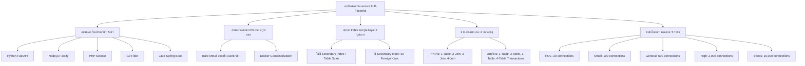

# โครงการวิจัยเปรียบเทียบประสิทธิภาพ Web Framework หลายภาษาและหลายสภาพแวดล้อม
## (Multi-Language & Multi-Environment Web Framework Benchmark Suite)

> **ภาษา / Language**: [English](README.md) | **ภาษาไทย (Thai)**

---

## 1. บทนำและความสำคัญของปัญหา (Background & Significance)

ในปัจจุบัน การประเมินประสิทธิภาพของภาษาโปรแกรมมีการศึกษาอย่างหลากหลาย ทว่างานวิจัยส่วนใหญ่มักมุ่งเน้นไปที่มิติเดียว เช่น การวัดความเร็วในการประมวลผลอัลกอริทึมพื้นฐาน หรือการใช้พลังงานในระดับตัวภาษาโดยตรง [[1]](#ref-1)[[2]](#ref-2)[[14]](#ref-14)[[24]](#ref-24)[[25]](#ref-25) 

อย่างไรก็ตาม ในการพัฒนาซอฟต์แวร์ระดับองค์กรยุคใหม่ ระบบไม่ได้ทำงานอย่างเป็นเอกเทศ แต่ต้องอยู่ภายใต้โครงสร้างพื้นฐานที่มีความซับซ้อน โดยเฉพาะการเปลี่ยนผ่านสู่สถาปัตยกรรมแบบ Cloud-Native ที่ต้องทำงานร่วมกับเทคโนโลยีคอนเทนเนอร์ (Containerization เช่น Docker) และระบบจัดการฐานข้อมูลเชิงสัมพันธ์ (Relational Database Management System - RDBMS เช่น MySQL และ PostgreSQL)

งานวิจัยที่ผ่านมาได้ยืนยันแล้วว่าคอนเทนเนอร์มีภาระงานส่วนเกินด้าน CPU และหน่วยความจำต่ำมาก แต่มีภาระงานส่วนเกินด้านดิสก์และเครือข่าย (NAT/Bridge) ที่ชัดเจน [[3]](#ref-3)[[4]](#ref-4)[[5]](#ref-5)[[6]](#ref-6)[[19]](#ref-19)[[20]](#ref-20) และมีงานที่เปรียบเทียบสถาปัตยกรรมแบบโมโนลิทิก (Monolithic Architecture) กับไมโครเซอร์วิส (Microservices Architecture) [[7]](#ref-7)[[8]](#ref-8)[[9]](#ref-9)[[31]](#ref-31) ภาษา Backend [[10]](#ref-10)[[11]](#ref-11)[[12]](#ref-12)[[13]](#ref-13) และระบบฐานข้อมูล [[15]](#ref-15)[[16]](#ref-16)[[17]](#ref-17) แต่ส่วนใหญ่ใช้ Microbenchmark เชิงสังเคราะห์ ทดสอบรอบเดียว หรือไม่มีฐานข้อมูล การศึกษาที่ผ่านมาจึงยังไม่ครอบคลุมและตอบคำถามได้อย่างชัดเจนว่า เมื่อภาษาโปรแกรมและเว็บเฟรมเวิร์กทำงานอยู่ภายในคอนเทนเนอร์ พร้อมทั้งเชื่อมต่อกับฐานข้อมูลภายใต้สภาวะโหลดสูง ประสิทธิภาพการทำงานแบบครบทั้งเส้นทาง (HTTP → Runtime → RDBMS) จะลดทอนลงมากน้อยเพียงใด

ด้วยเหตุนี้ โครงการวิจัยนี้จึงนำเสนอการประเมินและเปรียบเทียบประสิทธิภาพเชิงลึกภายใต้สภาพแวดล้อมการทำงานจริง เพื่อเป็นแนวทางให้นักพัฒนาและสถาปนิกซอฟต์แวร์สามารถเลือกชุดเทคโนโลยี (Technology Stack) และปรับแต่งประสิทธิภาพ (Optimization) ได้อย่างเหมาะสมและคุ้มค่าที่สุด

---

## 2. วัตถุประสงค์ของการวิจัย (Research Objectives)

1. **ประเมินภาระงานส่วนเกินของคอนเทนเนอร์ (Containerization Overhead)**: เพื่อประเมินและเปรียบเทียบประสิทธิภาพการทำงานและภาระงานส่วนเกิน (Overhead) ระหว่างการทำงานบนเครื่องจริง (**Bare Metal**) และแบบคอนเทนเนอร์ (**Docker Containerization**) ในระดับแอปพลิเคชันเว็บที่เชื่อมต่อฐานข้อมูลจริง (การเปรียบเทียบ Monolithic กับ Microservices อ้างอิงจากงานวิจัยที่มีอยู่แล้ว)
2. **วิเคราะห์สมรรถนะของภาษาและเว็บเฟรมเวิร์ก (Comparative Runtime & Framework Analysis)**: เพื่อวิเคราะห์และเปรียบเทียบสมรรถนะของภาษาและเว็บเฟรมเวิร์กที่แตกต่างกัน (**Python / FastAPI**, **Node.js / Fastify**, **PHP / Swoole**, **Go / Fiber** และ **Java / Spring Boot**) ในการรองรับภาระงานฐานข้อมูลทั้งการอ่าน (`GET` ตารางเดี่ยวและ `JOIN` 2–4 ตาราง) และการเขียน (`POST` Transactions หลายตาราง) ภายใต้ระดับความซับซ้อนของข้อมูลที่หลากหลาย
3. **ศึกษาผลกระทบของการจัดสรรทรัพยากรภายใต้สภาวะโหลดสูง (High-Concurrency Saturation & Resource Limits)**: เพื่อศึกษาผลกระทบของการจัดสรรทรัพยากรและการจำลองระบบ (Virtualization / Container Overhead) รวมถึงการทำ Index ฐานข้อมูล ที่มีต่อเวลาในการตอบสนอง (Response Time), ปริมาณงานที่รองรับได้ (Throughput) และความเสถียรของระบบภายใต้สภาวะโหลดสูง (จนถึง 10,000 Concurrent Connections)

---

## 3. เอกสารและงานวิจัยที่เกี่ยวข้อง และช่องว่างของงานวิจัย (Literature Review & Research Gap)

> เอกสารอ้างอิงทั้งหมดได้รับการตรวจสอบกับฐานข้อมูลของสำนักพิมพ์และ Crossref แล้ว (30 ก.ย. 2569) รายการเดิมที่ตรวจสอบไม่พบว่ามีอยู่จริง (บทความวารสารภาษาไทยเรื่อง Microservices กับ Containers, วิทยานิพนธ์ มหาวิทยาลัยบูรพา และบทความใน Jurnal RESTI) ถูกนำออก และแก้ไขรายการที่อ้างอิงไม่ตรง (Wickramage, Villamizar, Amaral, Shetty, Lauwren, Effendy, The Benchmarker)

### สรุปผลงานวิจัยที่เกี่ยวข้อง

| เอกสาร / งานวิจัย | ประเด็นที่ศึกษา | ข้อค้นพบสำคัญ |
| :--- | :--- | :--- |
| **Wickramage & Weerawarana (2005)** [[1]](#ref-1) | Benchmark สำหรับ SOAP Web Service Frameworks (IEEE SCC'05) | ความซับซ้อนของข้อความ SOAP และขนาด Payload เป็นปัจจัยหลักของเวลาตอบสนอง |
| **Prechelt (2000)** [[2]](#ref-2) | โปรแกรมเดียวกัน 80 ชุดใน 7 ภาษา | Scripting ใช้เวลาเขียนและโค้ดราวครึ่งหนึ่งแต่ใช้หน่วยความจำ ~2 เท่าของ C/C++ ความแปรปรวนระหว่างผู้เขียนใกล้เคียงความแปรปรวนระหว่างภาษา |
| **Morabito et al. (2015)** [[3]](#ref-3) | KVM vs LXC vs Docker vs OSv vs Native ด้วย Microbenchmark ทำซ้ำ 15 รอบ | CPU ของ Docker ≈ Native, TCP_RR −19.4% (KVM −47.4%), Random Write −14.7% (KVM −50.3%) ไม่มีภาระงานระดับแอปพลิเคชัน |
| **Felter et al. (2015)** [[4]](#ref-4) | VM vs Linux Containers (IBM) | Docker ≥ KVM เกือบทุกกรณี ภาระงานส่วนเกินอยู่ที่ I/O และเครือข่าย NAT ของ Docker |
| **Shetty et al. (2017)** [[5]](#ref-5) | Docker vs OpenStack VM vs Bare Metal (Phoronix, Apache Bench) | VM ช้ากว่า Bare Metal 21–30%, IOzone Write: VM −54%, Docker −13% ไม่มีฐานข้อมูลและไม่รายงาน CI |
| **Amaral et al. (2015)** [[6]](#ref-6) | Microservices บนคอนเทนเนอร์ (Sysbench, Netperf) | ไม่มี CPU Overhead ที่มีนัยสำคัญ เครือข่ายแบบ Bridge/OVS ให้ Throughput ~½ และ Latency ~2 เท่าของเครือข่ายโฮสต์ |
| **Wen et al. (2023)**, **Baumgartner et al. (2023)** [[19]](#ref-19)[[20]](#ref-20) | งานล่าสุด Bare Metal vs VM vs Container | คอนเทนเนอร์สูญเสีย CPU/หน่วยความจำ/เครือข่าย ~0–5% และดิสก์ ~5–15% |
| **Villamizar et al. (2015)** [[7]](#ref-7) | Monolith vs Microservices บน AWS (10CCC) | Microservices ลดต้นทุนโครงสร้างพื้นฐาน แลกกับเวลาตอบสนองที่สูงขึ้นเล็กน้อย |
| **Blinowski et al. (2022)** [[8]](#ref-8) | Monolith vs Microservices (Java, C#) บนเครื่องเดียวและ Azure | บนเครื่องเดียว Monolith ดีกว่า และ Vertical Scaling คุ้มค่ากว่า |
| **Lauwren & Setianto (2022)** [[9]](#ref-9) | Go Monolith (Echo) vs Microservices (Go-kit + NGINX) กับ PostgreSQL, JMeter 100–5,000 เธรด | Monolith ความหน่วงเฉลี่ยต่ำกว่าเล็กน้อย (7,205 vs 7,277 ms) Microservices Success Rate สูงกว่าเล็กน้อย (63.66% vs 61.44%) ทดสอบรอบเดียวไม่มีสถิติ |
| **Dirgantara et al. (2024)** [[31]](#ref-31) | Monolith vs Microservices บน Docker | ผลกลับด้านขึ้นกับการใช้ Docker แสดงว่าผลของคอนเทนเนอร์และสถาปัตยกรรมปะปนกัน |
| **Effendy et al. (2021)** [[10]](#ref-10) | Node.js/Go × MySQL/MongoDB | Go+MySQL ใช้ CPU/หน่วยความจำดีที่สุด Node.js+MySQL เวลาตอบสนองดีที่สุด |
| **Lei et al. (2014)**, **Choma et al. (2023)**, **Azzahidi et al. (2025)** [[11]](#ref-11)[[12]](#ref-12)[[13]](#ref-13) | เปรียบเทียบภาษา/เฟรมเวิร์ก Backend | Node.js เด่นในงาน I/O, Spring Boot เร็วที่สุดในงานล่าสุด ผลขึ้นกับเฟรมเวิร์กไม่ใช่แค่ภาษา |
| **Ala'anzy et al. (2026)** [[14]](#ref-14) | Throughput/Latency ของเฟรมเวิร์กภายใต้ทรัพยากรจำกัด | Native Binary ดีกว่า Managed Runtime แต่ใช้ JSON คงที่ ไม่มีฐานข้อมูล |
| **Salunke & Ouda (2024)**, **Truskowski et al. (2020)**, **Taipalus (2024)** [[15]](#ref-15)[[16]](#ref-16)[[17]](#ref-17) | MySQL vs PostgreSQL และการทบทวนวรรณกรรมงานเปรียบเทียบ DBMS | PostgreSQL อ่านเร็วกว่าและเสถียรกว่าเมื่ออ่าน-เขียนพร้อมกัน งานเปรียบเทียบ DBMS ส่วนใหญ่ไม่สะท้อนการใช้งานจริง |
| **Stack Overflow Survey (2023–2025)** [[18]](#ref-18) | การใช้งานในอุตสาหกรรม | PostgreSQL เป็นฐานข้อมูลที่ใช้มากที่สุดตั้งแต่ 2023 (2025: 55.6% vs MySQL 40.5%) |
| **ชาคริต ผาอินทร์ (2560)** [[27]](#ref-27) | ระบบจัดเก็บบันทึกจราจรเครือข่ายแบบ Monolith vs Microservices (จุฬาฯ) | แบบ Microservices ให้เวลาสืบค้นสั้นกว่า |
| **Kossmann et al. (2020)**, **Ramdhani & Widodo (2026)** [[28]](#ref-28)[[29]](#ref-29) | การเลือกดัชนี / B-Tree vs Hash ใน PostgreSQL | ดัชนีลดเวลา JOIN ระดับ Query ได้หลายระดับขนาด (วัดด้วย EXPLAIN ANALYZE ไม่ใช่ระดับ HTTP) |
| **Georges et al. (2007)**, **Kalibera & Jones (2013)**, **Papadopoulos et al. (2021)** [[21]](#ref-21)[[22]](#ref-22)[[23]](#ref-23) | ระเบียบวิธีวัดประสิทธิภาพที่เข้มงวดและทำซ้ำได้ | ต้องทำซ้ำหลายรอบ แยก Warm-up รายงาน CI และสภาพแวดล้อมครบถ้วน |
| **The Benchmarker** [[25]](#ref-25), **TechEmpower R23** [[26]](#ref-26) | Benchmark ของชุมชน/อุตสาหกรรม | The Benchmarker ไม่มีฐานข้อมูล TechEmpower (รอบสุดท้าย 2025 ยุติ 2026) มีฐานข้อมูลแต่ทดสอบบน Bare Metal เท่านั้น |

### ช่องว่างของงานวิจัย (Research Gap)
(1) งานด้านคอนเทนเนอร์ [[3]](#ref-3)[[4]](#ref-4)[[5]](#ref-5)[[6]](#ref-6)[[19]](#ref-19)[[20]](#ref-20) ใช้ Microbenchmark เชิงสังเคราะห์ ไม่มีภาระงานเว็บที่เชื่อมต่อฐานข้อมูลจริง (2) งานด้านภาษาและเฟรมเวิร์ก [[10]](#ref-10)[[11]](#ref-11)[[12]](#ref-12)[[13]](#ref-13)[[14]](#ref-14)[[25]](#ref-25) ส่วนใหญ่ทดสอบบนสภาพแวดล้อมเดียวและหลายงานไม่มีฐานข้อมูล (3) งานด้านดัชนี [[28]](#ref-28)[[29]](#ref-29) วัดผลระดับ Query ไม่ใช่ Throughput และ Tail Latency ระดับ HTTP (4) หลายงาน [[5]](#ref-5)[[9]](#ref-9)[[12]](#ref-12) ทดสอบรอบเดียวโดยไม่มีสถิติ ขัดกับข้อเสนอของ [[21]](#ref-21)[[22]](#ref-22)[[23]](#ref-23)

โครงการนี้เติมเต็มช่องว่างด้วยการทดลองแบบ **Full-Factorial** ที่ผสาน 5 ภาษา, Bare Metal vs Docker, สถานะดัชนี, ความซับซ้อนของ Query และ 5 ระดับ Concurrency ทดสอบซ้ำ 20 รอบต่อค่า พร้อมรายงาน Mean ± SD, 95% CI และ p50–p99

### แผนการวิจัย — อ้างอิงสิ่งที่มีอยู่แล้ว ไม่ทดลองซ้ำ
| ประเด็น | ข้อสรุปที่มีอยู่แล้ว | อ้างอิง | การตัดสินใจในโครงการนี้ |
| :--- | :--- | :--- | :--- |
| MySQL vs PostgreSQL | PostgreSQL อ่านเร็วกว่าหรือเท่ากัน เสถียรกว่าเมื่อโหลดผสม และเป็นฐานข้อมูลที่ใช้มากที่สุด | [[15]](#ref-15)[[16]](#ref-16)[[17]](#ref-17)[[18]](#ref-18) | ไม่ทดสอบ DBMS ซ้ำ `main_web_benchmark` ใช้ MySQL 8.0 (เสร็จแล้ว) และ `pos_web_benchmark` ใช้ **PostgreSQL 16** เพื่อให้ใกล้เคียงโลกจริง |
| Container vs VM | คอนเทนเนอร์ดีกว่า VM เกือบทุกด้าน | [[3]](#ref-3)[[4]](#ref-4)[[5]](#ref-5)[[19]](#ref-19)[[20]](#ref-20) | ไม่ทดสอบ VM เปรียบเทียบเฉพาะ Bare Metal กับ Docker |
| Monolith vs Microservices | บนเครื่องเดียว Monolith เร็วกว่า | [[7]](#ref-7)[[8]](#ref-8)[[9]](#ref-9)[[31]](#ref-31) | ใช้บริการเดี่ยวต่อภาษา และอ้างอิงแทนการทดลอง |
| อัตราเร่งดัชนีระดับ Query | ลดเวลา JOIN ได้หลายระดับขนาด | [[28]](#ref-28)[[29]](#ref-29) | วัดเฉพาะผลระดับ HTTP ทั้งเส้นทาง |
| ประสิทธิภาพพลังงานของภาษา | จัดอันดับไว้แล้ว 27 ภาษา | [[24]](#ref-24) | ไม่วัดพลังงาน |

ดูคำถามวิจัย (RQ1–RQ5) ตารางและกราฟที่จะนำเสนอ และผลเบื้องต้นได้ที่ [Programming_Benchmark_Report.md](Programming_Benchmark_Report.md) หัวข้อ 2.6

---

## 4. ระเบียบวิธีวิจัยและการออกแบบการทดลอง (Research Methodology)

งานวิจัยนี้ดำเนินตามระเบียบวิธีวิจัยเชิงทดลอง (*Experimental Research*) โดยใช้การออกแบบการทดลองแบบปัจจัยครบส่วน (**Full-Factorial Design**):


```mermaid
flowchart TD
    A[เมทริกซ์การทดลองแบบ Full-Factorial] --> B[ภาษาและเว็บเฟรมเวิร์ก: 5 ตัว]
    A --> C[สภาพแวดล้อมการทำงาน: 2 รูปแบบ]
    A --> D[สถานะ Index ของฐานข้อมูล: 2 รูปแบบ]
    A --> E[ประเภทภาระงาน: 2 หมวดหมู่]
    A --> F[ระดับโหลดการทดสอบ: 5 ระดับ]

    B --> B1[Python FastAPI]
    B --> B2[Node.js Fastify]
    B --> B3[PHP Swoole]
    B --> B4[Go Fiber]
    B --> B5[Java Spring Boot]

    C --> C1[Bare Metal บนเครื่องแม่ข่ายจริง]
    C --> C2[Docker Containerization]

    D --> D1[ไม่มี Secondary Index / Table Scan]
    D --> D2[มี Secondary Index บน Foreign Keys]

    E --> E1[การอ่าน: 1-Table, 2-Join, 3-Join, 4-Join]
    E --> E2[การเขียน: 1-Table, 2-Table, 3-Table, 4-Table Transactions]

    F --> F1[POC: 20 connections]
    F --> F2[Small: 100 connections]
    F --> F3[General: 500 connections]
    F --> F4[High: 2,000 connections]
    F --> F5[Stress: 10,000 connections]
```

### ขั้นตอนการดำเนินการทดลอง:
1. **สภาพแวดล้อมที่ใช้ในการทดลอง**: ปรับแต่ง Host OS (`ulimit -n 65535`), ใช้งาน MySQL 8.0 เฉพาะกิจ (`max_connections=10000`) และกำหนดทรัพยากรมาตรฐาน
2. **การออกแบบซอฟต์แวร์และระบบ**: ออกแบบ Database Schema, API Endpoints, Query และ JSON Structure ให้ตรงกันทุกประการทั้ง 5 ภาษา
3. **ขั้นตอนการดำเนินการทดลอง**: รันทดสอบอัตโนมัติด้วย `wrk`, มีขั้นตอน Warmup 3 วินาที, รีเซ็ตสถานะฐานข้อมูลระหว่างรอบ และรันซ้ำหาค่าเฉลี่ยทางสถิติ (`--runs N`)
4. **การวิเคราะห์ข้อมูล**: คำนวณการกระจายตัวทางสถิติ (Mean, SD, 95% CI, Percentiles), บันทึก Log ข้อมูลดิบรายรอบในรูปแบบ JSON และส่งออกรายงานสรุป Markdown/CSV

### การกำหนดตัวแปรของงานวิจัย (Research Variables Specification)

#### A. ตัวแปรต้น (Independent Variables)
| มิติการทดลอง | ตัวแปร | ระดับและข้อกำหนดในการทดลอง (Experimental Levels) |
| :--- | :--- | :--- |
| **ภาษาและเว็บเฟรมเวิร์ก** | รันไทม์ภาษาโปรแกรม | • **Python 3.12** (FastAPI / Uvicorn)<br>• **Node.js 20 LTS** (Fastify / Cluster)<br>• **PHP 8.3** (Swoole Coroutine)<br>• **Go 1.22** (Fiber v2)<br>• **Java 21 LTS** (Spring Boot 3.2) |
| **สภาพแวดล้อมการทำงาน** | ชั้นการจำลองระบบ (Virtualization) | • **Bare Metal (Host OS)**: รันตรงบนระบบปฏิบัติการ Linux ของโฮสต์<br>• **Docker (Containerized)**: รันผ่านกระบวนการแยกส่วน (Process Isolation) ภายใน Docker Container |
| **ดัชนีฐานข้อมูล (Indexing)** | สถานะ Secondary Index | • **ไม่มี Index รอง (`get_no_index`)**: มีเพียง Clustered Primary Key (`id`)<br>• **มี Index รอง (`get_with_index`)**: สร้าง B-Tree Index บน Foreign Keys (`profiles.user_id`, `orders.user_id`, `order_items.order_id`) |
| **ความซับซ้อนของภาระงาน** | รูปแบบคำสั่ง Query & Transaction | • **การอ่าน (GET)**: 1 ตาราง, 2 ตาราง JOIN, 3 ตาราง JOIN, 4 ตาราง JOIN<br>• **การเขียน (POST)**: 1 ตาราง INSERT, 2 ตาราง Tx, 3 ตาราง Tx, 4 ตาราง Tx (พร้อมรายการย่อย 2 แถว) |
| **ระดับโหลด (Concurrency)** | ระดับความเข้มข้นของผู้ใช้พร้อมกัน | • **POC**: 2 Threads, 20 Connections, 30 วินาที<br>• **Small**: 4 Threads, 100 Connections, 60 วินาที<br>• **General**: 8 Threads, 500 Connections, 60 วินาที<br>• **High**: 8 Threads, 2,000 Connections, 120 วินาที<br>• **Stress**: 16 Threads, 10,000 Connections, 300 วินาที |

#### B. ตัวแปรควบคุมและการตั้งค่าระบบ (Controlled & Fixed System Variables)
| ระบบย่อย (Subsystem) | ตัวแปร / พารามิเตอร์ | ค่าที่กำหนดในการทดลอง | วัตถุประสงค์และความสำคัญทางวิชาการ |
| :--- | :--- | :--- | :--- |
| **ระบบฐานข้อมูล (MySQL 8.0)** | `max_connections` | **`10,000`** | ป้องกันปัญหา Socket Connection Rejection ของ MySQL เมื่อทดสอบโหลดระดับ Stress Concurrency สูงสุด 10,000 Connections |
| **ระบบฐานข้อมูล (MySQL 8.0)** | `wait_timeout` / `interactive_timeout` | **`28,800`** วินาที | ป้องกันการตัดการเชื่อมต่อของ Connection Pool ก่อนเวลาอันควร |
| **ระบบฐานข้อมูล (MySQL 8.0)** | `character_set_server` / `collation` | `utf8mb4` / `utf8mb4_unicode_ci` | กำหนดการเข้ารหัส Unicode ให้เป็นมาตรฐานเดียวกันทุกการ Query |
| **ระบบฐานข้อมูล (MySQL 8.0)** | ปริมาณข้อมูลตั้งต้น (Baseline Volume) | **10,000 แถว / ตาราง** | ข้อมูลตั้งต้นที่เท่ากันในทุกตารางสำหรับการทดสอบการอ่าน (`users`, `profiles`, `orders`, `order_items`) |
| **ระบบปฏิบัติการ (Host Linux)** | `RLIMIT_NOFILE` (`ulimit -n`) | **`65,535`** | ปลดล็อกเพดาน File Descriptors เพื่อป้องกันข้อผิดพลาด "Too many open files" |
| **เครือข่ายระดับเคอร์เนล (Network Stack)** | `net.core.somaxconn` | **`65,535`** | ขยายคิวรอรับการเชื่อมต่อ (Listen Socket Backlog) สำหรับทราฟฟิกหนาแน่น |
| **เครือข่ายระดับเคอร์เนล (Network Stack)** | `net.ipv4.tcp_max_syn_backlog` | **`65,535`** | ป้องกันการปฏิเสธแพ็กเกจ TCP SYN ในช่วงการเริ่ม 10,000 Handshakes พร้อมกัน |
| **เครือข่ายระดับเคอร์เนล (Network Stack)** | `net.ipv4.tcp_tw_reuse` | **`1` (เปิดใช้งาน)** | อนุญาตให้นำ Socket ในสถานะ TIME_WAIT กลับมาใช้ซ้ำ ป้องกัน Port Exhaustion |
| **เครือข่ายระดับเคอร์เนล (Network Stack)** | `ip_local_port_range` | `1024 65535` | ขยายช่วงพอร์ตขาออก (Outbound Ports) ของเครื่อง Client สำหรับสร้างโหลด |
| **การจัดการ Connection Pool** | ขนาด Pool ต่อ Worker | มาตรฐาน (50–100) | ป้องกันปัญหา Pool ขาดแคลน และรักษาความยุติธรรมในการใช้ทรัพยากรฐานข้อมูล |
| **โพรโทคอลการทดสอบ** | ระยะเวลาอุ่นเครื่อง (Warmup Phase) | **3.0 วินาที** | เตรียมความพร้อม JIT Compilers (JVM/V8) และ Connection Pool ก่อนเริ่มจับเวลาจริง |
| **โพรโทคอลการทดสอบ** | จำนวนรอบที่รันซ้ำ (Sample Iterations) | **20 รอบ (หาค่าเฉลี่ย)** | ให้ค่าความเชื่อมั่นทางสถิติสูง และลด Margin of Error ของช่วงความเชื่อมั่น (95% CI) |

#### C. ตัวแปรตามและตัวชี้วัดทางสถิติ (Dependent Variables & Metrics)
| หมวดหมู่ตัวชี้วัด | ตัวแปรทางสถิติ | นิยามและความหมายทางคณิตศาสตร์ |
| :--- | :--- | :--- |
| **ปริมาณงาน (Throughput)** | ปริมาณงานเฉลี่ย ($\bar{T}$) | ค่าเฉลี่ยเลขคณิตของจำนวนคำร้องขอที่สำเร็จต่อวินาที (Requests/sec): $\bar{T} = \frac{1}{n}\sum_{i=1}^n T_i$ |
| **ปริมาณงาน (Throughput)** | ส่วนเบี่ยงเบนมาตรฐาน ($\sigma_T$) | การกระจายตัวของค่าปริมาณงาน: $\sigma_T = \sqrt{\frac{1}{n-1}\sum_{i=1}^n (T_i - \bar{T})^2}$ |
| **ปริมาณงาน (Throughput)** | ช่วงความเชื่อมั่น 95% ($95\% \text{ CI}_T$) | ขอบเขตความคลาดเคลื่อนทางสถิติที่ระดับความเชื่อมั่น 95%: $[\bar{T} - t_{crit} \frac{s_T}{\sqrt{n}}, \bar{T} + t_{crit} \frac{s_T}{\sqrt{n}}]$ |
| **เวลาตอบสนอง (Latency)** | เวลาตอบสนองเฉลี่ย ($\bar{L}$) | ค่าเฉลี่ยเลขคณิตของเวลาตอบสนองทั้งหมดในหน่วยมิลลิวินาที (ms) |
| **เวลาตอบสนอง (Latency)** | ส่วนเบี่ยงเบนมาตรฐาน ($\sigma_L$) | การกระจายตัวของเวลาตอบสนองในหน่วยมิลลิวินาที |
| **เวลาตอบสนอง (Latency)** | ช่วงความเชื่อมั่น 95% ($95\% \text{ CI}_L$) | ขอบเขตช่วงความเชื่อมั่นของเวลาตอบสนองที่ระดับ 95% |
| **หางแถวเวลาตอบสนอง (Tail Latency)** | Percentiles ($p_{50}, p_{90}, p_{95}, p_{99}$) | ลำดับเปอร์เซ็นไทล์ของเวลาตอบสนอง (เช่น 99% ของคำร้องขอสำเร็จภายในเวลา $p_{99}$) |
| **ความเสถียร (Reliability)** | เวลาตอบสนองสูงสุด ($L_{\max}$) & Errors | ค่าเวลาตอบสนองที่นานที่สุดที่พบ และผลรวมของข้อผิดพลาด Socket / Timeout / HTTP Status |
| **ภาระงานส่วนเกิน (Overhead)** | อัตราผลได้ของ Bare Metal ($\Delta_{\text{BME}}$) | สัดส่วนความแตกต่างของปริมาณงาน: $\Delta_{\text{BME}} = \frac{\bar{T}_{\text{BME}} - \bar{T}_{\text{DKR}}}{\bar{T}_{\text{DKR}}} \times 100\%$ |
| **ผลของดัชนี (Indexing Factor)** | อัตราเร่งจากการทำ Index ($\text{Gain}_{\text{Index}}$) | อัตราส่วนความเร็วที่เพิ่มขึ้น: $\text{Gain}_{\text{Index}} = \frac{\bar{T}_{\text{WithIndex}}}{\bar{T}_{\text{NoIndex}}}$ |

---

## 5. เทคโนโลยีที่นำมาประเมินและการรองรับภาษา/Framework ในอนาคต (Extensibility)

ชุดทดสอบนี้ถูกออกแบบสถาปัตยกรรมโฟลเดอร์ในรูปแบบ **โมดูลาร์แยกตามภาษาและเฟรมเวิร์กย่อย** (`frameworks/<ภาษา>/<เฟรมเวิร์ก>/`) เพื่อให้สามารถเพิ่มภาษาโปรแกรมและเว็บเฟรมเวิร์กใหม่ ๆ ได้อย่างสะดวกรวดเร็วและเป็นมาตรฐานเดียวกัน

### A. ชุดภาษาและ Web Framework หลักในการทดลอง
| ภาษา (Language) | Web Framework | Database Driver / Client | รูปแบบการทำงาน (Concurrency Model) | พอร์ตมาตรฐาน |
| :--- | :--- | :--- | :--- | :---: |
| **Python** | **FastAPI** (Uvicorn) | `aiomysql` (Async Pool) | Multi-process Async Event Loop | `8001` |
| **Node.js** | **Fastify** | `mysql2/promise` (Connection Pool) | Multi-core Cluster + Event Loop | `8002` |
| **PHP** | **Swoole** | `PDO_MySQL` (`PDOPool`) | Coroutine Event Loop Engine | `8003` |
| **Go** | **Fiber** (v2) | `database/sql` (`go-sql-driver/mysql`) | Lightweight Goroutines | `8004` |
| **Java** | **Spring Boot** (v3) | `JdbcTemplate` + `HikariCP` | Multi-threaded JVM Thread Pool | `8005` |

### B. การรองรับภาษาและ Framework อื่น ๆ เพิ่มเติมในอนาคต
โครงสร้างระบบพร้อมรองรับการต่อขยายเพื่อทดสอบภาษาและเฟรมเวิร์กยอดนิยมอื่น ๆ ได้ทันที:
* **Go**: Gin, Echo, Chi
* **Python**: Flask, Django, BlackSheep, Litestar
* **Node.js / TypeScript**: Express, NestJS, Hono
* **Rust**: Actix-Web, Axum, Rocket
* **C# / .NET**: ASP.NET Core Minimal APIs
* **Ruby**: Ruby on Rails, Sinatra, Hanami
* **Elixir**: Phoenix Framework

### C. สัญญาเชื่อมต่อมาตรฐาน (Standard Endpoint Contract)
ทุก Framework ใหม่ที่ต้องการนำมาทดสอบ เพียงเขียน Endpoint ตามสัญญามาตรฐาน (`GET /`, `GET /raw/1table` ถึง `4join`, `POST /raw/post/1table` ถึง `4table`) ก็จะสามารถรันร่วมกับชุดทดสอบอัตโนมัติทั้ง Bare Metal และ Docker ได้ทันที

---

## 6. รูปแบบการทดสอบและระดับโหลด (Scenarios & Tiers)

### A. หมวดการอ่านข้อมูล / GET Workloads
* `/raw/1table`: สืบค้นตารางเดี่ยว (`SELECT * FROM users LIMIT 100`)
* `/raw/2join`: สืบค้นเชื่อมโยง 2 ตาราง (`users` ⨝ `profiles`)
* `/raw/3join`: สืบค้นเชื่อมโยง 3 ตาราง (`users` ⨝ `profiles` ⨝ `orders`)
* `/raw/4join`: สืบค้นเชื่อมโยง 4 ตาราง (`users` ⨝ `profiles` ⨝ `orders` ⨝ `order_items`)

ทดสอบใน 2 สภาวะฐานข้อมูล:
1. **`get_no_index`**: สืบค้นแบบไม่มี Secondary Index (Table Scans)
2. **`get_with_index`**: สืบค้นแบบมี B-Tree Secondary Index บน Foreign Key

### B. หมวดการเขียนข้อมูล / POST Workloads (Transactions)
* `/raw/post/1table`: บันทึกข้อมูลลงตาราง `users` 1 รายการ
* `/raw/post/2table`: บันทึกข้อมูลแบบ Transaction เชื่อมโยง `users` และ `profiles`
* `/raw/post/3table`: บันทึกข้อมูลแบบ Transaction เชื่อมโยง `users`, `profiles` และ `orders`
* `/raw/post/4table`: บันทึกข้อมูลแบบ Transaction ครบวงจร `users`, `profiles`, `orders` และ `order_items` หลายรายการ

### C. 5 ระดับโหลดตามสถานการณ์จริง (ทดสอบด้วย `wrk`)

| ตัวเลือกระดับโหลด (`--tier`) | สถานการณ์ (Scenario) | ขนาดระบบจริงที่จำลอง | เธรด (`-t`) | Connections (`-c`) | ระยะเวลา (`-d`) |
| :--- | :--- | :--- | :---: | :---: | :---: |
| **`poc`** | **POC / ต้นแบบระบบ** | โปรเจกต์ทดลอง, ระบบภายในแผนก | `2` | `20` | `30s` |
| **`small`** | **ระบบขนาดเล็ก** | เว็บไซต์บริษัท, ธุรกิจท้องถิ่น | `4` | `100` | `60s` |
| **`general`** | **ระบบเว็บทั่วไป** | มหาวิทยาลัย, อีคอมเมิร์ซ, CMS | `8` | `500` | `60s` |
| **`high`** | **ระบบผู้ใช้หนาแน่น** | พอร์ทัลยอดนิยม, แพลตฟอร์ม SaaS | `8` | `2,000` | `120s` |
| **`stress`** | **การทดสอบขีดจำกัด** | ทดสอบจุดอิ่มตัวและขีดจำกัดสูงสุด | `16` | `10,000` | `300s` |
| **`all`** | **ทุกระดับโหลด (ค่าเริ่มต้น)** | รันครบทั้ง 5 สถานการณ์ต่อเนื่องกัน | Sequential | Sequential | Cumulative |

---

## 7. ผลการค้นพบและข้อสรุปสำคัญเชิงประจักษ์ (Key Empirical Results)

### สรุปเปรียบเทียบ Docker vs Bare Metal (`/raw/1table` - โหลดระดับเริ่มต้น)

| ชุดทดสอบ | ภาษา | Docker (Req/s ± SD) | Bare Metal (Req/s ± SD) | Docker p50 / p95 (ms) | BME p50 / p95 (ms) | ผลต่าง Overhead / Gain |
| :--- | :--- | :---: | :---: | :---: | :---: | :---: |
| **get_no_index** | **Go** | 7,850.23 ± 51.75 | 9,711.19 ± 61.88 | 2.46ms / 4.15ms | 1.96ms / 3.56ms | +23.7% BME เร็วกว่า |
| **get_no_index** | **Java** | 9,105.18 ± 89.66 | 11,762.53 ± 64.90 | 2.06ms / 3.38ms | 1.57ms / 2.67ms | +29.2% BME เร็วกว่า |
| **get_no_index** | **Node.js** | 2,323.77 ± 24.37 | 9,370.35 ± 3882.84 | 8.29ms / 15.86ms | 3.11ms / 13.65ms | +303.2% BME เร็วกว่า |
| **get_no_index** | **PHP** | 12,918.52 ± 687.64 | 15,043.28 ± 2874.09 | 1.37ms / 2.99ms | 1.16ms / 3.45ms | +16.4% BME เร็วกว่า |
| **get_no_index** | **Python** | 2,288.60 ± 170.13 | 449.78 ± 0.68 | 8.45ms / 16.19ms | 44.02ms / 46.29ms | -80.3% Docker สูงกว่า |
| **get_no_index** | **Python (opt.)** | 3,216.02 ± 234.04 | 2,814.82 ± 431.46 | 5.76ms / 11.25ms | 6.15ms / 17.14ms | -12.5% Docker สูงกว่า |
| **get_with_index** | **Go** | 8,027.43 ± 54.25 | 9,867.88 ± 55.62 | 2.40ms / 4.05ms | 1.93ms / 3.50ms | +22.9% BME เร็วกว่า |
| **get_with_index** | **Java** | 9,208.99 ± 100.33 | 11,829.43 ± 79.23 | 2.03ms / 3.33ms | 1.56ms / 2.67ms | +28.5% BME เร็วกว่า |
| **get_with_index** | **Node.js** | 2,324.28 ± 21.65 | 11,396.15 ± 218.38 | 8.19ms / 15.89ms | 1.75ms / 2.48ms | +390.3% BME เร็วกว่า |
| **get_with_index** | **PHP** | 12,932.29 ± 647.82 | 15,418.73 ± 1922.61 | 1.37ms / 2.91ms | 1.08ms / 3.19ms | +19.2% BME เร็วกว่า |
| **get_with_index** | **Python** | 2,279.05 ± 238.58 | 449.66 ± 0.64 | 8.14ms / 15.60ms | 44.02ms / 46.06ms | -80.3% Docker สูงกว่า |
| **get_with_index** | **Python (opt.)** | 3,220.85 ± 243.42 | 2,913.31 ± 504.98 | 5.56ms / 11.52ms | 5.94ms / 14.43ms | -9.5% Docker สูงกว่า |
| **post** | **Go** | 9,833.50 ± 164.97 | 12,905.17 ± 144.17 | 1.84ms / 4.21ms | 1.39ms / 3.29ms | +31.2% BME เร็วกว่า |
| **post** | **Java** | 9,774.09 ± 156.45 | 12,851.51 ± 85.05 | 1.85ms / 4.14ms | 1.37ms / 3.49ms | +31.5% BME เร็วกว่า |
| **post** | **Node.js** | 10,604.52 ± 170.15 | 14,308.05 ± 202.11 | 1.71ms / 3.83ms | 1.33ms / 2.83ms | +34.9% BME เร็วกว่า |
| **post** | **PHP** | 12,581.47 ± 910.07 | 18,730.75 ± 1048.83 | 1.30ms / 4.50ms | 0.87ms / 3.34ms | +48.9% BME เร็วกว่า |
| **post** | **Python** | 9,324.90 ± 333.54 | 10,087.07 ± 1284.45 | 1.95ms / 4.11ms | 1.85ms / 3.40ms | +8.2% BME เร็วกว่า |
| **post** | **Python (opt.)** | 9,324.90 ± 333.54 | 10,087.07 ± 1284.45 | 1.95ms / 4.11ms | 1.85ms / 3.40ms | +8.2% BME เร็วกว่า |

*\*หมายเหตุเกี่ยวกับความผิดปกติของข้อมูล Python GET บน Bare Metal ในอดีต: ข้อมูลประวัติเดิมของ Python GET ติดคอขวด Serialization ของ `jsonable_encoder()` และขาด `uvloop` ทำให้รันได้เพียง ~449 Req/s เมื่อปรับปรุงด้วย `CustomORJSONResponse` และ 16 workers ทั้งบน Docker และ Bare Metal พบว่าสามารถปลดล็อกทำได้ถึง ~3,200 Req/s บน Docker และแตะสูงสุด 4,754.70 Req/s บน Bare Metal (ระดับโหลด Small) จากการทดสอบ 20 รอบจริงเต็ม ดูการวิเคราะห์ปัญหาอย่างละเอียดได้ที่ [issue.md](main_web_benchmark/issue.md#12-python-fastapi-get-benchmark-bottleneck-missing-c-extensions-uvloophttptools--gil-bound-response-serialization-jsonable_encoder) และแท็บชีตเฉพาะ `Python (opt.)` ในไฟล์ `Programming_Benchmark_Report.xlsx`*

> ตรวจสอบผลลัพธ์ฉบับสมบูรณ์พร้อมค่า Mean ± SD, ช่วงความเชื่อมั่น 95% (95% CI) และ Percentiles (p50, p90, p95, p99) ของทุก Endpoint และระดับโหลดได้ที่ [main_web_benchmark/results/SUMMARY.md](main_web_benchmark/results/SUMMARY.md) และ [main_web_benchmark/results/SUMMARY.csv](main_web_benchmark/results/SUMMARY.csv)

---

## 8. วิธีการรันทดสอบชุด Benchmark

### ข้อกำหนดเบื้องต้น
* เปิดใช้งาน MySQL 8.0 ในเครื่อง Local พอร์ต `3306` (`user=admin`, `password=secret`, `database=benchmark_db`)
* ติดตั้ง Python 3.10+ และเครื่องมือ `wrk`
* ติดตั้ง Docker & Docker Compose (สำหรับการทดสอบในโหมดคอนเทนเนอร์)

### การรันชุด Benchmark แบบอัตโนมัติเต็มรูปแบบ (Automated Pipeline)
หากต้องการรันการทดสอบครบทุก 6 ชุดแบบเรียงลำดับต่อเนื่อง (GET No-Index DKR/BME, GET With-Index DKR/BME และ POST DKR/BME) พร้อมจัดการ Secondary Database Index, เคลียร์พอร์ต และสรุปผลรวมอัตโนมัติ:

```bash
# รัน Benchmark ครบทุก 6 ชุดแบบอัตโนมัติ (ค่าเริ่มต้น 20 รอบต่อ Endpoint)
python3 main_web_benchmark/auto_runner.py

# กำหนดจำนวนรอบที่ต้องการทดสอบ (เช่น 20 รอบ, 5 รอบ หรือ 3 รอบ)
python3 main_web_benchmark/auto_runner.py 20
python3 main_web_benchmark/auto_runner.py --runs 20
python3 main_web_benchmark/auto_runner.py -r 5

# ปิดช่วงเวลา Warmup 3 วินาที
python3 main_web_benchmark/auto_runner.py 20 --no-warmup
```

### คำสั่งการรันทดสอบแยกตามชุด (Manual Execution)
```bash
# 1. รันการทดสอบ GET (No Index) บน Bare Metal พร้อมหาค่าเฉลี่ย 3 รอบ
cd main_web_benchmark/GET/get_no_index
python3 run_bme_wrk.py --tier all --runs 3

# 2. รันการทดสอบ GET (With Index) บน Docker
cd main_web_benchmark/GET/get_with_index
python3 run_dkr_wrk.py --tier all --runs 3

# 3. รันการทดสอบ POST ธุรกรรมการเขียน
cd main_web_benchmark/POST
python3 run_bme_wrk.py --tier all --runs 3

# 4. กรองการทดสอบตามภาษา หรือ Framework
python3 run_dkr_wrk.py --lang python --tier all --runs 3       # รันทุก Framework ของ Python
python3 run_dkr_wrk.py --framework fiber --tier all --runs 3   # รันเฉพาะ Go Fiber
```

### ตัวเลือกคำสั่ง (CLI Arguments)
* `--tier {poc,small,general,high,stress,all}` (ค่าเริ่มต้น: `all`): เลือกระดับโหลดสถานการณ์ที่ต้องการทดสอบ
* `--lang {python,py,node,nodejs,js,php,go,golang,java,all}` (ค่าเริ่มต้น: None): กรองและรันทุก Framework ภายใต้ภาษาที่กำหนด
* `--framework, --fw {fastapi,fastify,swoole,fiber,springboot,spring-boot,spring,all}` (ค่าเริ่มต้น: None): กรองและรันเฉพาะ Framework ที่กำหนด
* `--runs N` (ค่าเริ่มต้น: `1` สำหรับตัวรันแยกชุด, `20` สำหรับ `auto_runner.py`): จำนวนรอบที่ต้องการรันซ้ำเพื่อคำนวณค่าเฉลี่ยทางสถิติ
* `--no-warmup` (ค่าเริ่มต้น: False): ปิดช่วง Warmup 3 วินาที

### การประมวลผลและสร้างรายงานสรุป
```bash
# ดูตารางสรุปเปรียบเทียบผลลัพธ์ผ่าน CLI
cd main_web_benchmark
python3 compare_results.py GET/get_no_index/dkr_benchmark_results.json

# สร้างเอกสารสรุปผล Markdown (SUMMARY.md) และตาราง CSV (SUMMARY.csv) รวม
cd main_web_benchmark/results
python3 generate_summary.py
```

---

## 9. โครงสร้างโฟลเดอร์โครงการ

```text
Programming-Benchmark/
├── Programming_Benchmark_Report.docx  # รายงานวิจัยฉบับสมบูรณ์ (Microsoft Word)
├── Programming_Benchmark_Report.md    # รายงานวิจัยฉบับแปลงเป็น Markdown
├── README.md                          # เอกสารคู่มือโครงการภาษาอังกฤษ (English)
├── README_TH.md                       # เอกสารคู่มือโครงการภาษาไทย (Thai)
├── main_web_benchmark/                # ชุดทดสอบเว็บเฟรมเวิร์กหลัก
│   ├── GET/
│   │   ├── get_no_index/              # การทดสอบ GET แบบไม่มี Secondary Index
│   │   │   ├── frameworks/            # โค้ดเซิร์ฟเวอร์แยกตามภาษาและเฟรมเวิร์ก (go, java, nodejs, php, python)
│   │   │   ├── docker-compose.yml     # คอนฟิกคอนเทนเนอร์เชื่อมโยงไปยังโฟลเดอร์ frameworks/
│   │   │   ├── run_bme_wrk.py         # ตัวรัน Bare Metal
│   │   │   └── run_dkr_wrk.py         # ตัวรัน Docker Container
│   │   └── get_with_index/            # การทดสอบ GET แบบมี Secondary Index
│   │       ├── frameworks/            # โค้ดเซิร์ฟเวอร์แยกตามภาษาและเฟรมเวิร์ก
│   │       ├── docker-compose.yml
│   │       ├── run_bme_wrk.py
│   │       └── run_dkr_wrk.py
│   ├── POST/                          # การทดสอบ POST ธุรกรรมการเขียน
│   │   ├── frameworks/                # โค้ดเซิร์ฟเวอร์แยกตามภาษาและเฟรมเวิร์ก
│   │   ├── docker-compose.yml
│   │   ├── run_bme_wrk.py
│   │   └── run_dkr_wrk.py
│   ├── results/                       # รวบรวมผลลัพธ์และสรุปรายงาน
│   │   ├── raw_results/               # ข้อมูลดิบรายรอบการทดสอบ
│   │   ├── generate_summary.py        # สคริปต์รวมและสร้าง SUMMARY.md / SUMMARY.csv
│   │   ├── SUMMARY.md                 # รายงานสรุปผลในรูปแบบ Markdown
│   │   └── SUMMARY.csv                # รายงานสรุปผลในรูปแบบ CSV
│   ├── compare_results.py             # เครื่องมือแสดงตารางเปรียบเทียบผลผ่าน CLI
│   └── issue.md                       # รายงานการวิเคราะห์ปัญหาทางเทคนิค
├── pos_web_benchmark/                 # ชุดทดสอบระบบ POS บน PostgreSQL 16 (11.11 ล้านแถว, กำลังดำเนินการ)
└── benchmark/                         # การทดสอบประสิทธิภาพอัลกอริทึมพื้นฐาน (Microbenchmarks)
```

---

## 10. เอกสารอ้างอิง (References)

<a id="ref-1"></a>
[1] N. Wickramage and S. Weerawarana, "A benchmark for web service frameworks," in Proc. IEEE Int. Conf. Services Comput. (SCC'05), Orlando, FL, USA, 2005, vol. 1, pp. 233–240. doi: [10.1109/SCC.2005.9](https://doi.org/10.1109/SCC.2005.9).

<a id="ref-2"></a>
[2] L. Prechelt, "An empirical comparison of seven programming languages," Computer, vol. 33, no. 10, pp. 23–29, Oct. 2000. doi: [10.1109/2.876288](https://doi.org/10.1109/2.876288).

<a id="ref-3"></a>
[3] R. Morabito, J. Kjällman, and M. Komu, "Hypervisors vs. lightweight virtualization: A performance comparison," in Proc. IEEE Int. Conf. Cloud Eng. (IC2E), Tempe, AZ, USA, 2015, pp. 386–393. doi: [10.1109/IC2E.2015.74](https://doi.org/10.1109/IC2E.2015.74).

<a id="ref-4"></a>
[4] W. Felter, A. Ferreira, R. Rajamony, and J. Rubio, "An updated performance comparison of virtual machines and Linux containers," in Proc. IEEE Int. Symp. Perform. Anal. Syst. Softw. (ISPASS), Philadelphia, PA, USA, 2015, pp. 171–172. doi: [10.1109/ISPASS.2015.7095802](https://doi.org/10.1109/ISPASS.2015.7095802).

<a id="ref-5"></a>
[5] J. Shetty, S. Upadhaya, H. S. Rajarajeshwari, G. Shobha, and J. Chandra, "An empirical performance evaluation of Docker container, OpenStack virtual machine and bare metal server," Indonesian J. Elect. Eng. Comput. Sci., vol. 7, no. 1, pp. 205–213, Jul. 2017. doi: [10.11591/ijeecs.v7.i1.pp205-213](https://doi.org/10.11591/ijeecs.v7.i1.pp205-213).

<a id="ref-6"></a>
[6] M. Amaral, J. Polo, D. Carrera, I. Mohomed, M. Unuvar, and M. Steinder, "Performance evaluation of microservices architectures using containers," in Proc. IEEE 14th Int. Symp. Netw. Comput. Appl. (NCA), Cambridge, MA, USA, 2015, pp. 27–34. doi: [10.1109/NCA.2015.49](https://doi.org/10.1109/NCA.2015.49).

<a id="ref-7"></a>
[7] M. Villamizar, O. Garcés, H. Castro, M. Verano, L. Salamanca, R. Casallas, and S. Gil, "Evaluating the monolithic and the microservice architecture pattern to deploy web applications in the cloud," in Proc. 10th Computing Colombian Conf. (10CCC), Bogotá, Colombia, 2015, pp. 583–590. doi: [10.1109/ColumbianCC.2015.7333476](https://doi.org/10.1109/ColumbianCC.2015.7333476).

<a id="ref-8"></a>
[8] G. Blinowski, A. Ojdowska, and A. Przybyłek, "Monolithic vs. microservice architecture: A performance and scalability evaluation," IEEE Access, vol. 10, pp. 20357–20374, 2022. doi: [10.1109/ACCESS.2022.3152803](https://doi.org/10.1109/ACCESS.2022.3152803).

<a id="ref-9"></a>
[9] A. J. Lauwren and Y. D. Setianto, "Microservice and monolith performance comparison in transaction application," Proxies: Jurnal Informatika, vol. 5, no. 2, pp. 86–105, 2022. doi: [10.24167/proxies.v5i2.12447](https://doi.org/10.24167/proxies.v5i2.12447).

<a id="ref-10"></a>
[10] F. Effendy, Taufik, and B. Adhilaksono, "Performance comparison of web backend and database: A case study of Node.JS, Golang and MySQL, Mongo DB," Recent Adv. Comput. Sci. Commun., vol. 14, no. 6, pp. 1955–1961, 2021. doi: [10.2174/2666255813666191219104133](https://doi.org/10.2174/2666255813666191219104133).

<a id="ref-11"></a>
[11] K. Lei, Y. Ma, and Z. Tan, "Performance comparison and evaluation of web development technologies in PHP, Python, and Node.js," in Proc. IEEE 17th Int. Conf. Comput. Sci. Eng. (CSE), Chengdu, China, 2014, pp. 661–668. doi: [10.1109/CSE.2014.142](https://doi.org/10.1109/CSE.2014.142).

<a id="ref-12"></a>
[12] D. Choma, K. Chwaleba, and M. Dzieńkowski, "The efficiency and reliability of backend technologies: Express, Django, and Spring Boot," Informatyka, Automatyka, Pomiary w Gospodarce i Ochronie Środowiska, vol. 13, no. 4, pp. 73–78, 2023. doi: [10.35784/iapgos.4279](https://doi.org/10.35784/iapgos.4279).

<a id="ref-13"></a>
[13] A. Azzahidi, B. Wijayanto, and A. Darmawan, "Performance evaluation of backend frameworks for REST API: A comparative study of Spring Boot, Flask, Express.js, Laravel FrankenPHP, and Gin," Jurnal Teknik Informatika (JUTIF), vol. 6, no. 4, pp. 2405–2419, 2025. doi: [10.52436/1.jutif.2025.6.4.4811](https://doi.org/10.52436/1.jutif.2025.6.4.4811).

<a id="ref-14"></a>
[14] M. A. Ala'anzy, O. Alramli, A. Ibraheem, and A. Al-Hadeethi, "Throughput and latency benchmarking of backend web frameworks under resource-constrained environments," in Proc. 6th Int. Conf. Electr., Comput., Commun. Mechatron. Eng. (ICECET), 2026, pp. 1–5. doi: [10.1109/ICECET65726.2026.11632913](https://doi.org/10.1109/ICECET65726.2026.11632913).

<a id="ref-15"></a>
[15] S. V. Salunke and A. Ouda, "A performance benchmark for the PostgreSQL and MySQL databases," Future Internet, vol. 16, no. 10, Art. no. 382, 2024. doi: [10.3390/fi16100382](https://doi.org/10.3390/fi16100382).

<a id="ref-16"></a>
[16] W. Truskowski, R. Klewek, and M. Skublewska-Paszkowska, "Comparison of MySQL, MSSQL, PostgreSQL, Oracle databases performance, including virtualization," Journal of Computer Sciences Institute, vol. 16, pp. 279–284, 2020. doi: [10.35784/jcsi.2026](https://doi.org/10.35784/jcsi.2026).

<a id="ref-17"></a>
[17] T. Taipalus, "Database management system performance comparisons: A systematic literature review," J. Syst. Softw., vol. 208, Art. no. 111872, 2024. doi: [10.1016/j.jss.2023.111872](https://doi.org/10.1016/j.jss.2023.111872).

<a id="ref-18"></a>
[18] Stack Overflow, "2025 Stack Overflow Developer Survey: Technology — Databases," 2025. [Online]. Available: [https://survey.stackoverflow.co/2025/technology](https://survey.stackoverflow.co/2025/technology). [Accessed: Sep. 30, 2026].

<a id="ref-19"></a>
[19] L. Wen, M. Rickert, F. Pan, J. Lin, and A. Knoll, "Bare-metal vs. hypervisors and containers: Performance evaluation of virtualization technologies for software-defined vehicles," in Proc. IEEE Intelligent Vehicles Symp. (IV), Anchorage, AK, USA, 2023, pp. 1–8. doi: [10.1109/IV55152.2023.10186789](https://doi.org/10.1109/IV55152.2023.10186789).

<a id="ref-20"></a>
[20] J. Baumgartner, C. Lillo, and S. Rumley, "Performance losses with virtualization: Comparing bare metal to VMs and containers," in High Performance Computing (ISC High Performance 2023 Workshops), Lecture Notes in Computer Science, Cham, Switzerland: Springer, 2023, pp. 107–120. doi: [10.1007/978-3-031-40843-4_9](https://doi.org/10.1007/978-3-031-40843-4_9).

<a id="ref-21"></a>
[21] A. Georges, D. Buytaert, and L. Eeckhout, "Statistically rigorous Java performance evaluation," in Proc. 22nd ACM SIGPLAN Conf. Object-Oriented Program. Syst. Lang. Appl. (OOPSLA), Montreal, QC, Canada, 2007, pp. 57–76. doi: [10.1145/1297105.1297033](https://doi.org/10.1145/1297105.1297033).

<a id="ref-22"></a>
[22] T. Kalibera and R. Jones, "Rigorous benchmarking in reasonable time," in Proc. ACM SIGPLAN Int. Symp. Memory Manage. (ISMM), Seattle, WA, USA, 2013, pp. 63–74. doi: [10.1145/2464157.2464160](https://doi.org/10.1145/2464157.2464160).

<a id="ref-23"></a>
[23] A. V. Papadopoulos et al., "Methodological principles for reproducible performance evaluation in cloud computing," IEEE Trans. Softw. Eng., vol. 47, no. 8, pp. 1528–1543, Aug. 2021. doi: [10.1109/TSE.2019.2927908](https://doi.org/10.1109/TSE.2019.2927908).

<a id="ref-24"></a>
[24] R. Pereira et al., "Ranking programming languages by energy efficiency," Sci. Comput. Program., vol. 205, Art. no. 102609, 2021. doi: [10.1016/j.scico.2021.102609](https://doi.org/10.1016/j.scico.2021.102609).

<a id="ref-25"></a>
[25] M. Rabbâa et al. (The Benchmarker), "Web frameworks benchmark," GitHub repository, 2017–2026. [Online]. Available: [https://github.com/the-benchmarker/web-frameworks](https://github.com/the-benchmarker/web-frameworks). [Accessed: Sep. 30, 2026].

<a id="ref-26"></a>
[26] TechEmpower, "TechEmpower web framework benchmarks, Round 23," 2025. [Online]. Available: [https://www.techempower.com/benchmarks/](https://www.techempower.com/benchmarks/). [Accessed: Sep. 30, 2026].

<a id="ref-27"></a>
[27] ชาคริต ผาอินทร์, "การขยายตัวจัดเก็บบันทึกจราจรเครือข่ายด้วยสถาปัตยกรรมไมโครเซอร์วิส," วิทยานิพนธ์ปริญญาวิทยาศาสตรมหาบัณฑิต สาขาวิชาวิทยาการคอมพิวเตอร์, จุฬาลงกรณ์มหาวิทยาลัย, กรุงเทพฯ, 2560. doi: [10.58837/CHULA.THE.2017.1256](https://doi.org/10.58837/CHULA.THE.2017.1256).

<a id="ref-28"></a>
[28] J. Kossmann, S. Halfpap, M. Jankrift, and R. Schlosser, "Magic mirror in my hand, which is the best in the land? An experimental evaluation of index selection algorithms," Proc. VLDB Endow., vol. 13, no. 12, pp. 2382–2395, 2020. doi: [10.14778/3407790.3407832](https://doi.org/10.14778/3407790.3407832).

<a id="ref-29"></a>
[29] A. Ramdhani and S. Widodo, "Comparative analysis of B-Tree and Hash indexes for PostgreSQL query optimization," JURTEKSI (Jurnal Teknologi dan Sistem Informasi), vol. 12, no. 3, pp. 461–468, 2026. doi: [10.33330/jurteksi.v12i3.4653](https://doi.org/10.33330/jurteksi.v12i3.4653).

<a id="ref-30"></a>
[30] W. Glozer, "wrk: Modern HTTP benchmarking tool," GitHub repository. [Online]. Available: [https://github.com/wg/wrk](https://github.com/wg/wrk); G. Tene, "wrk2: A constant throughput, correct latency recording variant of wrk," GitHub repository. [Online]. Available: [https://github.com/giltene/wrk2](https://github.com/giltene/wrk2). [Accessed: Sep. 30, 2026].

<a id="ref-31"></a>
[31] D. P. Dirgantara, D. S. Kusumo, and R. G. Utomo, "Docker-based monolithic and microservices architecture performance comparison," Jurnal Teknik Informatika (JUTIF), vol. 5, no. 2, pp. 357–365, 2024. doi: [10.52436/1.jutif.2024.5.2.1338](https://doi.org/10.52436/1.jutif.2024.5.2.1338).
