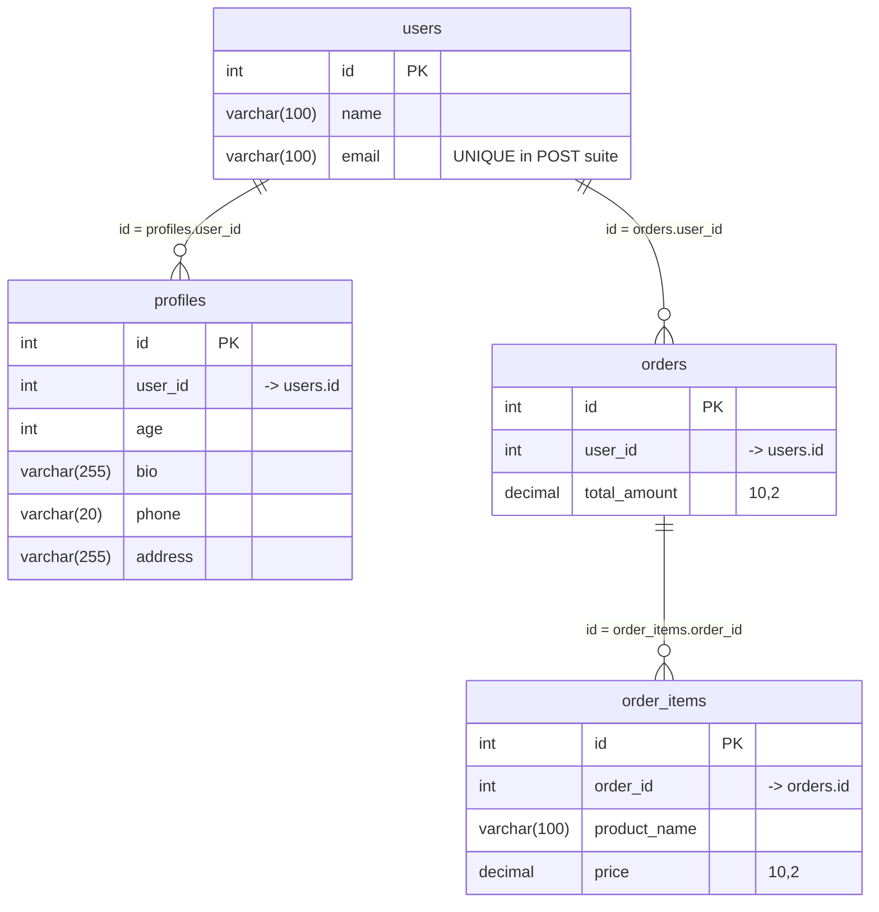

# DATABASE.md — Schema & Relationships

Source of truth: the `CREATE TABLE` statements embedded in each framework's `server.*` (`init_db()` / `initDb()` / equivalent), executed identically across all 5 languages. No real `FOREIGN KEY` constraints are declared anywhere — relations are enforced only at the application level via plain `INT` columns holding the parent's `id`. The `get_with_index` suite adds a secondary `INDEX` on those relation columns; `get_no_index` and `POST` do not.

---

## Entity-Relationship Diagram



**Cardinality:** `users` 1—N `profiles`, `users` 1—N `orders`, `orders` 1—N `order_items`. Baseline seed volume is 10,000 rows per table (per `README.md`); `order_items` is seeded at roughly 1 in 10 orders × 5 items (see mock-data generator below).

---

## Schema DDL

### `get_no_index` and `POST` suites (no secondary indexes)

```sql
CREATE TABLE IF NOT EXISTS users (
    id INT AUTO_INCREMENT PRIMARY KEY,
    name VARCHAR(100),
    email VARCHAR(100)          -- UNIQUE in the POST suite only, to avoid dup key errors under concurrent inserts
);

CREATE TABLE IF NOT EXISTS profiles (
    id INT AUTO_INCREMENT PRIMARY KEY,
    user_id INT,                -- relates to users.id (no FK constraint)
    age INT,
    bio VARCHAR(255),
    phone VARCHAR(20),
    address VARCHAR(255)
);

CREATE TABLE IF NOT EXISTS orders (
    id INT AUTO_INCREMENT PRIMARY KEY,
    user_id INT,                -- relates to users.id (no FK constraint)
    total_amount DECIMAL(10, 2)
);

CREATE TABLE IF NOT EXISTS order_items (
    id INT AUTO_INCREMENT PRIMARY KEY,
    order_id INT,                -- relates to orders.id (no FK constraint)
    product_name VARCHAR(100),
    price DECIMAL(10, 2)
);
```

### `get_with_index` suite (adds secondary indexes on the relation columns)

```sql
CREATE TABLE IF NOT EXISTS users (
    id INT AUTO_INCREMENT PRIMARY KEY,
    name VARCHAR(100),
    email VARCHAR(100)
);

CREATE TABLE IF NOT EXISTS profiles (
    id INT AUTO_INCREMENT PRIMARY KEY,
    user_id INT,
    age INT,
    bio VARCHAR(255),
    phone VARCHAR(20),
    address VARCHAR(255),
    INDEX idx_profiles_user_id (user_id)      -- secondary index, no FK constraint
);

CREATE TABLE IF NOT EXISTS orders (
    id INT AUTO_INCREMENT PRIMARY KEY,
    user_id INT,
    total_amount DECIMAL(10, 2),
    INDEX idx_orders_user_id (user_id)        -- secondary index, no FK constraint
);

CREATE TABLE IF NOT EXISTS order_items (
    id INT AUTO_INCREMENT PRIMARY KEY,
    order_id INT,
    product_name VARCHAR(100),
    price DECIMAL(10, 2),
    INDEX idx_order_items_order_id (order_id) -- secondary index, no FK constraint
);
```

This pair is exactly the independent variable from `README.md`'s "Database Indexing" axis — same schema, same data, only the presence of `INDEX idx_*` on the join columns differs.

---

## Relations in code

### 1. Mock data seeding (how the FK-like relations are populated)

```python
# GET/get_no_index/frameworks/python/fastapi/server.py — insert_mock_data()
user_vals = [(f"User{i}", f"user{i}@example.com") for i in range(1, 10001)]
prof_vals = [(i, 20 + (i % 50), f"Address {i}", f"Bio {i}", f"555-{i}") for i in range(1, 10001)]
ord_vals  = [(i, 100.0 + i) for i in range(1, 10001)]
item_vals = [(i, f"Product{j}", 10.0 + j) for i in range(1, 10001) if i % 10 == 0 for j in range(5)]

await cursor.executemany("INSERT INTO users (name, email) VALUES (%s, %s)", user_vals)
await cursor.executemany("INSERT INTO profiles (user_id, age, address, bio, phone) VALUES (%s, %s, %s, %s, %s)", prof_vals)
await cursor.executemany("INSERT INTO orders (user_id, total_amount) VALUES (%s, %s)", ord_vals)
await cursor.executemany("INSERT INTO order_items (order_id, product_name, price) VALUES (%s, %s, %s)", item_vals)
```

`prof_vals`/`ord_vals` reuse loop index `i` directly as `user_id`, i.e. `profiles.user_id = users.id` and `orders.user_id = users.id` 1:1 by construction. `item_vals` only fires for every 10th `i` (`i % 10 == 0`) and attaches 5 items per that order, so `order_items.order_id -> orders.id` is roughly 1:5 for 1 in 10 orders.

### 2. Reading the relations — progressive JOIN endpoints (GET suites)

```python
# /raw/1table — no relation, single table
"SELECT * FROM users LIMIT 100"

# /raw/2join — users -> profiles (1 hop, via profiles.user_id)
"SELECT u.name, p.age
 FROM users u
 JOIN profiles p ON u.id = p.user_id
 LIMIT 100"

# /raw/3join — users -> profiles, users -> orders (2 hops from users)
"SELECT u.name, p.age, o.total_amount
 FROM users u
 JOIN profiles p ON u.id = p.user_id
 JOIN orders   o ON u.id = o.user_id
 LIMIT 100"

# /raw/4join — users -> profiles, users -> orders -> order_items (3 hops, full chain)
"SELECT u.name, p.age, o.total_amount, oi.product_name
 FROM users u
 JOIN profiles    p  ON u.id = p.user_id
 JOIN orders      o  ON u.id = o.user_id
 JOIN order_items oi ON o.id = oi.order_id
 LIMIT 100"
```

Identical across all 5 language servers (`server.py`/`server.js`/`server.php`/`server.go`/`BenchmarkApplication.java`) in both `get_no_index` and `get_with_index` — the SQL text never changes between suites; only whether `idx_*` indexes exist on the join columns changes.

### 3. Writing the relations — transactional multi-table INSERT (POST suite)

```python
# /raw/post/4table — full parent-chain insert inside one transaction
await conn.begin()
await cursor.execute(
    "INSERT INTO users (name, email) VALUES (%s, %s)", (name, email)
)
user_id = cursor.lastrowid                      # capture PK to use as child FK

await cursor.execute(
    "INSERT INTO profiles (user_id, age, address, bio, phone) VALUES (%s, %s, %s, %s, %s)",
    (user_id, 25, "123 St", f"Bio {user_id}", phone)
)

await cursor.execute(
    "INSERT INTO orders (user_id, total_amount) VALUES (%s, %s)", (user_id, 100.00)
)
order_id = cursor.lastrowid                     # capture PK to use as grandchild FK

await cursor.execute(
    "INSERT INTO order_items (order_id, product_name, price) VALUES (%s, %s, %s)",
    (order_id, "Prod1", 25.00)
)
await cursor.execute(
    "INSERT INTO order_items (order_id, product_name, price) VALUES (%s, %s, %s)",
    (order_id, "Prod2", 75.00)
)
await conn.commit()
```

`/raw/post/1table` inserts only `users`; `/raw/post/2table` adds `profiles`; `/raw/post/3table` adds `orders`; `/raw/post/4table` adds 2 `order_items` rows — each tier extends the previous transaction by one more hop down the relation chain (`users -> profiles`, `users -> orders`, `orders -> order_items`), always propagating the parent's auto-increment `id` (via `lastrowid`) into the child's FK-like column, inside a single `BEGIN...COMMIT` transaction.

---

## Key facts to remember

- **No `FOREIGN KEY` constraints anywhere** — relational integrity is enforced entirely by application code (matching PK values into child `_id` columns), never by MySQL itself. This was a deliberate simplification, not an oversight, but if a committee asks "why no FK constraints," the honest answer is: FK constraint checks add write overhead that would confound the raw-SQL performance measurement, and the schema is fully controlled/seeded by the benchmark itself so referential integrity risk is negligible.
- **The only schema difference between `get_no_index` and `get_with_index`** is the 3 `INDEX idx_*` declarations on `profiles.user_id`, `orders.user_id`, `order_items.order_id` — nothing else changes.
- **The `POST` suite's `users.email` is `UNIQUE`**; the GET suites' is not — because POST continuously inserts new rows and needs collision protection (each `server.*` generates a randomized email per request), while GET suites only ever seed once.
