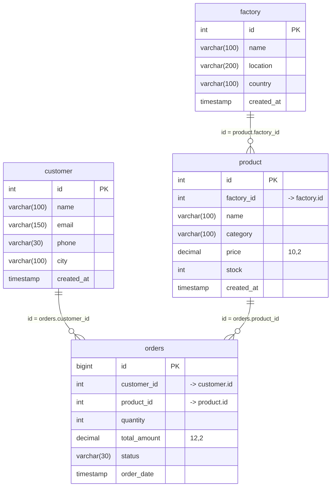

# DATABASE.md — PostgreSQL Schema, Relations & Indexing Specification

## Overview

The PostgreSQL Web Framework Benchmark evaluates high-concurrency read and write throughput against an enterprise-scale relational dataset containing **11,110,000 total records** across 4 interrelated tables:
- `factory`: **10,000 records**
- `product`: **100,000 records**
- `customer`: **1,000,000 records**
- `orders`: **10,000,000 records**

---

## Entity-Relationship Diagram



---

## Cardinality & Join Chain

1. **1-Table Query (`/raw/1table`)**:
   ```sql
   SELECT id, name, email, phone, city, created_at FROM customer LIMIT 100;
   ```
2. **2-Table JOIN (`/raw/2join`)**:
   `orders` ⨝ `customer` on `orders.customer_id = customer.id`
   ```sql
   SELECT o.id, c.name, o.quantity, o.total_amount, o.order_date
   FROM orders o
   JOIN customer c ON o.customer_id = c.id
   LIMIT 100;
   ```
3. **3-Table JOIN (`/raw/3join`)**:
   `orders` ⨝ `customer` ⨝ `product`
   ```sql
   SELECT o.id, c.name, p.name AS product_name, o.quantity, o.total_amount
   FROM orders o
   JOIN customer c ON o.customer_id = c.id
   JOIN product p ON o.product_id = p.id
   LIMIT 100;
   ```
4. **4-Table JOIN (`/raw/4join`)**:
   `orders` ⨝ `customer` ⨝ `product` ⨝ `factory`
   ```sql
   SELECT o.id, c.name, p.name AS product_name, f.name AS factory_name, o.quantity, o.total_amount
   FROM orders o
   JOIN customer c ON o.customer_id = c.id
   JOIN product p ON o.product_id = p.id
   JOIN factory f ON p.factory_id = f.id
   LIMIT 100;
   ```

---

## Indexing Specification

All tables have Primary Key indexes automatically created. Secondary B-Tree indexes are applied on join and filter columns:

| Table | Index Name | Indexed Column(s) | Role |
| :--- | :--- | :--- | :--- |
| **`factory`** | `factory_pkey` | `id` | Primary Key |
| **`factory`** | `idx_factory_name` | `name` | Search Filter |
| **`factory`** | `idx_factory_country` | `country` | Regional Filter |
| **`product`** | `product_pkey` | `id` | Primary Key |
| **`product`** | `idx_product_factory_id` | `factory_id` | Foreign Key Join |
| **`product`** | `idx_product_category` | `category` | Categorical Filter |
| **`product`** | `idx_product_price` | `price` | Range Filter |
| **`customer`** | `customer_pkey` | `id` | Primary Key |
| **`customer`** | `idx_customer_email` | `email` | Unique / Identity Filter |
| **`customer`** | `idx_customer_city` | `city` | Geographic Filter |
| **`orders`** | `orders_pkey` | `id` | Primary Key |
| **`orders`** | `idx_orders_customer_id` | `customer_id` | Foreign Key Join |
| **`orders`** | `idx_orders_product_id` | `product_id` | Foreign Key Join |
| **`orders`** | `idx_orders_order_date` | `order_date` | Time-Series Filter |
| **`orders`** | `idx_orders_status` | `status` | State Filter |

---

## Concurrency Load Tiers

Benchmarking runs against the 5 standardized load intensity scenarios:

| Tier | Scenario | Typical Context | Threads (`-t`) | Connections (`-c`) | Duration (`-d`) |
| :--- | :--- | :--- | :--- | :--- | :--- |
| **`poc`** | POC / Small Internal | Prototype / thesis evaluation | `2` | `20` | `30s` |
| **`small`** | Small Production | Local SME business traffic | `4` | `100` | `60s` |
| **`general`** | General Web Application | E-Commerce / CMS application | `8` | `500` | `60s` |
| **`high`** | High-Density Portal | SaaS / high-concurrency portal | `8` | `2,000` | `120s` |
| **`stress`** | Saturation Stress Test | Maximum throughput saturation | `16` | `10,000` | `300s` |
