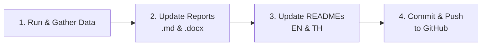

# Benchmark Report & Repository Sync Skill

This skill enforces and automates the complete lifecycle whenever benchmark data is generated, modified, or updated in the repository.

---

## 1. Mandatory Workflow Requirements

Whenever benchmark data or configurations are updated, the agent **MUST** complete all 4 steps in sequence:



1. **Gather Data via Standard Method**: Extract raw `wrk` metrics, run `generate_summary.py` to aggregate statistics into `SUMMARY.md` and `SUMMARY.csv`.
2. **Update the Research Report**: Mirror all updated figures, rankings, and analysis into `Programming_Benchmark_Report.md` and rebuild `Programming_Benchmark_Report.docx`.
3. **Update README & README_TH**: Mirror the executive summaries, comparison tables, and key findings in [README.md](../../README.md) and [README_TH.md](../../README_TH.md).
4. **Commit and Push to GitHub**: Automatically stage all modified files, create a descriptive commit, and push upstream to GitHub (`git push origin main`).

---

## 2. Data Gathering Method for the Report

The benchmark report requires a rigorous, deterministic data collection process following the **Full-Factorial Experimental Design** ($5 \text{ Languages} \times 2 \text{ Environments} \times 2 \text{ Index States} \times 5 \text{ Concurrency Tiers}$):

### Step 1: Raw Metric Extraction
Run tests with multi-run averaging (`--runs 3` or `--runs 5`) to capture:
- **Throughput ($T$)**: Requests per second ($\text{req/s}$).
- **Latency Distribution ($L$)**: Mean latency ($\text{ms}$), 50th percentile (median), 90th percentile, 99th percentile, and Maximum latency.
- **Reliability & Errors ($E$)**: Socket connect errors, read timeouts, and non-2xx/3xx HTTP responses.

Raw metrics are saved to `raw_results.json` and centralized in `main_web_benchmark/results/raw_results/<suite>_raw.json`.

### Step 2: Statistical Aggregation & Distribution Analysis
Execute the centralized summary script:
```bash
python main_web_benchmark/results/generate_summary.py
```
This parses all `<suite>_<env>.json` files and calculates comprehensive distributions across runs:
- **Arithmetic Mean ($\bar{X}$)**:
  - Throughput: $\bar{T} = \frac{1}{N}\sum_{i=1}^{N} T_i$
  - Latency: $\bar{L} = \frac{1}{N}\sum_{i=1}^{N} L_i$
- **Standard Deviation ($\sigma$ / SD)**: Sample dispersion $s = \sqrt{\frac{1}{N-1}\sum_{i=1}^{N} (x_i - \bar{x})^2}$
- **95% Confidence Interval (95% CI)**: $[\bar{X} - t_{crit}\frac{s}{\sqrt{N}}, \bar{X} + t_{crit}\frac{s}{\sqrt{N}}]$
- **Latency Percentiles**: $p_{50}$ (median), $p_{90}$, $p_{95}$, and $p_{99}$ tail latency metrics.
- **Reliability & Max Bounds**: Max Latency $L_{\max}$ and Total Socket/Timeout Error Counts $E_{\text{total}} = \sum_{i=1}^{N} E_i$.

### Step 3: Comparative Factorial Synthesis
Calculate key cross-layer metrics:
1. **Containerization Overhead / Bare Metal Gain**:
   $$\text{Gain}_{\text{BME}} = \left( \frac{\bar{T}_{\text{BareMetal}} - \bar{T}_{\text{Docker}}}{\bar{T}_{\text{Docker}}} \right) \times 100\%$$
2. **Database Indexing Impact Ratio**:
   $$\text{Speedup}_{\text{Index}} = \frac{\bar{T}_{\text{WithIndex}}}{\bar{T}_{\text{NoIndex}}}$$
3. **Concurrency Saturation Threshold**:
   Identify the connection tier ($\text{POC}=20 \rightarrow \text{Small}=100 \rightarrow \text{General}=500 \rightarrow \text{High}=2,000 \rightarrow \text{Stress}=10,000$) where error rate $E > 0$ or latency exceeds $1,000\,\text{ms}$.

---

## 3. Report & Document Synchronization

### A. Update Report Markdown (`Programming_Benchmark_Report.md`)
Update the chapters with the latest data:
* **Chapter 1 (บทนำ)**: Background, cloud-native context, and 3 formal objectives.
* **Chapter 2 (วรรณกรรมที่เกี่ยวข้อง)**: 13 academic citations and research gap.
* **Chapter 3 (ระเบียบวิธีวิจัย)**: Full-factorial matrix, test variables, and load tiers.
* **Results & Discussion**: Insert updated comparison tables and Docker vs. Bare Metal analysis.
* **References**: Maintain full IEEE bibliography (`[1]`–`[13]`).

### B. Compile Word Document (`Programming_Benchmark_Report.docx`)
Run the report builder utility:
```bash
python scripts/sync_benchmark_report.py --docx
```

### C. Update README.md & README_TH.md
Mirror the updated tables into:
- [README.md](../../README.md) (English)
- [README_TH.md](../../README_TH.md) (Thai)

---

## 4. Git Synchronization Protocol

Execute the following commands whenever data or reports change:

```bash
# 1. Check changed files
git status -s

# 2. Stage all result JSONs, CSVs, markdown docs, and docx reports
git add main_web_benchmark/results/ Programming_Benchmark_Report.docx Programming_Benchmark_Report.md README.md README_TH.md

# 3. Commit with standard message format
git commit -m "benchmarks: update results, sync report docx, and mirror READMEs"

# 4. Push to remote repository
git push origin main
```
